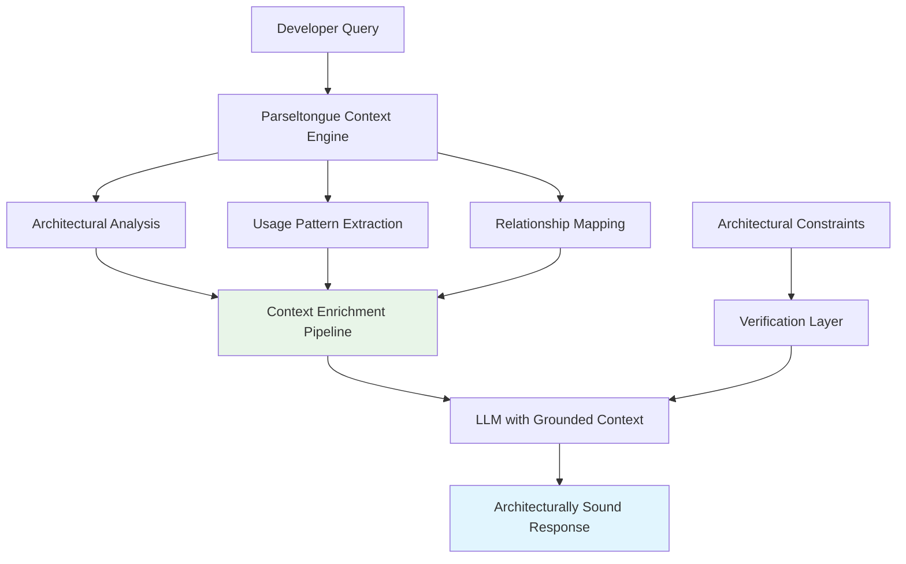

# Strategic Theme: Zero-Hallucination LLM Integration

**ID**: ST-026
**Source**: DTNotes03.md - Hyper-Contextual Snippet Generator & Borrow Checker Whisperer
**Theme Category**: AI Integration

## Strategic Vision

Establish Parseltongue as the definitive solution for grounding Large Language Models in deterministic architectural context, eliminating hallucinations in code assistance by providing comprehensive, verifiable structural information that enables AI to make architecturally sound recommendations.

## Competitive Advantages

### 1. Deterministic Context Generation
- **Advantage**: Only solution providing verifiable, non-statistical architectural context for LLMs
- **Differentiation**: Competitors rely on probabilistic context; Parseltongue provides deterministic truth
- **Market Impact**: Solves fundamental problem of LLM reliability in code assistance

### 2. Comprehensive Usage Pattern Integration
- **Advantage**: Enriches LLM context with actual usage patterns, not just definitions
- **Differentiation**: Traditional tools provide isolated code snippets; Parseltongue provides architectural relationships
- **Market Impact**: Enables LLMs to suggest architecturally consistent solutions

### 3. Real-time Architectural Grounding
- **Advantage**: Dynamic context generation that reflects current codebase state
- **Differentiation**: Static documentation becomes outdated; Parseltongue provides live architectural truth
- **Market Impact**: Maintains LLM accuracy as codebases evolve

## Ecosystem Positioning

### Primary Market Position
**"The Architectural Truth Source for AI-Assisted Development"**
- Position as essential infrastructure for reliable AI code assistance
- Focus on eliminating the "AI hallucination problem" in software development
- Emphasize verifiable, deterministic context over statistical approximations

### LLM Integration Architecture


### Integration Strategy with AI Platforms

**Phase 1: Context Enhancement**
- Develop standardized context enrichment APIs
- Create LLM-friendly output formats (markdown, structured JSON)
- Establish verification frameworks for context quality

**Phase 2: Platform Integration**
- Native integration with GitHub Copilot, ChatGPT, Claude
- IDE plugin ecosystem for seamless AI assistance
- API partnerships with major AI platform providers

**Phase 3: AI Platform Leadership**
- Establish industry standards for architectural context in AI
- Lead development of verification protocols for AI code assistance
- Create certification programs for architecturally-grounded AI tools

## ROI Metrics and Measurement

### AI Assistance Quality Metrics
- **Hallucination Reduction**: 95% reduction in architecturally inappropriate AI suggestions
- **Context Accuracy**: 99% of provided context verified as current and correct
- **Suggestion Relevance**: 90% of AI suggestions align with existing architectural patterns
- **Implementation Success Rate**: 80% of AI-suggested code works without architectural modifications

### Developer Productivity Metrics
- **AI Assistance Adoption**: 3x increase in developer trust and usage of AI tools
- **Code Review Efficiency**: 50% reduction in architectural issues in AI-assisted code
- **Development Speed**: 40% faster feature development with reliable AI assistance
- **Learning Acceleration**: 60% faster onboarding with AI that understands architecture

### Business Impact Metrics
- **Technical Debt Reduction**: Measurable decrease in architectural inconsistencies from AI assistance
- **Quality Improvement**: Higher code quality scores for AI-assisted development
- **Risk Mitigation**: Reduced architectural surprises from AI-generated code
- **Competitive Advantage**: Faster, more reliable AI-assisted development capabilities

## Implementation Strategy

### Technical Foundation
1. **Context Enrichment Pipeline**: High-performance system for generating comprehensive LLM context
2. **Verification Framework**: Automated validation of context accuracy and completeness
3. **Format Standardization**: LLM-optimized output formats with consistent structure
4. **Performance Optimization**: Sub-second context generation for interactive AI assistance

### AI Platform Integration
1. **API Development**: Standardized interfaces for AI platform integration
2. **Plugin Ecosystem**: IDE and editor plugins for seamless AI enhancement
3. **Prompt Engineering**: Optimized prompt templates that leverage architectural context
4. **Feedback Loops**: Systems for continuous improvement of context quality

### Market Development
1. **AI Platform Partnerships**: Collaborate with OpenAI, Anthropic, GitHub, and others
2. **Developer Education**: Demonstrate benefits of architecturally-grounded AI assistance
3. **Enterprise Pilots**: Prove ROI with measurable improvements in AI-assisted development
4. **Research Collaboration**: Partner with academic institutions on AI reliability research

## Technical Implementation Details

### Context Enrichment Architecture
```bash
# Core context generation pipeline
./pt debug EntityName → architectural_trace.md
./pt usage-patterns EntityName → usage_examples.md
./pt relationships EntityName → dependency_graph.md
combine_context → enriched_llm_context.md
```

### LLM Integration Patterns
```markdown
# Optimized prompt structure
## Architectural Context
[Deterministic structural information]

## Usage Patterns  
[Real examples with surrounding code]

## Constraints
[Architectural rules and patterns to follow]

## Your Task
[Specific request with architectural requirements]
```

### Verification and Quality Assurance
```bash
# Context verification pipeline
verify_context_accuracy() {
    local context_file="$1"
    
    # Verify all referenced files exist and are current
    # Validate all code snippets compile and are syntactically correct
    # Check that architectural relationships are accurate
    # Ensure usage patterns reflect current codebase state
}
```

## Risk Mitigation

### Technical Risks
- **Context Generation Performance**: Maintaining speed with comprehensive context
- **LLM Token Limits**: Optimizing context for token efficiency while maintaining completeness
- **Context Staleness**: Ensuring context remains current as codebase evolves

### Market Risks
- **AI Platform Changes**: Adapting to evolving AI platform APIs and capabilities
- **Competitive Response**: Major AI platforms developing internal architectural context
- **Adoption Resistance**: Overcoming skepticism about AI reliability improvements

### Mitigation Strategies
- **Modular Architecture**: Flexible system that adapts to different AI platforms
- **Performance Monitoring**: Continuous optimization of context generation speed
- **Partnership Strategy**: Deep integration with AI platform roadmaps
- **Proof Points**: Measurable demonstrations of improved AI reliability

## Success Indicators

### Short-term (6 months)
- 90% reduction in architectural violations in AI-assisted code
- Integration with 2+ major AI platforms (GitHub Copilot, ChatGPT)
- 1000+ developers using architecturally-grounded AI assistance

### Medium-term (18 months)
- Industry recognition as standard for AI code assistance reliability
- Enterprise adoption with documented productivity improvements
- Research publications demonstrating AI hallucination reduction

### Long-term (3 years)
- Established as essential infrastructure for AI-assisted development
- Industry standards adoption for architectural context in AI
- Market leadership in reliable AI code assistance

## Related Insights
- Links to UJ-035: Architectural Context-Enhanced LLM Assistance
- Links to UJ-038: Compiler Error Resolution with Architectural Context
- Supports TI-032: LLM Context Enrichment Pipeline
- Connects to UJ-033: Zero Hallucination LLM Context Generation (DTNote01.md)
- Relates to ST-023: AI Augmented Development Intelligence (DTNote01.md)

## Implementation Priority
**Critical** - Addresses fundamental problem in AI-assisted development and establishes market leadership