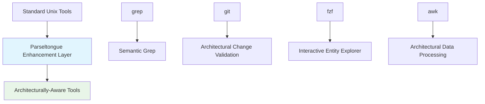

# Strategic Theme: Unix Philosophy Applied to Architectural Analysis

**ID**: ST-027
**Source**: DTNotes03.md - Shell script integrations with ripgrep, git, awk, fzf
**Theme Category**: Developer Productivity

## Strategic Vision

Apply the Unix philosophy of "do one thing well" and composable tools to architectural analysis, creating a ecosystem where Parseltongue provides architectural intelligence that seamlessly integrates with existing command-line tools, enhancing rather than replacing the developer's current workflow.

## Competitive Advantages

### 1. Composable Architectural Intelligence
- **Advantage**: Architectural analysis becomes a composable component in any workflow
- **Differentiation**: Monolithic IDEs require wholesale adoption; Parseltongue enhances existing tools
- **Market Impact**: Reduces adoption friction by working with developer's current toolchain

### 2. Unix Tool Enhancement Strategy
- **Advantage**: Makes standard tools (grep, git, fzf) architecturally aware without changing their interface
- **Differentiation**: Competitors create new tools; Parseltongue makes existing tools smarter
- **Market Impact**: Leverages decades of Unix tool optimization and developer familiarity

### 3. Scriptable Architectural Workflows
- **Advantage**: Enables custom architectural workflows through simple shell scripting
- **Differentiation**: GUI tools limit customization; command-line tools enable infinite composition
- **Market Impact**: Empowers developers to create domain-specific architectural workflows

## Ecosystem Positioning

### Primary Market Position
**"Architectural Intelligence for the Command Line"**
- Position as the architectural layer that enhances existing Unix workflows
- Focus on composability and integration rather than replacement
- Emphasize the power of combining architectural analysis with proven Unix tools

### Unix Philosophy Integration
```bash
# Core Unix philosophy principles applied to architectural analysis
./pt entities | grep "Service" | xargs -I {} ./pt impact {}    # Composability
./pt debug EntityName | head -20                               # Simple output
./pt impact EntityName --format=files_only | xargs rg pattern # Tool chaining
```

### Tool Enhancement Strategy


## ROI Metrics and Measurement

### Developer Workflow Metrics
- **Tool Adoption Speed**: 90% of developers can integrate within first day
- **Workflow Disruption**: <5% change to existing development workflows
- **Productivity Gain**: 30% improvement in architectural analysis tasks
- **Learning Curve**: Minimal - leverages existing Unix tool knowledge

### Integration Efficiency Metrics
- **Script Development Speed**: 80% faster creation of custom architectural workflows
- **Maintenance Overhead**: 50% reduction compared to monolithic tool approaches
- **Customization Capability**: Unlimited workflow combinations through shell scripting
- **Performance**: Native Unix tool performance with architectural enhancement

### Ecosystem Impact Metrics
- **Tool Ecosystem Growth**: Number of community-created integration scripts
- **Cross-Platform Adoption**: Usage across Linux, macOS, and Windows/WSL
- **Enterprise Integration**: Adoption in existing Unix-based development environments
- **Community Contribution**: Developer contributions to integration script library

## Implementation Strategy

### Technical Foundation
1. **Standardized Output Formats**: Consistent, parseable output that works with Unix tools
2. **Performance Optimization**: Ensure architectural analysis doesn't slow down Unix workflows
3. **Error Handling**: Graceful degradation that maintains Unix tool reliability
4. **Documentation**: Comprehensive examples of tool integration patterns

### Community Development
1. **Script Library**: Curated collection of integration scripts for common workflows
2. **Documentation Hub**: Best practices for combining Parseltongue with Unix tools
3. **Community Contributions**: Framework for developers to share custom integrations
4. **Tool Maintainer Engagement**: Collaborate with maintainers of popular Unix tools

### Enterprise Adoption
1. **CI/CD Integration**: Seamless integration with existing Unix-based build systems
2. **Infrastructure Compatibility**: Works with existing development infrastructure
3. **Security Compliance**: Maintains security posture of existing Unix environments
4. **Training Programs**: Minimal training required due to familiar Unix patterns

## Technical Implementation Patterns

### Core Integration Patterns
```bash
# Pattern 1: Architectural Filtering
./pt impact EntityName --format=files_only | xargs grep "pattern"

# Pattern 2: Contextual Enhancement  
./pt debug EntityName | awk '/Usage:/ {print $2}' | xargs vim

# Pattern 3: Workflow Orchestration
git diff --name-only | ./pt validate-scope EntityName

# Pattern 4: Interactive Enhancement
./pt list-entities | fzf --preview './pt debug {}'
```

### Standardized Interface Design
```bash
# Consistent output formats for Unix tool compatibility
--format=files_only    # One file path per line
--format=lines         # File:line format for grep compatibility  
--format=json          # Structured data for jq processing
--format=tsv           # Tab-separated for awk processing
```

### Performance Optimization
```bash
# Streaming output for large datasets
./pt entities --stream | while read entity; do
    ./pt impact "$entity" --format=files_only
done

# Parallel processing with xargs
./pt entities | xargs -P 4 -I {} ./pt debug {}
```

## Risk Mitigation

### Technical Risks
- **Performance Overhead**: Architectural analysis slowing down fast Unix tools
- **Output Format Stability**: Changes breaking existing script integrations
- **Tool Compatibility**: Different Unix tool versions and platforms

### Adoption Risks
- **Complexity Perception**: Developers viewing integration as too complex
- **Maintenance Burden**: Scripts becoming outdated or unmaintained
- **Platform Fragmentation**: Different behaviors across Unix variants

### Mitigation Strategies
- **Performance Benchmarking**: Continuous monitoring of integration overhead
- **Backward Compatibility**: Stable output formats with versioned changes
- **Testing Framework**: Automated testing across different Unix environments
- **Community Support**: Active maintenance of core integration scripts

## Success Indicators

### Short-term (6 months)
- 50+ integration scripts in community library
- 5000+ developers using Unix tool integrations
- Performance overhead <10% for typical workflows

### Medium-term (18 months)
- Integration with 20+ popular Unix tools documented
- Enterprise adoption in Unix-based development environments
- Community-driven ecosystem of custom integrations

### Long-term (3 years)
- Industry standard for architectural analysis in Unix environments
- Native integration discussions with major Unix tool maintainers
- Established pattern for architectural enhancement of command-line tools

## Related Insights
- Links to UJ-036: Semantic Code Search and Navigation
- Links to UJ-037: Architectural Guardrails for Change Validation
- Links to UJ-039: Interactive Terminal-Based Code Exploration
- Supports TI-031: Shell Script Orchestration Architecture
- Supports TI-034: Multi-Tool Integration Framework
- Connects to ST-025: Architectural-Aware Development Ecosystem

## Implementation Priority
**High** - Leverages existing developer workflows and reduces adoption friction while establishing unique market position