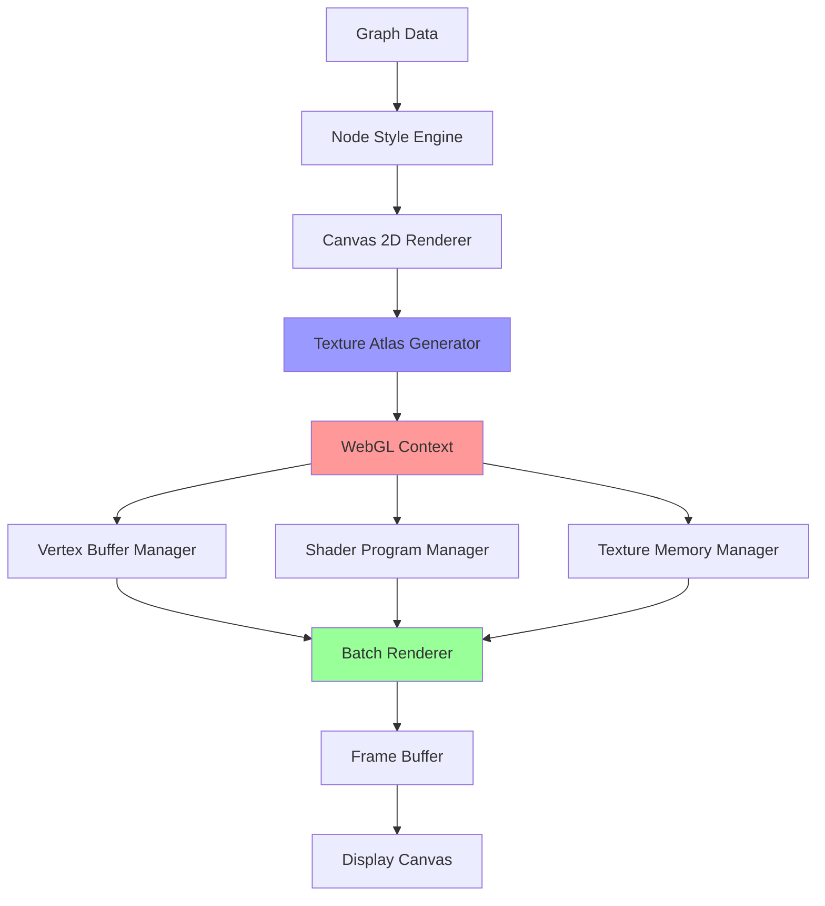

# TI-010: WebGL Sprite Sheet Optimization Architecture

## Technical Insight Overview
**Title**: WebGL Sprite Sheet Optimization Architecture
**Category**: Performance Optimization
**Priority**: High
**Implementation Complexity**: Medium-High
**Source**: DTNote01.md chunks 41-60 analysis

## Description

Hybrid rendering system that combines Canvas API sprite sheet generation with WebGL texture-based rendering to achieve 5x performance improvement for large-scale graph visualization. The architecture uses off-screen Canvas rendering to generate node sprites, then leverages GPU texture memory and parallel processing for high-performance visualization of networks with 100k+ nodes.

## Architecture

### Core Components

#### 1. Sprite Sheet Generation Pipeline
```
Canvas 2D Context → Node Rendering → Texture Atlas → GPU Memory
```

**Process Flow**:
1. **Off-screen Canvas Creation**: Generate 2D context for sprite rendering
2. **Node Style Application**: Apply visual styles (colors, shapes, labels) to individual nodes
3. **Texture Atlas Assembly**: Pack rendered nodes into optimized texture sheets
4. **GPU Memory Transfer**: Upload texture atlases to WebGL texture memory

#### 2. WebGL Rendering Engine
```
Vertex Buffers → Shader Programs → Texture Sampling → Frame Buffer
```

**Rendering Pipeline**:
1. **Geometry Generation**: Create vertex buffers for node positions and texture coordinates
2. **Batch Processing**: Group nodes into rendering batches for optimal GPU utilization
3. **Shader Execution**: Execute vertex and fragment shaders for texture sampling
4. **Composite Rendering**: Combine node and edge rendering into final frame

#### 3. Memory Management System
```
Texture Pool → LRU Cache → Dynamic Loading → Garbage Collection
```

**Memory Strategy**:
1. **Texture Pool Management**: Pre-allocate texture memory for optimal performance
2. **LRU Caching**: Maintain most recently used textures in GPU memory
3. **Dynamic Loading**: Stream texture data for very large graphs
4. **Garbage Collection**: Reclaim unused texture memory automatically

### System Architecture Diagram



## Technology Stack

### Core Technologies
- **WebGL 1.0/2.0**: GPU-accelerated rendering with broad browser support
- **Canvas 2D API**: High-quality sprite sheet generation with full styling support
- **JavaScript/TypeScript**: Application logic and WebGL API interaction
- **WASM (Optional)**: Performance-critical operations for very large graphs

### Browser Compatibility
- **Chrome/Chromium**: Full WebGL 2.0 support with optimal performance
- **Firefox**: WebGL 1.0/2.0 support with good performance characteristics
- **Safari**: WebGL 1.0 support with iOS/macOS optimization
- **Edge**: WebGL 2.0 support with Windows GPU acceleration

### Fallback Strategy
```
WebGL 2.0 → WebGL 1.0 → Optimized Canvas → Basic Canvas
```

## Performance Requirements

### Rendering Performance Targets
- **Small Networks (< 1k nodes)**: 60 FPS sustained interaction
- **Medium Networks (1k-10k nodes)**: 30 FPS sustained interaction  
- **Large Networks (10k-50k nodes)**: 15 FPS sustained interaction
- **Very Large Networks (50k-100k nodes)**: 5 FPS minimum, 15 FPS target

### Memory Usage Constraints
- **Texture Memory**: 2GB maximum GPU memory usage
- **System Memory**: 4GB maximum for graph data structures
- **Texture Atlas Size**: 4096x4096 pixels default (configurable)
- **Batch Size**: 2048 nodes per batch (configurable)

### Loading Performance
- **Initial Load Time**: Under 5 seconds for 10k nodes
- **Incremental Loading**: 1000 nodes/second streaming rate
- **Texture Generation**: 500 nodes/second sprite creation
- **Memory Transfer**: 100MB/second GPU upload rate

## Integration Patterns

### Configuration API
```javascript
const renderer = new WebGLGraphRenderer({
  // Texture Configuration
  webglTexSize: 4096,        // Texture atlas dimensions
  webglTexRows: 24,          // Rows per texture atlas
  webglBatchSize: 2048,      // Nodes per rendering batch
  webglTexPerBatch: 16,      // Textures per batch (hardware limit)
  
  // Performance Tuning
  enableLOD: true,           // Level of detail optimization
  lodThreshold: 10000,       // Node count for LOD activation
  memoryLimit: 2048,         // GPU memory limit (MB)
  
  // Fallback Options
  canvasFallback: true,      // Enable Canvas API fallback
  webglDebug: false,         // Debug mode for development
  showFPS: false             // Performance monitoring display
});
```

### Integration with Existing Libraries
```javascript
// Cytoscape.js Integration
cy = cytoscape({
  container: document.getElementById('cy'),
  elements: graphData,
  style: styleSheet,
  renderer: {
    name: 'canvas',
    webgl: true,
    ...webglConfig
  }
});

// D3.js Integration  
const webglRenderer = d3.webglRenderer()
  .size([width, height])
  .nodes(nodeData)
  .links(linkData);
```

### Event Handling Integration
```javascript
// Mouse/Touch Event Mapping
renderer.on('nodeClick', (event, nodeId) => {
  // Handle node interaction
});

renderer.on('viewportChange', (viewport) => {
  // Update LOD based on zoom level
  renderer.updateLOD(viewport.scale);
});
```

## Security Considerations

### WebGL Security Model
- **Context Isolation**: Separate WebGL contexts prevent cross-contamination
- **Memory Protection**: GPU memory access restricted to allocated textures
- **Shader Validation**: Fragment and vertex shaders validated before compilation
- **Cross-Origin Restrictions**: Texture loading respects CORS policies

### Threat Mitigation Strategies
- **Memory Exhaustion**: Texture size validation and memory limit enforcement
- **GPU Hang Prevention**: Shader complexity limits and timeout mechanisms
- **Data Validation**: Input sanitization for node/edge data
- **Resource Cleanup**: Automatic context and memory cleanup on errors

### Privacy Considerations
- **GPU Fingerprinting**: Minimize exposed GPU capabilities information
- **Performance Profiling**: Avoid exposing detailed hardware performance characteristics
- **Data Residency**: Ensure graph data doesn't persist in GPU memory unnecessarily

## Scalability Approaches

### Horizontal Scaling
- **Multi-Context Rendering**: Distribute rendering across multiple WebGL contexts
- **Worker Thread Integration**: Off-load sprite generation to web workers
- **Streaming Architecture**: Progressive loading for very large graphs
- **Viewport Culling**: Render only visible portions of large graphs

### Vertical Scaling
- **GPU Memory Optimization**: Efficient texture packing and compression
- **Batch Size Tuning**: Dynamic batch sizing based on hardware capabilities
- **LOD Implementation**: Multiple detail levels based on zoom and importance
- **Caching Strategies**: Intelligent texture caching and preloading

### Performance Monitoring Integration
```javascript
// OpenTelemetry Integration
const tracer = trace.getTracer('webgl-renderer');

function renderFrame() {
  const span = tracer.startSpan('webgl.render.frame');
  
  span.setAttributes({
    'webgl.nodes.count': nodeCount,
    'webgl.batch.size': batchSize,
    'webgl.texture.memory': textureMemoryUsage
  });
  
  try {
    // Rendering logic
    const frameTime = performRendering();
    
    span.setAttributes({
      'webgl.render.duration': frameTime,
      'webgl.fps': 1000 / frameTime
    });
  } finally {
    span.end();
  }
}
```

## Linked User Journeys

### Primary Journeys
- **UJ-012 (High-Performance Graph Analysis)**: Enables 5x performance improvement for data scientists
- **UJ-013 (Accessible Graph Navigation)**: WebGL rendering with accessibility-preserved DOM structure
- **UJ-009 (Semantic Enhanced Code Search)**: Fast visualization of search results in large codebases

### Secondary Journeys
- **UJ-010 (Intelligent CI/CD Quality Gates)**: Real-time visualization of build dependency graphs
- **UJ-011 (Real-time Architectural Feedback)**: Interactive exploration of system architecture changes

## Implementation Roadmap

### Phase 1: Core WebGL Renderer (Months 1-2)
- Basic WebGL context setup and shader programs
- Simple sprite sheet generation and texture management
- Canvas fallback implementation for compatibility

### Phase 2: Performance Optimization (Months 3-4)
- Batch rendering system with configurable parameters
- Memory management and texture streaming
- LOD implementation for large graphs

### Phase 3: Advanced Features (Months 5-6)
- Multi-context rendering for extreme scale
- Advanced caching and preloading strategies
- Performance monitoring and telemetry integration

### Phase 4: Production Hardening (Months 7-8)
- Cross-browser compatibility testing and optimization
- Security audit and vulnerability mitigation
- Performance benchmarking and validation

## Success Metrics

### Performance Validation
- **Rendering Speed**: 5x improvement over Canvas-only implementation
- **Memory Efficiency**: Linear scaling with node count up to hardware limits
- **Browser Compatibility**: 95%+ compatibility across target browser versions
- **Hardware Support**: Functional on 90%+ of target hardware configurations

### Quality Assurance
- **Visual Fidelity**: Pixel-perfect rendering compared to Canvas reference
- **Interaction Responsiveness**: Sub-16ms frame times for smooth animation
- **Stability**: Zero memory leaks or GPU context corruption
- **Accessibility**: Full compatibility with assistive technology integration

This technical insight provides the foundation for high-performance graph visualization that maintains accessibility and developer experience while leveraging modern GPU capabilities.