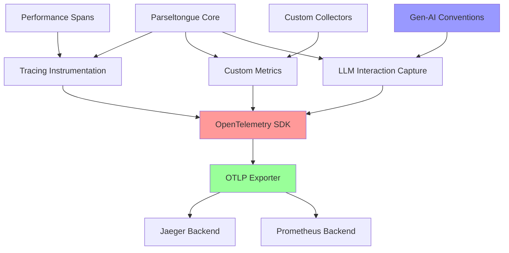

# TI-011: OpenTelemetry Rust Integration Framework

## Technical Insight Overview
**Title**: OpenTelemetry Rust Integration Framework
**Category**: Observability & Monitoring
**Priority**: High
**Implementation Complexity**: Medium
**Source**: DTNote01.md chunks 41-60 analysis

## Description

Comprehensive telemetry system for parseltongue that leverages OpenTelemetry's Rust ecosystem to provide detailed performance monitoring, LLM interaction tracking, and system observability. The framework implements nested span creation for pipeline monitoring, OTLP export to industry-standard backends, and specialized `gen-ai` semantic conventions for AI interaction capture.

## Architecture

### Core Telemetry Pipeline
```
Application Code → Tracing Layer → OpenTelemetry SDK → OTLP Exporter → Backend
```

**Data Flow**:
1. **Instrumentation Points**: Strategic placement throughout parseltongue codebase
2. **Span Creation**: Nested spans for hierarchical operation tracking
3. **Metric Collection**: Custom metrics for domain-specific measurements
4. **Export Processing**: Batched export to reduce performance overhead
5. **Backend Integration**: Jaeger for traces, Prometheus for metrics

### System Architecture Diagram



### Instrumentation Architecture

#### 1. Nested Span Hierarchy
```
parseltongue.session
├── parseltongue.parse.file
│   ├── parseltongue.ast.traverse
│   └── parseltongue.syntax.analyze
├── parseltongue.graph.build
│   ├── parseltongue.relationships.extract
│   └── parseltongue.index.update
└── parseltongue.query.execute
    ├── parseltongue.search.semantic
    └── parseltongue.results.format
```

#### 2. Metric Collection Points
```
Counters:
- parseltongue.llm.hallucination.detected
- parseltongue.files.processed.total
- parseltongue.errors.count

Histograms:
- parseltongue.time_to_nav.duration
- parseltongue.blast_radius.duration
- parseltongue.parse.latency

Gauges:
- parseltongue.memory.usage
- parseltongue.graph.nodes.count
- parseltongue.active.sessions
```

## Technology Stack

### Core Rust Crates
```toml
[dependencies]
# OpenTelemetry Core
opentelemetry = "0.21"
opentelemetry-sdk = "0.21"
opentelemetry-otlp = "0.14"

# Tracing Integration
tracing = "0.1"
tracing-opentelemetry = "0.22"
tracing-subscriber = "0.3"

# Async Runtime
tokio = { version = "1.0", features = ["full"] }

# Serialization
serde = { version = "1.0", features = ["derive"] }
serde_json = "1.0"
```

### Backend Integration
- **Jaeger**: Distributed tracing visualization and analysis
- **Prometheus**: Metrics collection and alerting
- **Grafana**: Dashboard visualization and monitoring
- **OTLP Protocol**: Vendor-neutral telemetry data export

### Semantic Conventions
- **Standard OpenTelemetry**: HTTP, database, system resource conventions
- **Gen-AI Conventions**: LLM interaction tracking with prompt/completion capture
- **Custom Parseltongue**: Domain-specific attributes for code analysis operations

## Performance Requirements

### Telemetry Overhead Constraints
- **CPU Overhead**: Maximum 5% of total execution time
- **Memory Overhead**: Maximum 10% additional memory usage
- **Network Overhead**: Batched export to minimize bandwidth impact
- **Latency Impact**: Sub-millisecond instrumentation overhead

### Export Performance
- **Batch Size**: 512 spans per export batch (configurable)
- **Export Interval**: 5-second intervals for real-time monitoring
- **Retry Logic**: Exponential backoff for failed exports
- **Buffer Limits**: 10,000 spans maximum in-memory buffer

### Metric Granularity
- **Histogram Buckets**: Optimized for parseltongue operation latencies
- **Sample Rate**: 100% for errors, 10% for successful operations (configurable)
- **Cardinality Limits**: Maximum 1000 unique metric label combinations

## Integration Patterns

### Basic Instrumentation Setup
```rust
use opentelemetry::{global, trace::TraceError};
use opentelemetry_otlp::WithExportConfig;
use opentelemetry_sdk::{trace as sdktrace, Resource};
use tracing_opentelemetry::OpenTelemetryLayer;
use tracing_subscriber::{layer::SubscriberExt, util::SubscriberInitExt};

fn init_telemetry() -> Result<(), TraceError> {
    // Configure OTLP exporter
    let tracer = opentelemetry_otlp::new_pipeline()
        .tracing()
        .with_exporter(
            opentelemetry_otlp::new_exporter()
                .tonic()
                .with_endpoint("http://localhost:4317")
        )
        .with_trace_config(
            sdktrace::config().with_resource(Resource::new(vec![
                opentelemetry::KeyValue::new("service.name", "parseltongue"),
                opentelemetry::KeyValue::new("service.version", env!("CARGO_PKG_VERSION")),
            ]))
        )
        .install_batch(opentelemetry_sdk::runtime::Tokio)?;

    // Configure tracing subscriber
    tracing_subscriber::registry()
        .with(OpenTelemetryLayer::new(tracer))
        .with(tracing_subscriber::fmt::layer())
        .init();

    Ok(())
}
```

### Span Instrumentation Patterns
```rust
use tracing::{instrument, info, warn, error};
use opentelemetry::{trace::Span, Context};

#[instrument(
    name = "parseltongue.parse.file",
    fields(
        file.path = %file_path,
        file.size = file_size,
        parse.language = language
    )
)]
async fn parse_file(file_path: &Path, language: &str) -> Result<ParseResult, ParseError> {
    let span = Span::current();
    
    // Add dynamic attributes
    span.set_attribute("parse.start_time", SystemTime::now());
    
    let result = perform_parsing(file_path, language).await;
    
    match &result {
        Ok(parse_result) => {
            span.set_attribute("parse.nodes.count", parse_result.node_count as i64);
            span.set_attribute("parse.success", true);
            info!("File parsed successfully");
        }
        Err(error) => {
            span.set_attribute("parse.success", false);
            span.set_attribute("parse.error", error.to_string());
            error!("Parse failed: {}", error);
        }
    }
    
    result
}
```

### Custom Metrics Implementation
```rust
use opentelemetry::{
    metrics::{Counter, Histogram, Meter},
    KeyValue,
};

pub struct ParseltongueMetrics {
    // Counters
    files_processed: Counter<u64>,
    llm_hallucinations: Counter<u64>,
    
    // Histograms
    time_to_nav: Histogram<f64>,
    blast_radius_duration: Histogram<f64>,
    parse_latency: Histogram<f64>,
}

impl ParseltongueMetrics {
    pub fn new(meter: &Meter) -> Self {
        Self {
            files_processed: meter
                .u64_counter("parseltongue.files.processed.total")
                .with_description("Total number of files processed")
                .init(),
                
            llm_hallucinations: meter
                .u64_counter("parseltongue.llm.hallucination.detected")
                .with_description("Number of detected LLM hallucinations")
                .init(),
                
            time_to_nav: meter
                .f64_histogram("parseltongue.time_to_nav.duration")
                .with_description("Time to navigate to code location")
                .with_unit("seconds")
                .init(),
                
            blast_radius_duration: meter
                .f64_histogram("parseltongue.blast_radius.duration")
                .with_description("Time to calculate blast radius")
                .with_unit("seconds")
                .init(),
                
            parse_latency: meter
                .f64_histogram("parseltongue.parse.latency")
                .with_description("File parsing latency")
                .with_unit("seconds")
                .init(),
        }
    }
    
    pub fn record_file_processed(&self, language: &str, success: bool) {
        self.files_processed.add(1, &[
            KeyValue::new("language", language.to_string()),
            KeyValue::new("success", success),
        ]);
    }
    
    pub fn record_navigation_time(&self, duration: f64, query_type: &str) {
        self.time_to_nav.record(duration, &[
            KeyValue::new("query.type", query_type.to_string()),
        ]);
    }
}
```

### LLM Interaction Tracking
```rust
use opentelemetry::trace::{Span, Tracer};

#[instrument(
    name = "gen_ai.chat.completions",
    fields(
        gen_ai.system = "openai",
        gen_ai.request.model = model,
        gen_ai.request.max_tokens = max_tokens,
    )
)]
async fn llm_completion(
    prompt: &str,
    model: &str,
    max_tokens: u32,
) -> Result<String, LLMError> {
    let span = Span::current();
    
    // Record request details
    span.set_attribute("gen_ai.prompt.tokens", count_tokens(prompt) as i64);
    span.set_attribute("gen_ai.request.temperature", 0.7);
    
    let start_time = Instant::now();
    let response = call_llm_api(prompt, model, max_tokens).await?;
    let duration = start_time.elapsed();
    
    // Record response details
    span.set_attribute("gen_ai.completion.tokens", count_tokens(&response) as i64);
    span.set_attribute("gen_ai.usage.total_tokens", 
        (count_tokens(prompt) + count_tokens(&response)) as i64);
    span.set_attribute("gen_ai.response.duration", duration.as_secs_f64());
    
    // Record events for detailed tracking
    span.add_event("gen_ai.prompt", vec![
        KeyValue::new("gen_ai.prompt.content", prompt.to_string()),
    ]);
    
    span.add_event("gen_ai.completion", vec![
        KeyValue::new("gen_ai.completion.content", response.clone()),
    ]);
    
    Ok(response)
}
```

## Security Considerations

### Data Privacy
- **PII Scrubbing**: Automatic removal of personally identifiable information from traces
- **Sensitive Data Filtering**: Configurable filters for API keys, passwords, and secrets
- **Retention Policies**: Automatic data expiration based on sensitivity classification
- **Access Controls**: Role-based access to telemetry data in backend systems

### Performance Security
- **Resource Limits**: Prevent telemetry from consuming excessive system resources
- **Rate Limiting**: Protect against telemetry data flooding attacks
- **Circuit Breakers**: Disable telemetry collection if backend becomes unavailable
- **Graceful Degradation**: Application continues functioning if telemetry fails

### Network Security
- **TLS Encryption**: All telemetry data encrypted in transit using TLS 1.3
- **Authentication**: Mutual TLS or API key authentication for backend connections
- **Network Isolation**: Telemetry traffic isolated from application data flows
- **Firewall Rules**: Restricted network access for telemetry export endpoints

## Scalability Approaches

### Horizontal Scaling
- **Distributed Tracing**: Trace correlation across multiple parseltongue instances
- **Metric Aggregation**: Efficient aggregation of metrics from multiple sources
- **Backend Sharding**: Distribute telemetry data across multiple backend instances
- **Load Balancing**: Balance telemetry export load across multiple collectors

### Vertical Scaling
- **Sampling Strategies**: Intelligent sampling to reduce data volume while maintaining insights
- **Compression**: Efficient compression of telemetry data before export
- **Batching Optimization**: Dynamic batch sizing based on system load
- **Memory Management**: Efficient memory usage for high-throughput scenarios

### Performance Optimization
```rust
// Adaptive sampling based on system load
pub struct AdaptiveSampler {
    base_rate: f64,
    load_threshold: f64,
    current_load: AtomicU64,
}

impl AdaptiveSampler {
    pub fn should_sample(&self, span_context: &SpanContext) -> bool {
        let load = self.current_load.load(Ordering::Relaxed) as f64 / 100.0;
        let adjusted_rate = if load > self.load_threshold {
            self.base_rate * (1.0 - load)
        } else {
            self.base_rate
        };
        
        rand::random::<f64>() < adjusted_rate
    }
}
```

## Linked User Journeys

### Primary Integration
- **UJ-012 (High-Performance Graph Analysis)**: Performance monitoring for optimization
- **UJ-010 (Intelligent CI/CD Quality Gates)**: Build pipeline observability and metrics
- **UJ-009 (Semantic Enhanced Code Search)**: Search performance tracking and optimization

### Secondary Benefits
- **UJ-013 (Accessible Graph Navigation)**: Accessibility feature usage analytics
- **UJ-011 (Real-time Architectural Feedback)**: System change impact measurement
- **All User Journeys**: Comprehensive error tracking and performance insights

## Implementation Roadmap

### Phase 1: Core Infrastructure (Months 1-2)
- Basic OpenTelemetry SDK integration with Rust ecosystem
- OTLP exporter configuration for Jaeger and Prometheus
- Essential span instrumentation for core parseltongue operations

### Phase 2: Advanced Metrics (Months 3-4)
- Custom metric collectors for domain-specific measurements
- LLM interaction tracking with gen-ai semantic conventions
- Performance optimization and overhead reduction

### Phase 3: Production Features (Months 5-6)
- Adaptive sampling and intelligent data reduction
- Security hardening and PII protection
- Advanced dashboard and alerting configuration

### Phase 4: Ecosystem Integration (Months 7-8)
- Integration with existing monitoring infrastructure
- Custom exporters for specialized backends
- Performance benchmarking and validation

## Success Metrics

### Observability Quality
- **Coverage**: 95% of critical code paths instrumented
- **Accuracy**: 99.9% trace completeness and correctness
- **Latency**: Sub-1ms instrumentation overhead
- **Reliability**: 99.95% telemetry data delivery success rate

### Operational Impact
- **MTTR Reduction**: 50% faster incident resolution through better observability
- **Performance Insights**: 90% of performance bottlenecks identified through telemetry
- **Capacity Planning**: Accurate resource usage prediction and scaling decisions
- **User Experience**: Proactive issue detection before user impact

This technical insight establishes comprehensive observability for parseltongue, enabling data-driven optimization and reliable production operations.