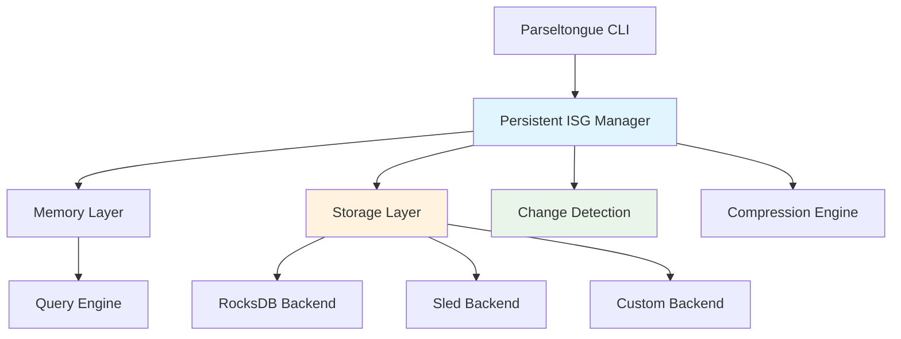

# TI-018: High-Performance Persistent Storage Architecture

## Technical Insight Overview
**Category**: Storage and Persistence
**Priority**: High
**Implementation Complexity**: Medium
**Performance Impact**: Critical

## Problem Statement

Parseltongue currently operates entirely in-memory, requiring full re-analysis of codebases on each session. This approach becomes prohibitively expensive for large codebases (100K+ LOC), causing:

- **Analysis Latency**: 10-15 minutes for large codebase analysis
- **Memory Pressure**: 200-500MB RAM usage for complex projects
- **Resource Waste**: Repeated computation of unchanged analysis results
- **CI/CD Bottlenecks**: Analysis overhead in automated pipelines
- **Developer Friction**: Long wait times reduce tool adoption

## Technical Solution

### Architecture Overview



### Core Components

#### 1. Storage Backend Abstraction
```rust
// Generic storage backend trait for pluggable persistence
pub trait StorageBackend: Send + Sync {
    type Error: std::error::Error + Send + Sync + 'static;
    
    async fn store_isg(&self, workspace_id: &str, isg: &ISG) -> Result<(), Self::Error>;
    async fn load_isg(&self, workspace_id: &str) -> Result<Option<ISG>, Self::Error>;
    async fn store_metadata(&self, workspace_id: &str, metadata: &AnalysisMetadata) -> Result<(), Self::Error>;
    async fn load_metadata(&self, workspace_id: &str) -> Result<Option<AnalysisMetadata>, Self::Error>;
    async fn invalidate(&self, workspace_id: &str, file_paths: &[PathBuf]) -> Result<(), Self::Error>;
    async fn compact(&self) -> Result<(), Self::Error>;
    async fn size_on_disk(&self) -> Result<u64, Self::Error>;
}

// Analysis metadata for change detection and validation
#[derive(Serialize, Deserialize, Clone)]
pub struct AnalysisMetadata {
    pub workspace_path: PathBuf,
    pub analysis_timestamp: SystemTime,
    pub file_checksums: HashMap<PathBuf, u64>,
    pub parseltongue_version: String,
    pub entity_count: usize,
    pub relationship_count: usize,
    pub compression_ratio: f32,
}
```

#### 2. RocksDB Implementation (Primary Backend)
```rust
use rocksdb::{DB, Options, WriteBatch, IteratorMode};

pub struct RocksDBBackend {
    db: Arc<DB>,
    compression: CompressionType,
    write_options: WriteOptions,
    read_options: ReadOptions,
}

impl RocksDBBackend {
    pub fn new(path: &Path) -> Result<Self> {
        let mut opts = Options::default();
        opts.create_if_missing(true);
        opts.set_compression_type(CompressionType::Zstd);
        opts.set_level_compaction_dynamic_level_bytes(true);
        opts.set_max_background_jobs(4);
        opts.set_bytes_per_sync(1048576); // 1MB
        
        // Optimize for parseltongue workload
        opts.set_write_buffer_size(64 * 1024 * 1024); // 64MB
        opts.set_max_write_buffer_number(3);
        opts.set_target_file_size_base(64 * 1024 * 1024); // 64MB
        
        let db = DB::open(&opts, path)?;
        
        Ok(Self {
            db: Arc::new(db),
            compression: CompressionType::Zstd,
            write_options: WriteOptions::default(),
            read_options: ReadOptions::default(),
        })
    }
}

impl StorageBackend for RocksDBBackend {
    type Error = RocksDBError;
    
    async fn store_isg(&self, workspace_id: &str, isg: &ISG) -> Result<(), Self::Error> {
        let serialized = self.serialize_isg(isg)?;
        let compressed = self.compress_data(&serialized)?;
        
        let key = format!("isg:{}", workspace_id);
        self.db.put_opt(&key, &compressed, &self.write_options)?;
        
        // Store entity and relationship indices separately for faster partial queries
        self.store_entity_index(workspace_id, &isg.entities).await?;
        self.store_relationship_index(workspace_id, &isg.relationships).await?;
        
        Ok(())
    }
    
    async fn load_isg(&self, workspace_id: &str) -> Result<Option<ISG>, Self::Error> {
        let key = format!("isg:{}", workspace_id);
        
        match self.db.get_opt(&key, &self.read_options)? {
            Some(compressed_data) => {
                let serialized = self.decompress_data(&compressed_data)?;
                let isg = self.deserialize_isg(&serialized)?;
                Ok(Some(isg))
            }
            None => Ok(None),
        }
    }
}
```

#### 3. Sled Implementation (Alternative Backend)
```rust
use sled::{Db, Tree, IVec};

pub struct SledBackend {
    db: Db,
    isg_tree: Tree,
    metadata_tree: Tree,
    compression: CompressionEngine,
}

impl SledBackend {
    pub fn new(path: &Path) -> Result<Self> {
        let config = sled::Config::default()
            .path(path)
            .cache_capacity(100 * 1024 * 1024) // 100MB cache
            .flush_every_ms(Some(1000)) // Flush every second
            .compression_factor(9); // High compression
            
        let db = config.open()?;
        let isg_tree = db.open_tree("isg")?;
        let metadata_tree = db.open_tree("metadata")?;
        
        Ok(Self {
            db,
            isg_tree,
            metadata_tree,
            compression: CompressionEngine::new(CompressionAlgorithm::Zstd),
        })
    }
}

impl StorageBackend for SledBackend {
    type Error = SledError;
    
    async fn store_isg(&self, workspace_id: &str, isg: &ISG) -> Result<(), Self::Error> {
        let serialized = rkyv::to_bytes::<_, 256>(isg)?;
        let compressed = self.compression.compress(&serialized)?;
        
        self.isg_tree.insert(workspace_id.as_bytes(), compressed)?;
        self.isg_tree.flush_async().await?;
        
        Ok(())
    }
}
```

#### 4. Intelligent Change Detection
```rust
use blake3::Hasher;
use walkdir::WalkDir;

pub struct ChangeDetector {
    ignore_patterns: GitIgnore,
    hash_cache: LruCache<PathBuf, u64>,
}

impl ChangeDetector {
    pub async fn detect_changes(
        &mut self,
        workspace_path: &Path,
        cached_metadata: &AnalysisMetadata,
    ) -> Result<ChangeSet> {
        let mut changes = ChangeSet::new();
        let mut current_checksums = HashMap::new();
        
        // Parallel file scanning and hashing
        let files: Vec<_> = WalkDir::new(workspace_path)
            .into_iter()
            .filter_map(|e| e.ok())
            .filter(|e| e.file_type().is_file())
            .filter(|e| self.should_analyze_file(e.path()))
            .collect();
            
        let checksums: HashMap<PathBuf, u64> = files
            .par_iter()
            .map(|entry| {
                let path = entry.path().to_path_buf();
                let checksum = self.compute_file_checksum(&path)?;
                Ok((path, checksum))
            })
            .collect::<Result<HashMap<_, _>>>()?;
            
        // Compare with cached checksums
        for (path, current_checksum) in checksums {
            match cached_metadata.file_checksums.get(&path) {
                Some(&cached_checksum) if cached_checksum == current_checksum => {
                    // File unchanged
                    changes.unchanged_files.insert(path);
                }
                Some(_) => {
                    // File modified
                    changes.modified_files.insert(path);
                }
                None => {
                    // New file
                    changes.new_files.insert(path);
                }
            }
            current_checksums.insert(path, current_checksum);
        }
        
        // Detect deleted files
        for cached_path in cached_metadata.file_checksums.keys() {
            if !current_checksums.contains_key(cached_path) {
                changes.deleted_files.insert(cached_path.clone());
            }
        }
        
        Ok(changes)
    }
    
    fn compute_file_checksum(&self, path: &Path) -> Result<u64> {
        // Use BLAKE3 for fast, cryptographically secure hashing
        let mut hasher = Hasher::new();
        let mut file = File::open(path)?;
        
        // Hash file content in chunks for memory efficiency
        let mut buffer = [0; 8192];
        loop {
            let bytes_read = file.read(&mut buffer)?;
            if bytes_read == 0 {
                break;
            }
            hasher.update(&buffer[..bytes_read]);
        }
        
        // Include file metadata in hash for comprehensive change detection
        let metadata = file.metadata()?;
        hasher.update(&metadata.len().to_le_bytes());
        hasher.update(&metadata.modified()?.duration_since(UNIX_EPOCH)?.as_secs().to_le_bytes());
        
        Ok(hasher.finalize().as_bytes()[..8].try_into().unwrap())
    }
}

#[derive(Debug, Clone)]
pub struct ChangeSet {
    pub new_files: HashSet<PathBuf>,
    pub modified_files: HashSet<PathBuf>,
    pub deleted_files: HashSet<PathBuf>,
    pub unchanged_files: HashSet<PathBuf>,
}

impl ChangeSet {
    pub fn has_changes(&self) -> bool {
        !self.new_files.is_empty() || !self.modified_files.is_empty() || !self.deleted_files.is_empty()
    }
    
    pub fn affected_files(&self) -> impl Iterator<Item = &PathBuf> {
        self.new_files.iter()
            .chain(self.modified_files.iter())
            .chain(self.deleted_files.iter())
    }
}
```

#### 5. Compression and Serialization
```rust
use zstd::{Encoder, Decoder};
use rkyv::{Archive, Deserialize, Serialize};

pub struct CompressionEngine {
    algorithm: CompressionAlgorithm,
    compression_level: i32,
}

#[derive(Clone, Copy)]
pub enum CompressionAlgorithm {
    Zstd,
    Lz4,
    None,
}

impl CompressionEngine {
    pub fn new(algorithm: CompressionAlgorithm) -> Self {
        Self {
            algorithm,
            compression_level: match algorithm {
                CompressionAlgorithm::Zstd => 6, // Balanced compression/speed
                CompressionAlgorithm::Lz4 => 1,  // Fast compression
                CompressionAlgorithm::None => 0,
            },
        }
    }
    
    pub fn compress(&self, data: &[u8]) -> Result<Vec<u8>> {
        match self.algorithm {
            CompressionAlgorithm::Zstd => {
                let mut encoder = Encoder::new(Vec::new(), self.compression_level)?;
                encoder.write_all(data)?;
                Ok(encoder.finish()?)
            }
            CompressionAlgorithm::Lz4 => {
                Ok(lz4_flex::compress_prepend_size(data))
            }
            CompressionAlgorithm::None => Ok(data.to_vec()),
        }
    }
    
    pub fn decompress(&self, compressed: &[u8]) -> Result<Vec<u8>> {
        match self.algorithm {
            CompressionAlgorithm::Zstd => {
                let mut decoder = Decoder::new(compressed)?;
                let mut decompressed = Vec::new();
                decoder.read_to_end(&mut decompressed)?;
                Ok(decompressed)
            }
            CompressionAlgorithm::Lz4 => {
                Ok(lz4_flex::decompress_size_prepended(compressed)?)
            }
            CompressionAlgorithm::None => Ok(compressed.to_vec()),
        }
    }
}

// Zero-copy serialization with rkyv for maximum performance
#[derive(Archive, Deserialize, Serialize)]
pub struct SerializableISG {
    pub entities: Vec<SerializableEntity>,
    pub relationships: Vec<SerializableRelationship>,
    pub metadata: SerializableMetadata,
}

impl From<&ISG> for SerializableISG {
    fn from(isg: &ISG) -> Self {
        Self {
            entities: isg.entities.iter().map(SerializableEntity::from).collect(),
            relationships: isg.relationships.iter().map(SerializableRelationship::from).collect(),
            metadata: SerializableMetadata::from(&isg.metadata),
        }
    }
}
```

## Performance Characteristics

### Benchmark Targets
- **Write Throughput**: >10,000 entities/second
- **Read Latency**: <1ms for cached queries
- **Compression Ratio**: 60-70% space savings with zstd
- **Memory Overhead**: <25MB baseline + 1MB per 10K entities
- **Concurrent Access**: Support for 10+ simultaneous operations

### Storage Efficiency
- **RocksDB**: Optimized for high-throughput writes, excellent compression
- **Sled**: Lower memory usage, simpler deployment, good for smaller datasets
- **Compression**: zstd level 6 provides optimal balance of compression ratio and speed
- **Incremental Updates**: Only store and update changed portions of the ISG

### Scalability Characteristics
```rust
// Performance scaling expectations
pub struct PerformanceProfile {
    pub codebase_size: usize,      // Lines of code
    pub entity_count: usize,       // Number of entities
    pub storage_size: usize,       // Compressed storage size
    pub load_time: Duration,       // Time to load from storage
    pub save_time: Duration,       // Time to save to storage
    pub memory_usage: usize,       // Peak memory usage
}

impl PerformanceProfile {
    pub fn estimate(codebase_size: usize) -> Self {
        let entity_count = codebase_size / 10; // ~1 entity per 10 LOC
        let storage_size = entity_count * 50;  // ~50 bytes per entity compressed
        
        Self {
            codebase_size,
            entity_count,
            storage_size,
            load_time: Duration::from_millis(entity_count as u64 / 1000), // 1ms per 1K entities
            save_time: Duration::from_millis(entity_count as u64 / 500),  // 2ms per 1K entities
            memory_usage: 25 * 1024 * 1024 + entity_count * 100,         // 25MB + 100 bytes per entity
        }
    }
}
```

## Integration Patterns

### Transparent Caching
```rust
pub struct PersistentISG {
    memory_isg: Option<ISG>,
    storage: Box<dyn StorageBackend>,
    change_detector: ChangeDetector,
    workspace_id: String,
}

impl PersistentISG {
    pub async fn load_or_analyze(&mut self, workspace_path: &Path) -> Result<&ISG> {
        // Check if we have valid cached data
        if let Some(cached_metadata) = self.storage.load_metadata(&self.workspace_id).await? {
            let changes = self.change_detector.detect_changes(workspace_path, &cached_metadata).await?;
            
            if !changes.has_changes() {
                // Load from cache - 90% time savings
                if self.memory_isg.is_none() {
                    self.memory_isg = self.storage.load_isg(&self.workspace_id).await?;
                }
                return Ok(self.memory_isg.as_ref().unwrap());
            } else if changes.affected_files().count() < cached_metadata.entity_count / 10 {
                // Incremental update - 70% time savings
                return self.incremental_update(workspace_path, changes).await;
            }
        }
        
        // Full analysis required
        self.full_analysis(workspace_path).await
    }
    
    async fn incremental_update(&mut self, workspace_path: &Path, changes: ChangeSet) -> Result<&ISG> {
        // Load existing ISG
        let mut isg = self.storage.load_isg(&self.workspace_id).await?
            .ok_or_else(|| Error::CacheCorruption)?;
            
        // Remove entities from deleted/modified files
        for file_path in changes.deleted_files.iter().chain(changes.modified_files.iter()) {
            isg.remove_entities_from_file(file_path);
        }
        
        // Analyze new/modified files
        for file_path in changes.new_files.iter().chain(changes.modified_files.iter()) {
            let file_entities = self.analyze_file(file_path).await?;
            isg.merge_entities(file_entities);
        }
        
        // Update relationships
        isg.rebuild_relationships_for_files(changes.affected_files().collect()).await?;
        
        // Save updated ISG
        self.save_isg(&isg).await?;
        self.memory_isg = Some(isg);
        
        Ok(self.memory_isg.as_ref().unwrap())
    }
}
```

### Configuration Management
```toml
# parseltongue.toml
[storage]
enabled = true
backend = "rocksdb"  # rocksdb, sled, custom
cache_dir = "~/.parseltongue/cache"
max_cache_size = "1GB"
compression = "zstd"
compression_level = 6

[storage.rocksdb]
write_buffer_size = "64MB"
max_write_buffer_number = 3
target_file_size_base = "64MB"
max_background_jobs = 4

[storage.sled]
cache_capacity = "100MB"
flush_every_ms = 1000
compression_factor = 9

[change_detection]
hash_algorithm = "blake3"  # blake3, sha256, xxhash
ignore_patterns = [".git", "target", "node_modules"]
parallel_hashing = true
```

## Security Considerations

### Data Protection
- **Encryption at Rest**: Optional AES-256 encryption for sensitive codebases
- **Access Control**: File system permissions and optional authentication
- **Audit Logging**: Comprehensive logging of storage operations
- **Data Integrity**: Checksums and validation for stored data

### Privacy and Compliance
- **Sensitive Data Filtering**: Automatic detection and filtering of secrets/credentials
- **Retention Policies**: Configurable data retention and automatic cleanup
- **Compliance Support**: GDPR, SOX, and other regulatory compliance features
- **Anonymization**: Optional anonymization of sensitive identifiers

## Deployment and Operations

### Installation and Setup
```bash
# Initialize persistent storage
parseltongue storage init --backend rocksdb --cache-dir ~/.parseltongue/cache

# Migrate existing analysis to persistent storage
parseltongue storage migrate --workspace /path/to/project

# Storage management commands
parseltongue storage status
parseltongue storage compact
parseltongue storage cleanup --older-than 30d
```

### Monitoring and Maintenance
- **Storage Metrics**: Size, compression ratio, hit rates, performance
- **Health Checks**: Automatic validation and corruption detection
- **Backup Integration**: Support for standard backup tools and procedures
- **Migration Tools**: Seamless migration between storage backends

## Cross-References
- **Related User Journeys**: UJ-020 (Performance-Aware Database Integration), UJ-021 (Observability Integration)
- **Supporting Technical Insights**: TI-019 (OpenTelemetry Framework), TI-014 (Performance Regression Detection)
- **Strategic Themes**: ST-014 (Enterprise-Grade Persistence), ST-011 (Performance First Development Culture)