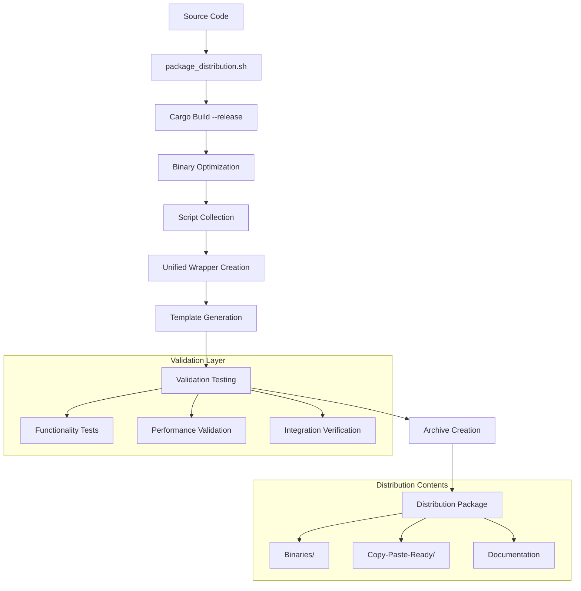

# Technical Insight: Automated Distribution Architecture

## Overview
**ID:** TI-021  
**Title:** Automated Distribution Architecture  
**Category:** Distribution & Packaging  
**Source:** DTNote01.md chunks 161-180 (lines 47981-54000)

## Description
Complete packaging and distribution system for developer tools achieving zero-dependency deployment through automated build pipelines, unified interfaces, and copy-paste integration templates.

## Architecture Design

### Core Distribution Pipeline


### Distribution Structure
```
distribution/
├── binaries/
│   ├── parseltongue              # Generic executable (4.3MB)
│   └── parseltongue_TIMESTAMP    # Timestamped version
├── copy-paste-ready/
│   ├── pt                        # Unified wrapper script
│   ├── onboard_codebase.sh      # Complete onboarding workflow
│   ├── feature_impact.sh        # Feature analysis automation
│   ├── debug_entity.sh          # Debug workflow scripts
│   ├── generate_llm_context.sh  # LLM context generation
│   └── *.md                     # LLM instruction templates
└── PACKAGE_MANIFEST.md          # Complete package details
```

## Technology Stack

### Build System
- **Rust Cargo:** Release optimization with minimal binary size
- **Cross-Compilation:** Multi-platform binary generation
- **Dependency Management:** Zero external runtime dependencies
- **Optimization Flags:** Performance and size optimization

### Automation Framework
- **Shell Scripting:** Cross-platform automation scripts
- **Git Integration:** Automated tagging and version management
- **Testing Pipeline:** Comprehensive validation before distribution
- **Archive Management:** Compressed distribution packages

### Packaging Components
- **Binary Timestamping:** Traceability and version identification
- **Unified Wrapper:** Single interface (`pt`) for all functionality
- **Template System:** Ready-to-use integration patterns
- **Documentation Generation:** Automated manifest and instructions

## Performance Requirements

### Build Performance
- **Build Time:** <2 minutes for complete distribution
- **Binary Size:** ~4.3MB optimized executable
- **Compression Ratio:** Efficient archive packaging
- **Validation Time:** <30 seconds for complete testing

### Runtime Performance
- **Startup Time:** <100ms for unified wrapper
- **Memory Footprint:** Minimal overhead for wrapper scripts
- **Execution Speed:** Native performance for core binary
- **Integration Time:** <30 seconds copy-paste deployment

### Scalability Metrics
- **Multi-Platform:** Consistent behavior across operating systems
- **Large Codebases:** Validated on 1000+ file projects
- **Concurrent Usage:** Thread-safe operation in team environments
- **Resource Efficiency:** Minimal system resource consumption

## Integration Patterns

### Zero-Dependency Deployment
```bash
# Single command complete setup
./scripts/package_distribution.sh

# Result: Complete distribution ready
./distribution/
```

### Copy-Paste Integration
```bash
# Immediate deployment to any project
cp distribution/binaries/parseltongue your_project/
cp -r distribution/copy-paste-ready/* your_project/
cd your_project
./pt onboard .
```

### Automated Release Pipeline
```bash
# Production release with validation
./scripts/release.sh v0.2.0

# Automated process:
# 1. Git state validation
# 2. Test execution
# 3. Distribution packaging
# 4. Release tagging
# 5. Archive generation
```

### Unified Interface Pattern
```bash
# Single command interface for all functionality
./pt onboard /path/to/codebase    # Complete onboarding
./pt debug EntityName             # Debug analysis
./pt feature-start EntityName     # Feature planning
./pt refactor-check EntityName    # Refactor assessment
```

## Security Considerations

### Binary Integrity
- **Checksums:** Automated validation of binary integrity
- **Timestamping:** Audit trail for version tracking
- **Reproducible Builds:** Consistent binary generation
- **Minimal Attack Surface:** Zero external dependencies

### Distribution Security
- **Validation Pipeline:** Comprehensive testing before release
- **Secure Packaging:** Integrity verification for archives
- **Version Control:** Git-based audit trail
- **Access Control:** Controlled release process

### Runtime Security
- **Memory Safety:** Rust ownership model for core binary
- **Input Validation:** Secure handling of user inputs
- **Privilege Isolation:** Minimal system permissions required
- **Error Handling:** Graceful failure without information leakage

## Implementation Details

### Automated Packaging Process
1. **Source Validation:** Git state and test execution
2. **Binary Building:** Optimized release compilation
3. **Script Collection:** Gathering all workflow scripts
4. **Wrapper Generation:** Unified interface creation
5. **Template Preparation:** LLM and integration templates
6. **Validation Testing:** Comprehensive functionality verification
7. **Archive Creation:** Compressed distribution package
8. **Manifest Generation:** Complete package documentation

### Quality Assurance
- **Automated Testing:** Functionality verification at each step
- **Performance Validation:** Benchmark execution and verification
- **Integration Testing:** End-to-end workflow validation
- **Cross-Platform Testing:** Multi-environment compatibility

### Continuous Integration
- **Build Automation:** Triggered by code changes
- **Test Execution:** Comprehensive test suite validation
- **Performance Monitoring:** Regression detection and alerting
- **Release Automation:** Streamlined production deployment

## Linked User Journeys
- **UJ-025:** Zero-Dependency Tool Distribution
- **UJ-027:** Orchestrated Developer Onboarding

## Related Technical Insights
- **TI-022:** Performance Contract Validation System
- **TI-023:** Discovery-First Architecture Implementation

## Competitive Advantages
1. **Zero Dependencies:** Eliminates environment-specific installation issues
2. **Automated Pipeline:** Reduces manual distribution overhead and errors
3. **Unified Interface:** Consistent experience across all functionality
4. **Copy-Paste Ready:** Immediate productivity without complex setup
5. **Validated Quality:** Comprehensive testing ensures reliable distribution

## Future Enhancements
- **Multi-Platform Binaries:** Native compilation for all major platforms
- **Plugin Architecture:** Extensible distribution with community plugins
- **Cloud Distribution:** Automated deployment to cloud repositories
- **Telemetry Integration:** Usage analytics and performance monitoring