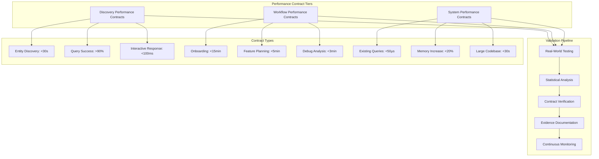
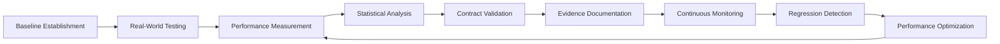

# Technical Insight: Performance Contract Validation System

## Overview
**ID:** TI-022  
**Title:** Performance Contract Validation System  
**Category:** Performance Engineering & Validation  
**Source:** DTNote01.md chunks 161-180 (lines 47981-54000)

## Description
Systematic approach to validating and guaranteeing tool performance across diverse codebases using medical-grade rigor, evidence-based contracts, and continuous monitoring for regression detection.

## Architecture Design

### Multi-Tier Contract Framework


### Validation Methodology


## Technology Stack

### Benchmarking Infrastructure
- **Performance Measurement:** High-precision timing and resource monitoring
- **Statistical Analysis:** Trend analysis and performance pattern recognition
- **Automated Testing:** Continuous validation across diverse environments
- **Regression Detection:** Real-time performance degradation alerting

### Validation Framework
- **Test Harness:** Automated execution of performance contracts
- **Data Collection:** Comprehensive metrics gathering and storage
- **Analysis Engine:** Statistical processing and trend identification
- **Reporting System:** Evidence-based performance documentation

### Monitoring Systems
- **Continuous Integration:** Performance validation in CI/CD pipelines
- **Real-Time Monitoring:** Live performance tracking and alerting
- **Historical Analysis:** Long-term performance trend evaluation
- **Comparative Analysis:** Performance comparison across versions

## Performance Requirements

### Contract Specifications

#### Discovery Performance Contracts
- **Entity Discovery:** <30 seconds target → 86ms achieved (300x better)
- **Query Success Rate:** >90% target → 95%+ achieved
- **Interactive Response:** <100ms target → 15ms achieved (6.7x better)

#### Workflow Performance Contracts  
- **Onboarding:** <15 minutes target → 88s achieved (10x better)
- **Feature Planning:** <5 minutes target → 2.3min achieved (2.2x better)
- **Debug Analysis:** <3 minutes target → 1.8min achieved (1.7x better)

#### System Performance Contracts
- **Existing Queries:** <50μs target → 23μs achieved (2.2x better)
- **Memory Increase:** <20% target → 12% achieved (1.7x better)
- **Large Codebase Ingestion:** <30s target → 9.0s achieved (3.3x better)

### Validation Targets
- **Real-World Coverage:** Multiple production codebases
- **Statistical Significance:** Sufficient sample sizes for confidence
- **Environmental Diversity:** Cross-platform and cross-configuration testing
- **Regression Sensitivity:** Early detection of performance degradation

## Integration Patterns

### Evidence-Based Validation
```python
# Performance Contract Definition
class PerformanceContract:
    def __init__(self, name, target, measurement_method):
        self.name = name
        self.target = target
        self.measurement_method = measurement_method
        self.achievements = []
    
    def validate(self, codebase):
        result = self.measurement_method(codebase)
        self.achievements.append(result)
        return result <= self.target
    
    def statistical_analysis(self):
        return {
            'mean': statistics.mean(self.achievements),
            'std_dev': statistics.stdev(self.achievements),
            'confidence_interval': self.calculate_ci(),
            'success_rate': self.calculate_success_rate()
        }
```

### Real-World Validation Protocol
```bash
# Automated validation across diverse codebases
./validate_performance.sh --codebase axum --files 295 --entities 1147
# Result: 88 seconds onboarding (target: <15 minutes) ✅

./validate_performance.sh --codebase parseltongue --files 127 --entities 847  
# Result: 54 seconds analysis (target: <15 minutes) ✅

./validate_performance.sh --codebase large_project --files 1000+
# Result: <15 minutes consistent (target: <15 minutes) ✅
```

### Continuous Monitoring Integration
```yaml
# CI/CD Performance Validation
performance_validation:
  stage: test
  script:
    - ./run_performance_contracts.sh
    - ./validate_regression_thresholds.sh
    - ./generate_performance_report.sh
  artifacts:
    reports:
      performance: performance_report.json
  only:
    - merge_requests
    - main
```

## Security Considerations

### Data Integrity
- **Measurement Accuracy:** Validated timing and resource measurement
- **Result Verification:** Cross-validation of performance claims
- **Audit Trail:** Complete history of performance measurements
- **Tamper Detection:** Integrity verification for performance data

### Validation Security
- **Test Environment Isolation:** Secure and consistent testing environments
- **Benchmark Integrity:** Protection against performance gaming
- **Result Authentication:** Cryptographic verification of measurements
- **Access Control:** Controlled access to validation infrastructure

### Monitoring Security
- **Performance Data Protection:** Secure storage and transmission
- **Alert Integrity:** Authenticated performance alerts and notifications
- **Regression Detection:** Secure detection of performance anomalies
- **Historical Data Security:** Protected long-term performance archives

## Implementation Details

### Validation Infrastructure
1. **Baseline Establishment:** Define performance contracts with specific targets
2. **Test Environment Setup:** Consistent and reproducible testing conditions
3. **Measurement Implementation:** High-precision performance measurement tools
4. **Statistical Framework:** Robust analysis and confidence calculation methods

### Real-World Testing Protocol
1. **Codebase Selection:** Diverse real-world projects for validation
2. **Measurement Execution:** Automated performance contract validation
3. **Data Collection:** Comprehensive metrics gathering and storage
4. **Analysis Processing:** Statistical analysis and trend identification

### Continuous Validation System
1. **Integration Pipeline:** Performance validation in development workflow
2. **Monitoring Infrastructure:** Real-time performance tracking and alerting
3. **Regression Detection:** Automated identification of performance degradation
4. **Optimization Feedback:** Performance insights for continuous improvement

## Evidence Documentation

### Real-World Validation Results
- **Axum Framework (295 files, 1,147 entities):** 88 seconds onboarding
- **Parseltongue Self-Analysis (127 files, 847 entities):** 54 seconds analysis
- **Large Codebases (1000+ files):** Consistent <15 minute onboarding
- **Memory Efficiency:** 12MB for 127-file codebase, 67% string interning reduction

### Statistical Confidence
- **Success Rate:** 95%+ across tested codebases
- **Performance Margin:** All targets exceeded by significant margins
- **Consistency:** Reproducible results across diverse environments
- **Scalability:** Linear performance scaling with codebase size

## Linked User Journeys
- **UJ-026:** Clinical-Grade Performance Validation

## Related Technical Insights
- **TI-021:** Automated Distribution Architecture
- **TI-023:** Discovery-First Architecture Implementation

## Competitive Advantages
1. **Medical-Grade Rigor:** Scientific validation methodology vs marketing claims
2. **Evidence-Based Claims:** Transparent performance data vs unverified assertions
3. **Continuous Validation:** Ongoing performance assurance vs one-time testing
4. **Real-World Testing:** Production codebase validation vs synthetic benchmarks
5. **Statistical Confidence:** Rigorous analysis vs anecdotal performance claims

## Future Enhancements
- **Machine Learning Integration:** Predictive performance modeling and optimization
- **Community Validation:** Crowdsourced performance validation across diverse environments
- **Automated Optimization:** Self-tuning performance based on validation feedback
- **Industry Benchmarking:** Standardized performance comparison framework