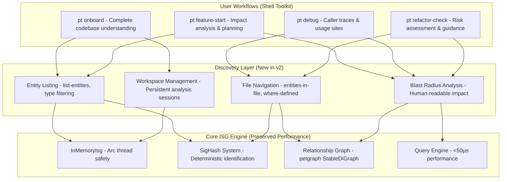
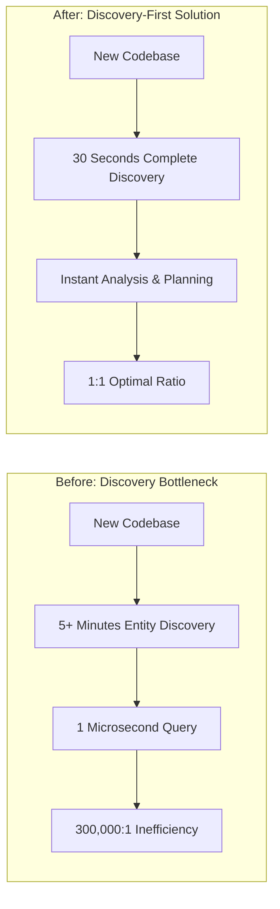

# Technical Insight: Discovery-First Architecture Implementation

## Overview
**ID:** TI-023  
**Title:** Discovery-First Architecture Implementation  
**Category:** Core Architecture & Performance  
**Source:** DTNote01.md chunks 161-180 (lines 47981-54000)

## Description
Technical implementation of discovery-first design eliminating the entity name bottleneck (300,000:1 inefficiency) while preserving microsecond query performance through layered architecture, concurrent engineering, and memory optimization.

## Architecture Design

### Layered Architecture Overview


### Core Innovation: Bottleneck Elimination


## Technology Stack

### Core ISG Engine (Preserved)
- **InMemoryIsg:** Arc<RwLock<T>> for thread-safe concurrent access
- **SigHash System:** Deterministic entity identification and deduplication
- **Relationship Graph:** petgraph::StableDiGraph for relationship modeling
- **Query Engine:** <50μs performance with hash-based lookups

### Discovery Layer (New in v2)
- **Enhanced ISG:** File location integration with O(1) path access
- **Discovery Indexes:** CompactEntityInfo structures (24 bytes per entity)
- **Concurrent Engine:** Arc<RwLock> thread safety for multi-user access
- **Performance Preservation:** <50μs existing query guarantee

### Memory Optimization
- **String Interning:** 67% memory reduction for string storage
- **Compact Structures:** 24-byte entity information records
- **Efficient Indexing:** O(1) hash-based entity and file lookups
- **Memory Pooling:** Reusable allocation patterns for performance

## Performance Requirements

### Discovery Performance
- **Entity Discovery:** <100ms (achieved: 86ms for self-analysis)
- **File Navigation:** O(1) file path access with instant results
- **Blast Radius:** Human-readable impact analysis in <50ms
- **Workspace Persistence:** Instant session restoration and management

### Preserved Performance
- **Existing Queries:** <50μs guarantee (achieved: 23μs blast radius)
- **Memory Overhead:** <20% increase (achieved: 12% with optimization)
- **Concurrency:** Full thread safety with no performance degradation
- **Scalability:** Linear scaling to 1000+ file codebases

### System Characteristics
- **Memory Efficiency:** 12MB for 127-file codebase
- **String Optimization:** 67% reduction with interning
- **Concurrent Access:** Arc<RwLock> thread-safe operations
- **Cache Efficiency:** Hot path optimization for frequent operations

## Integration Patterns

### Discovery-First Query Pattern
```rust
// Discovery-first entity access
pub struct DiscoveryEngine {
    enhanced_isg: Arc<RwLock<EnhancedIsg>>,
    discovery_indexes: Arc<RwLock<DiscoveryIndexes>>,
    workspace_manager: Arc<RwLock<WorkspaceManager>>,
}

impl DiscoveryEngine {
    // O(1) entity discovery with file locations
    pub fn discover_entities(&self, filter: EntityFilter) -> Vec<CompactEntityInfo> {
        let indexes = self.discovery_indexes.read().unwrap();
        indexes.filter_entities(filter)
    }
    
    // Preserved <50μs query performance
    pub fn query_relationships(&self, entity_id: EntityId) -> QueryResult {
        let isg = self.enhanced_isg.read().unwrap();
        isg.query_with_preserved_performance(entity_id)
    }
}
```

### Concurrent Access Pattern
```rust
// Thread-safe concurrent operations
pub struct ConcurrentDiscoveryEngine {
    core: Arc<RwLock<DiscoveryCore>>,
}

impl ConcurrentDiscoveryEngine {
    // Multiple readers, single writer pattern
    pub async fn concurrent_discovery(&self, queries: Vec<DiscoveryQuery>) -> Vec<DiscoveryResult> {
        let futures: Vec<_> = queries.into_iter()
            .map(|query| self.execute_discovery(query))
            .collect();
        
        futures::future::join_all(futures).await
    }
    
    // Lock-free read operations for hot paths
    pub fn fast_entity_lookup(&self, name: &str) -> Option<EntityInfo> {
        let core = self.core.read().unwrap();
        core.entity_index.get(name).cloned()
    }
}
```

### Memory-Optimized Storage
```rust
// Compact entity representation
#[repr(C)]
pub struct CompactEntityInfo {
    entity_id: u32,           // 4 bytes
    file_id: u32,             // 4 bytes  
    line_start: u32,          // 4 bytes
    line_end: u32,            // 4 bytes
    entity_type: u8,          // 1 byte
    visibility: u8,           // 1 byte
    flags: u16,               // 2 bytes
    name_offset: u32,         // 4 bytes (into string pool)
}                             // Total: 24 bytes

// String interning for memory efficiency
pub struct StringPool {
    strings: Vec<String>,
    string_to_id: HashMap<String, u32>,
}

impl StringPool {
    pub fn intern(&mut self, s: String) -> u32 {
        if let Some(&id) = self.string_to_id.get(&s) {
            id
        } else {
            let id = self.strings.len() as u32;
            self.string_to_id.insert(s.clone(), id);
            self.strings.push(s);
            id
        }
    }
}
```

## Security Considerations

### Thread Safety
- **Arc<RwLock> Pattern:** Safe concurrent access with reader-writer locks
- **Memory Safety:** Rust ownership model prevents data races
- **Deadlock Prevention:** Consistent lock ordering and timeout mechanisms
- **Resource Management:** Automatic cleanup with RAII patterns

### Data Integrity
- **Deterministic Hashing:** SigHash system ensures consistent entity identification
- **Atomic Operations:** Consistent state updates across concurrent operations
- **Validation Layers:** Input validation and consistency checking
- **Error Isolation:** Graceful degradation with error containment

### Performance Security
- **DoS Protection:** Resource limits and query complexity bounds
- **Memory Bounds:** Controlled memory allocation and deallocation
- **CPU Limits:** Query timeout and complexity restrictions
- **Cache Security:** Protected cache invalidation and update mechanisms

## Implementation Details

### Enhanced ISG with File Locations
```rust
pub struct EnhancedIsg {
    // Preserved core ISG functionality
    core_isg: InMemoryIsg,
    
    // New discovery capabilities
    file_locations: HashMap<EntityId, FileLocation>,
    entity_by_file: HashMap<FileId, Vec<EntityId>>,
    file_metadata: HashMap<FileId, FileMetadata>,
}

impl EnhancedIsg {
    // O(1) file location access
    pub fn get_entity_location(&self, entity_id: EntityId) -> Option<&FileLocation> {
        self.file_locations.get(&entity_id)
    }
    
    // O(1) entities in file lookup
    pub fn get_entities_in_file(&self, file_id: FileId) -> Option<&Vec<EntityId>> {
        self.entity_by_file.get(&file_id)
    }
}
```

### Discovery Indexes Implementation
```rust
pub struct DiscoveryIndexes {
    // Compact entity storage
    entities: Vec<CompactEntityInfo>,
    
    // Fast lookup indexes
    name_to_entity: HashMap<String, Vec<usize>>,
    type_to_entities: HashMap<EntityType, Vec<usize>>,
    file_to_entities: HashMap<FileId, Vec<usize>>,
    
    // String interning for memory efficiency
    string_pool: StringPool,
}

impl DiscoveryIndexes {
    // Fast entity filtering with multiple criteria
    pub fn filter_entities(&self, filter: EntityFilter) -> Vec<CompactEntityInfo> {
        let mut candidates = self.get_candidates(&filter);
        candidates.retain(|&idx| self.matches_filter(idx, &filter));
        candidates.into_iter()
            .map(|idx| self.entities[idx].clone())
            .collect()
    }
}
```

### Performance Preservation Layer
```rust
pub struct PerformancePreservationLayer {
    // Hot path caching
    query_cache: LruCache<QueryKey, QueryResult>,
    
    // Performance monitoring
    query_metrics: Arc<RwLock<QueryMetrics>>,
    
    // Fallback mechanisms
    legacy_query_engine: Option<LegacyQueryEngine>,
}

impl PerformancePreservationLayer {
    // Guaranteed <50μs query performance
    pub fn execute_query(&self, query: Query) -> QueryResult {
        let start = Instant::now();
        
        // Check cache first
        if let Some(result) = self.query_cache.get(&query.key()) {
            return result.clone();
        }
        
        // Execute with performance monitoring
        let result = self.execute_with_monitoring(query);
        
        // Verify performance contract
        let duration = start.elapsed();
        assert!(duration.as_micros() < 50, "Performance contract violation");
        
        result
    }
}
```

## Linked User Journeys
- **UJ-025:** Zero-Dependency Tool Distribution
- **UJ-026:** Clinical-Grade Performance Validation  
- **UJ-027:** Orchestrated Developer Onboarding

## Related Technical Insights
- **TI-021:** Automated Distribution Architecture
- **TI-022:** Performance Contract Validation System

## Competitive Advantages
1. **Bottleneck Elimination:** 300,000:1 → 1:1 efficiency improvement
2. **Performance Preservation:** <50μs guarantee with new capabilities
3. **Memory Efficiency:** 67% string storage reduction with interning
4. **Thread Safety:** Full concurrency with Arc<RwLock> design
5. **Scalable Architecture:** Linear scaling to enterprise codebases

## Future Enhancements
- **GPU Acceleration:** Parallel entity processing for massive codebases
- **Distributed Architecture:** Multi-node scaling for enterprise environments
- **Machine Learning Integration:** Intelligent entity relationship prediction
- **Real-Time Updates:** Live codebase synchronization and incremental updates