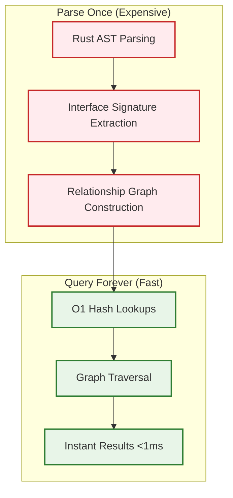

# TI-024: High-Performance Graph Query Architecture

## Technical Insight Overview

**Insight Name**: High-Performance Graph Query Architecture
**Domain**: Performance Engineering & Graph Algorithms
**Implementation Priority**: Critical
**Complexity**: High

## Description

Parseltongue achieves sub-millisecond query performance through a carefully designed two-phase architecture that separates expensive parsing operations from fast query execution. The "Parse Once, Query Forever" approach enables interactive architectural exploration by front-loading computational costs during ingestion and optimizing for query-time performance.

## Architecture Design

### Two-Phase Architecture Pattern



### Core Components

#### 1. AST Parsing Layer (syn crate)
- **Purpose**: Convert Rust source code into structured Abstract Syntax Tree
- **Technology**: syn crate for robust, production-grade parsing
- **Performance**: One-time cost during ingestion, handles complex Rust syntax
- **Output**: Structured representation of all code entities and relationships

#### 2. Interface Signature Extraction
- **Purpose**: Extract semantic signatures from AST nodes (functions, structs, traits, impls)
- **Process**: Normalize signatures, resolve types, identify relationships
- **Optimization**: Focus on interface-level information, ignore implementation details
- **Output**: Canonical interface signatures for graph node creation

#### 3. Relationship Graph Construction (petgraph)
- **Purpose**: Build efficient graph representation of code relationships
- **Technology**: petgraph crate for optimized graph operations
- **Structure**: Nodes (entities) + Edges (relationships) with typed connections
- **Indexing**: Multiple hash-based indexes for different query patterns

#### 4. Query Execution Engine
- **Hash Lookups**: FxHashMap for O(1) entity resolution by name/signature
- **Graph Traversal**: Efficient algorithms for relationship queries (what-implements, blast-radius)
- **Concurrency**: parking_lot::RwLock for thread-safe read-heavy access patterns
- **Caching**: In-memory result caching for repeated queries

## Technology Stack Rationale

### Rust 100% Implementation
- **Memory Safety**: Eliminates segfaults and memory leaks in long-running daemon processes
- **Zero-Cost Abstractions**: High-level code without runtime performance penalties
- **Concurrency**: Safe parallelism through ownership system and type safety
- **Performance**: Compiled native code with aggressive optimizations

### syn Crate for AST Parsing
- **Robustness**: Production-grade parser used by proc-macro ecosystem
- **Completeness**: Handles full Rust syntax including complex features
- **Maintenance**: Actively maintained, tracks Rust language evolution
- **Integration**: Seamless integration with Rust toolchain and ecosystem

### petgraph for Graph Operations
- **Efficiency**: Optimized graph algorithms and data structures
- **Flexibility**: Supports directed graphs with typed nodes and edges
- **Memory Layout**: Efficient memory representation for large graphs
- **Algorithm Library**: Built-in traversal algorithms (DFS, BFS, shortest path)

### FxHashMap for O(1) Lookups
- **Performance**: Faster than standard HashMap for string keys
- **Determinism**: Consistent performance characteristics
- **Memory Efficiency**: Lower memory overhead than alternatives
- **Integration**: Drop-in replacement for std::HashMap

### parking_lot::RwLock for Concurrency
- **Performance**: Faster than std::sync::RwLock
- **Fairness**: Better handling of reader/writer contention
- **Features**: Upgradeable locks, timeout support
- **Compatibility**: API-compatible replacement for standard library

## Performance Requirements & Validation

### Query Performance Contracts
- **Simple Queries**: <500μs (entity lookup, direct relationships)
- **Complex Queries**: <1ms (blast-radius, transitive dependencies)
- **File Updates**: <12ms (incremental graph updates)
- **Memory Usage**: <25MB @ 100K LOC (efficient representation)

### Performance Testing Strategy
```rust
// Example performance validation
#[test]
fn validate_query_performance() {
    let graph = build_test_graph(100_000); // 100K LOC equivalent
    
    let start = Instant::now();
    let result = graph.what_implements("Clone");
    let duration = start.elapsed();
    
    assert!(duration < Duration::from_micros(500));
    assert!(result.len() > 0);
}
```

### Scalability Characteristics
- **Linear Ingestion**: O(n) parsing time with codebase size
- **Constant Query Time**: O(1) for hash lookups, O(k) for k-hop traversals
- **Memory Efficiency**: Compact graph representation, shared string interning
- **Incremental Updates**: Only reparse changed files, update affected relationships

## Integration Patterns

### CLI Integration
```bash
# Fast architectural queries
parseltongue query what-implements Trait   # <1ms response
parseltongue query blast-radius Function   # <1ms impact analysis
parseltongue query find-cycles Service     # <1ms cycle detection
```

### Daemon Mode Integration
```bash
# Real-time monitoring with <12ms updates
parseltongue daemon --watch src/
# Maintains hot graph in memory for instant queries
```

### LLM Context Generation
```bash
# Zero-latency context for AI assistants
parseltongue generate-context Entity --format json
# Factual, deterministic data eliminates hallucinations
```

## Security Considerations

### Memory Safety
- **Rust Guarantees**: No buffer overflows, use-after-free, or data races
- **Input Validation**: Robust parsing handles malformed or malicious code
- **Resource Limits**: Bounded memory usage prevents DoS attacks

### Concurrency Safety
- **Thread Safety**: RwLock ensures safe concurrent access to graph data
- **Deadlock Prevention**: Consistent lock ordering, timeout mechanisms
- **Data Integrity**: Atomic updates maintain graph consistency

## Linked User Journeys

- **UJ-028**: Zero-Friction Architectural Onboarding (instant architecture understanding)
- **UJ-015**: GPU-Accelerated Codebase Visualization (high-performance graph rendering)
- **UJ-016**: Performance-Aware Development Workflow (sub-millisecond feedback loops)
- **UJ-019**: CLI Workflow Optimization (efficient command-line interactions)

## Implementation Roadmap

### Phase 1: Core Engine (0-2 months)
- Implement basic two-phase architecture
- Validate performance contracts on test codebases
- Establish benchmarking and regression testing

### Phase 2: Optimization (2-4 months)  
- Advanced caching strategies
- Memory layout optimizations
- Concurrent query processing

### Phase 3: Scaling (4-6 months)
- Persistent storage integration (RocksDB)
- Distributed graph processing
- Enterprise-scale validation

## Success Metrics

### Performance Metrics
- Query latency: <1ms for 95th percentile
- Memory efficiency: <25MB per 100K LOC
- Update latency: <12ms for file changes
- Throughput: >1000 queries/second

### Quality Metrics
- Relationship accuracy: >95% precision/recall
- Parse success rate: >99% on real-world Rust code
- Crash rate: <0.01% (high reliability)
- Memory leak rate: 0% (Rust safety guarantees)

This technical insight establishes the foundational architecture that enables parseltongue's unique performance characteristics and differentiates it from existing code analysis tools through deterministic, sub-millisecond architectural intelligence.