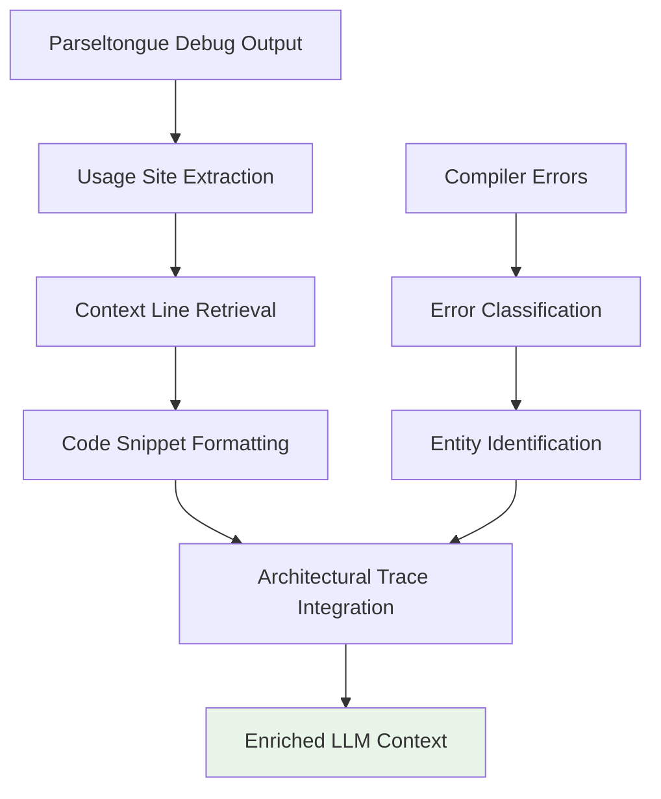

# Technical Insight: LLM Context Enrichment Pipeline

**ID**: TI-032
**Source**: DTNotes03.md - Hyper-Contextual Snippet Generator & Borrow Checker Whisperer
**Description**: Pipeline architecture for enriching LLM context with architectural understanding and real usage patterns

## Architecture Overview

The LLM Context Enrichment Pipeline transforms raw architectural data into comprehensive, LLM-friendly context that eliminates hallucinations by providing deterministic structural information:



## Technology Stack

**Core Processing Components**:
- **awk**: Reliable parsing of Parseltongue output formats
- **ripgrep**: High-performance context extraction with line numbers
- **jq**: JSON processing for structured compiler output
- **Markdown Generation**: LLM-friendly formatting with syntax highlighting

**Data Flow Architecture**:
```bash
# Context enrichment pipeline
./pt debug EntityName → usage_sites.txt
awk parsing → file_path|line_number pairs
ripgrep context extraction → code_snippets_with_context
markdown formatting → enriched_llm_context.md
```

## Performance Requirements

- **Context Generation Speed**: <2 seconds for typical entities
- **Memory Efficiency**: Process large files without loading entirely into memory
- **Scalability**: Handle entities with 100+ usage sites
- **Context Quality**: Include 3-5 lines of surrounding context per usage

## Integration Specifications

**Input Formats**:
```bash
# Parseltongue usage_sites.txt format
File: src/main.rs Line: 42
File: src/lib.rs Line: 156
File: tests/integration.rs Line: 89
```

**Output Format**:
```markdown
## Enriched Contextual Usage for EntityName

### Usage at src/main.rs:42
```rust
40: fn initialize_system() -> Result<System, Error> {
41:     let config = load_configuration()?;
42:     let entity = EntityName::new(config);  // ← Target usage
43:     entity.validate()?;
44:     Ok(System::new(entity))
45: }
```

### Usage at src/lib.rs:156
```rust
154: impl Display for EntityName {
155:     fn fmt(&self, f: &mut Formatter) -> fmt::Result {
156:         write!(f, "EntityName({})", self.inner)  // ← Target usage
157:     }
158: }
```
```

## Context Quality Framework

**Context Selection Criteria**:
- **Relevance**: Include actual usage patterns, not just definitions
- **Completeness**: Show error handling, argument passing, return value usage
- **Architectural Significance**: Highlight relationships and dependencies
- **Code Quality**: Include both typical and edge-case usage patterns

**Context Enrichment Levels**:
1. **Basic**: Entity usage with 3 lines of context
2. **Enhanced**: Include function signatures and error handling
3. **Comprehensive**: Add architectural relationships and impact analysis
4. **Expert**: Include performance characteristics and design rationale

## Error Handling and Fallbacks

```bash
# Robust context extraction with fallbacks
extract_context() {
    local file_path="$1"
    local line_num="$2"
    local context_lines="${3:-3}"
    
    if [ ! -f "$file_path" ]; then
        echo "⚠️ File not found: $file_path"
        return 1
    fi
    
    # Primary: Use ripgrep for performance
    if command -v rg &> /dev/null; then
        rg --context "$context_lines" --line-number "^$line_num:" "$file_path"
    # Fallback: Use standard grep
    elif command -v grep &> /dev/null; then
        grep -A"$context_lines" -B"$context_lines" -n "^$line_num:" "$file_path"
    # Last resort: Use sed/awk
    else
        awk -v target="$line_num" -v ctx="$context_lines" \
            'NR >= target-ctx && NR <= target+ctx {print NR ":" $0}' "$file_path"
    fi
}
```

## LLM Integration Patterns

**Context Injection Strategies**:
```markdown
# Strategy 1: Comprehensive Context Block
## Architectural Context for [Entity]
[Full architectural trace]

## Usage Patterns
[Real usage examples with context]

## Your Task
[Specific request with architectural constraints]
```

**Prompt Engineering Integration**:
- **System Prompt**: Include architectural principles and constraints
- **Context Window**: Optimize for token efficiency while maintaining completeness
- **Instruction Clarity**: Specify architectural requirements explicitly
- **Validation Hooks**: Include checkpoints for architectural compliance

## Security and Privacy Considerations

- **Code Sanitization**: Remove sensitive information from context
- **Path Normalization**: Avoid exposing internal directory structures
- **Content Filtering**: Exclude configuration files and secrets
- **Access Control**: Respect file permissions and access restrictions

## Performance Optimization

**Caching Strategy**:
```bash
# Context caching for repeated queries
CACHE_DIR="$HOME/.parseltongue/context_cache"
CACHE_KEY=$(echo "$ENTITY$FILES_HASH" | sha256sum | cut -d' ' -f1)
CACHE_FILE="$CACHE_DIR/$CACHE_KEY.md"

if [ -f "$CACHE_FILE" ] && [ "$CACHE_FILE" -nt "$USAGE_SITES_FILE" ]; then
    cat "$CACHE_FILE"
else
    generate_context > "$CACHE_FILE"
    cat "$CACHE_FILE"
fi
```

**Parallel Processing**:
- Process multiple usage sites concurrently
- Batch file operations for efficiency
- Stream processing for large context generation

## Linked User Journeys
- UJ-035: Architectural Context-Enhanced LLM Assistance
- UJ-038: Compiler Error Resolution with Architectural Context
- UJ-033: Zero Hallucination LLM Context Generation (DTNote01.md)

## Implementation Priority
**Critical** - Foundation for zero-hallucination LLM integration

## Future Enhancements
- Semantic similarity analysis for context relevance
- Machine learning-based context quality scoring
- Integration with vector databases for context retrieval
- Real-time context updates during development