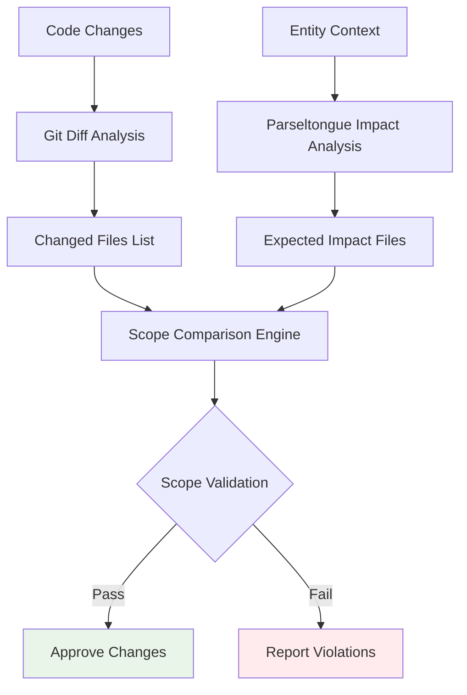

# Technical Insight: Architectural Scope Validation System

**ID**: TI-033
**Source**: DTNotes03.md - Scope Cop Script
**Description**: System for validating that code changes align with expected architectural impact boundaries

## Architecture Overview

The Architectural Scope Validation System provides automated guardrails that prevent architectural drift by comparing actual changes against predicted architectural impact:



## Technology Stack

**Core Validation Components**:
- **Git**: Change detection and file tracking
- **Parseltongue**: Architectural impact analysis
- **comm**: Set comparison for file lists
- **Bash**: Orchestration and control flow
- **CI/CD Integration**: Automated validation gates

**Validation Pipeline**:
```bash
# Core validation workflow
git diff --name-only HEAD → actual_changes.txt
./pt impact EntityName --format=files_only → expected_impact.txt
comm -13 expected_impact.txt actual_changes.txt → violations.txt
```

## Performance Requirements

- **Validation Speed**: <5 seconds for typical change sets
- **Scalability**: Handle repositories with 10,000+ files
- **Memory Efficiency**: Process large file lists without memory issues
- **CI/CD Integration**: Minimal overhead in automated pipelines

## Integration Specifications

**Git Integration**:
```bash
# Change detection patterns
git diff --name-only HEAD                    # Working directory changes
git diff --name-only HEAD~1..HEAD           # Last commit changes
git diff --name-only origin/main..HEAD      # Branch changes
git diff --name-only --cached               # Staged changes
```

**Parseltongue Integration Requirements**:
- Impact analysis with `--format=files_only` output flag
- Reliable entity identification from change context
- Consistent file path formatting (relative to repository root)
- Performance optimization for large impact analysis

**CI/CD Integration Patterns**:
```yaml
# GitHub Actions integration
- name: Architectural Scope Validation
  run: |
    # Extract entity context from commit message or PR description
    ENTITY=$(extract_entity_from_context)
    ./pt-scope-cop.sh "$ENTITY"
  continue-on-error: false
```

## Validation Logic Framework

**Core Validation Algorithm**:
```bash
validate_architectural_scope() {
    local entity="$1"
    local comparison_base="${2:-HEAD}"
    
    # 1. Generate expected impact scope
    local expected_files=$(./pt impact "$entity" --format=files_only | sort -u)
    
    # 2. Get actual changed files
    local actual_files=$(git diff --name-only "$comparison_base" | sort -u)
    
    # 3. Find violations (files changed but not in expected scope)
    local violations=$(comm -13 <(echo "$expected_files") <(echo "$actual_files"))
    
    # 4. Report results
    if [ -z "$violations" ]; then
        echo "✅ SUCCESS: All changes within expected architectural scope"
        return 0
    else
        echo "❌ VIOLATION: Changes detected outside expected scope:"
        echo "$violations"
        return 1
    fi
}
```

**Advanced Validation Modes**:
- **Strict Mode**: No changes allowed outside predicted scope
- **Advisory Mode**: Report violations but don't block changes
- **Whitelist Mode**: Allow specific files to be excluded from validation
- **Multi-Entity Mode**: Validate against multiple entity contexts

## Error Handling and Edge Cases

**Common Edge Cases**:
```bash
# Handle empty impact analysis
if [ -z "$expected_files" ]; then
    echo "⚠️ Warning: No expected impact found for entity '$entity'"
    echo "Proceeding with manual review required"
    exit 2  # Special exit code for manual review
fi

# Handle new files not in git history
if git diff --name-only --diff-filter=A HEAD | grep -q .; then
    echo "ℹ️ New files detected - additional validation may be required"
fi

# Handle deleted files
if git diff --name-only --diff-filter=D HEAD | grep -q .; then
    echo "ℹ️ File deletions detected - impact analysis may be incomplete"
fi
```

**Fallback Strategies**:
- Manual review triggers for ambiguous cases
- Configurable tolerance levels for scope violations
- Integration with code review systems for human oversight
- Logging and audit trails for validation decisions

## Configuration Framework

**Configuration File Structure**:
```bash
# .parseltongue-scope-config
VALIDATION_MODE="strict"           # strict|advisory|whitelist
WHITELIST_PATTERNS=(              # Files to exclude from validation
    "*.md"
    "docs/*"
    "tests/fixtures/*"
)
ENTITY_EXTRACTION_STRATEGY="commit_message"  # commit_message|pr_description|manual
TOLERANCE_THRESHOLD=0             # Number of allowed violations
```

**Runtime Configuration**:
```bash
# Environment variable overrides
export PT_SCOPE_MODE="advisory"
export PT_SCOPE_TOLERANCE="2"
export PT_SCOPE_WHITELIST="*.md,docs/*"
```

## Reporting and Feedback

**Violation Report Format**:
```
❌ ARCHITECTURAL SCOPE VIOLATION DETECTED

Entity Context: UserService
Expected Impact Scope: 12 files
Actual Changes: 15 files

Files Changed Outside Expected Scope:
  - src/unrelated_module.rs
  - lib/external_dependency.rs
  - config/database_settings.toml

Recommendation:
  1. Review if these changes are architecturally related
  2. Consider splitting the change into separate commits
  3. Update entity context if scope expansion is intentional

For manual override: git commit --no-verify
```

**Success Report Format**:
```
✅ ARCHITECTURAL SCOPE VALIDATION PASSED

Entity Context: UserService
Files Changed: 8
All changes within expected architectural scope

Changed Files:
  - src/user_service.rs
  - src/user_repository.rs
  - tests/user_service_tests.rs
  - src/user_models.rs
```

## Security Considerations

- **Input Validation**: Sanitize entity names and file paths
- **Command Injection Prevention**: Proper quoting and parameter handling
- **File System Access**: Validate file permissions and paths
- **CI/CD Security**: Secure handling of git credentials and repository access

## Linked User Journeys
- UJ-037: Architectural Guardrails for Change Validation
- UJ-010: Intelligent CI/CD Quality Gates (DTNote01.md)
- UJ-034: Blast Radius Guided Quality Assurance (DTNote01.md)

## Implementation Priority
**Critical** - Essential for maintaining architectural integrity in automated environments

## Future Enhancements
- Machine learning-based scope prediction refinement
- Integration with static analysis tools for enhanced validation
- Visual diff tools for architectural impact visualization
- Automated suggestion system for scope corrections