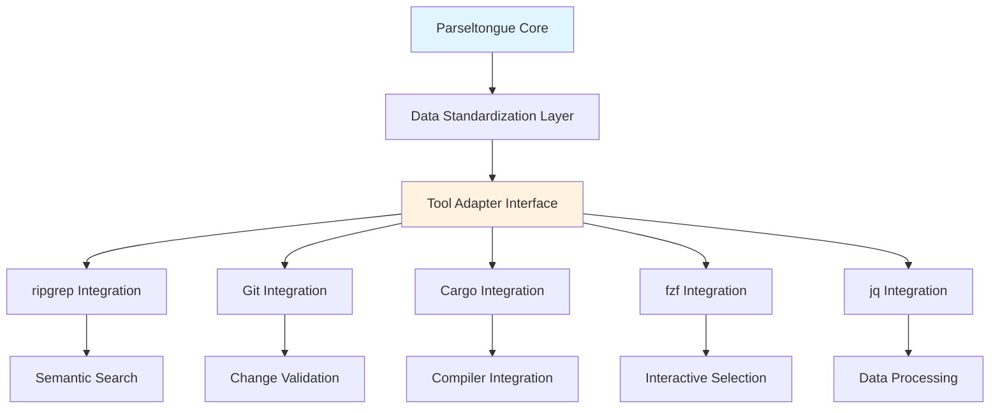

# Technical Insight: Multi-Tool Integration Framework

**ID**: TI-034
**Source**: DTNotes03.md - Multiple script integrations (ripgrep, git, awk, cargo, fzf)
**Description**: Framework for seamlessly integrating Parseltongue with existing command-line development tools

## Architecture Overview

The Multi-Tool Integration Framework creates a unified ecosystem where Parseltongue serves as the architectural backbone connecting disparate development tools through standardized interfaces and data flows:



## Technology Stack

**Integration Layer Components**:
- **Parseltongue**: Architectural analysis and entity management
- **ripgrep (rg)**: High-performance text search with context
- **Git**: Version control and change tracking
- **Cargo**: Rust toolchain and compiler integration
- **fzf**: Interactive fuzzy finding and selection
- **jq**: JSON processing and data transformation
- **awk**: Text processing and data extraction

**Standardization Interfaces**:
```bash
# Standardized output formats
--format=files_only     # File paths only, one per line
--format=json          # Structured JSON output
--format=tsv           # Tab-separated values
--format=markdown      # Human-readable markdown
```

## Performance Requirements

- **Tool Startup**: <100ms for interactive commands
- **Data Processing**: Handle 100MB+ output efficiently
- **Memory Usage**: Streaming processing for large datasets
- **Concurrent Operations**: Support parallel tool execution

## Integration Specifications

**Data Flow Patterns**:
```bash
# Pattern 1: Pipeline Integration
./pt command | tool --input-format=stdin

# Pattern 2: File-based Integration
./pt command --output=temp_file
tool --input=temp_file
rm temp_file

# Pattern 3: Variable-based Integration
RESULT=$(./pt command --format=json)
echo "$RESULT" | jq '.field' | tool --process
```

**Tool-Specific Integrations**:

### ripgrep Integration
```bash
# Semantic search within architectural scope
FILES=$(./pt impact EntityName --format=files_only)
echo "$FILES" | xargs rg --context=3 "pattern"

# Performance optimization
rg --files-from=<(./pt query scope --format=files_only) "pattern"
```

### Git Integration
```bash
# Architectural change validation
EXPECTED=$(./pt impact EntityName --format=files_only | sort)
ACTUAL=$(git diff --name-only HEAD | sort)
comm -13 <(echo "$EXPECTED") <(echo "$ACTUAL")

# Commit message enhancement
git log --oneline | while read commit; do
    ./pt analyze-commit "$commit"
done
```

### Cargo Integration
```bash
# Compiler error enrichment
cargo check --message-format=json | \
jq -r 'select(.reason=="compiler-message") | .message' | \
while read error; do
    ./pt enrich-error "$error"
done

# Test scope optimization
AFFECTED=$(./pt impact EntityName --format=files_only)
cargo test $(echo "$AFFECTED" | grep "_test.rs" | tr '\n' ' ')
```

### fzf Integration
```bash
# Interactive entity exploration
./pt list-entities | fzf \
  --preview './pt debug {1}' \
  --bind 'enter:execute(./pt where-defined {1} | xargs vim)' \
  --bind 'ctrl-i:execute(./pt impact {1})'
```

## Adapter Interface Design

**Generic Tool Adapter**:
```bash
# Tool adapter template
integrate_tool() {
    local tool_name="$1"
    local parseltongue_command="$2"
    local tool_args="$3"
    
    # Check tool availability
    if ! command -v "$tool_name" &> /dev/null; then
        echo "⚠️ $tool_name not available, using fallback"
        return 1
    fi
    
    # Execute integration
    case "$tool_name" in
        "rg"|"ripgrep")
            integrate_ripgrep "$parseltongue_command" "$tool_args"
            ;;
        "git")
            integrate_git "$parseltongue_command" "$tool_args"
            ;;
        "fzf")
            integrate_fzf "$parseltongue_command" "$tool_args"
            ;;
        *)
            echo "❌ Unknown tool: $tool_name"
            return 1
            ;;
    esac
}
```

**Configuration Management**:
```bash
# Tool configuration registry
declare -A TOOL_CONFIGS=(
    ["rg"]="--context=3 --line-number --color=always"
    ["fzf"]="--height=80% --layout=reverse --border"
    ["git"]="--no-pager"
    ["jq"]="--compact-output"
)

# User customization support
load_user_config() {
    local config_file="$HOME/.parseltongue/tool_config"
    [ -f "$config_file" ] && source "$config_file"
}
```

## Error Handling and Fallbacks

**Graceful Degradation Strategy**:
```bash
# Tool availability checking with fallbacks
check_and_execute() {
    local primary_tool="$1"
    local fallback_tool="$2"
    local command="$3"
    
    if command -v "$primary_tool" &> /dev/null; then
        $primary_tool $command
    elif command -v "$fallback_tool" &> /dev/null; then
        echo "ℹ️ Using fallback: $fallback_tool"
        $fallback_tool $command
    else
        echo "❌ Neither $primary_tool nor $fallback_tool available"
        return 1
    fi
}

# Example: ripgrep with grep fallback
search_with_fallback() {
    check_and_execute "rg" "grep" "--context=3 '$pattern' $files"
}
```

**Data Format Validation**:
```bash
# Validate Parseltongue output format
validate_output() {
    local output="$1"
    local expected_format="$2"
    
    case "$expected_format" in
        "files_only")
            # Validate each line is a valid file path
            echo "$output" | while read -r file; do
                [ -f "$file" ] || echo "⚠️ Invalid file: $file"
            done
            ;;
        "json")
            # Validate JSON structure
            echo "$output" | jq empty 2>/dev/null || {
                echo "❌ Invalid JSON output"
                return 1
            }
            ;;
    esac
}
```

## Performance Optimization

**Caching Strategy**:
```bash
# Tool integration caching
CACHE_DIR="$HOME/.parseltongue/integration_cache"
cache_key() {
    echo "$1$2" | sha256sum | cut -d' ' -f1
}

cached_integration() {
    local tool="$1"
    local command="$2"
    local cache_file="$CACHE_DIR/$(cache_key "$tool" "$command")"
    
    if [ -f "$cache_file" ] && [ "$cache_file" -nt "Cargo.toml" ]; then
        cat "$cache_file"
    else
        integrate_tool "$tool" "$command" | tee "$cache_file"
    fi
}
```

**Parallel Processing**:
```bash
# Concurrent tool execution
parallel_integration() {
    local -a pids=()
    
    # Start background processes
    integrate_tool "rg" "$command1" > result1.tmp &
    pids+=($!)
    
    integrate_tool "git" "$command2" > result2.tmp &
    pids+=($!)
    
    # Wait for completion
    for pid in "${pids[@]}"; do
        wait "$pid"
    done
    
    # Combine results
    combine_results result1.tmp result2.tmp
}
```

## Security Considerations

- **Command Injection Prevention**: Proper parameter sanitization
- **File Path Validation**: Prevent directory traversal attacks
- **Tool Version Verification**: Ensure compatible tool versions
- **Privilege Management**: Run with minimal required permissions

## Linked User Journeys
- UJ-035: Architectural Context-Enhanced LLM Assistance
- UJ-036: Semantic Code Search and Navigation
- UJ-037: Architectural Guardrails for Change Validation
- UJ-038: Compiler Error Resolution with Architectural Context
- UJ-039: Interactive Terminal-Based Code Exploration

## Implementation Priority
**High** - Foundation for ecosystem integration strategy

## Future Enhancements
- Plugin architecture for custom tool integrations
- Visual integration dashboard for tool orchestration
- Machine learning-based tool recommendation system
- Performance monitoring and optimization analytics