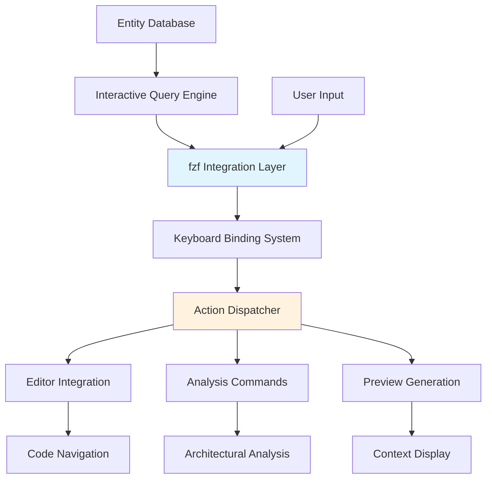

# Technical Insight: Terminal-Based Semantic Navigation Interface

**ID**: TI-035
**Source**: DTNotes03.md - Interactive ISG Explorer
**Description**: Interface design for providing IDE-like semantic navigation capabilities in terminal environments

## Architecture Overview

The Terminal-Based Semantic Navigation Interface bridges the gap between heavyweight IDEs and lightweight command-line workflows by providing rich, interactive semantic exploration capabilities in terminal environments:



## Technology Stack

**Core Interface Components**:
- **fzf**: Fuzzy finding with advanced key bindings and preview
- **Parseltongue**: Entity listing and architectural analysis
- **Terminal Emulator**: Advanced input handling and display
- **Text Editors**: vim, code, emacs integration
- **Shell Environment**: bash/zsh with proper key binding support

**Interface Architecture**:
```bash
# Core interface pattern
Entity_List | fzf_with_bindings | Action_Dispatcher | Tool_Integration
```

## Performance Requirements

- **Search Responsiveness**: <50ms for fuzzy search updates
- **Preview Generation**: <200ms for entity preview display
- **Navigation Speed**: Instant editor opening and command execution
- **Memory Efficiency**: Handle 10,000+ entities without performance degradation

## Interface Design Specifications

**fzf Configuration**:
```bash
export FZF_DEFAULT_OPTS='
--layout=reverse
--height=80%
--border=rounded
--prompt="🔍 Search Entities> "
--header="[Enter] Definition | [Ctrl+C] Callers | [Ctrl+I] Impact | [Ctrl+P] Preview"
--preview="./pt debug {1} | head -20"
--preview-window=right:50%:wrap
--bind="ctrl-/:toggle-preview"
--bind="ctrl-u:preview-page-up"
--bind="ctrl-d:preview-page-down"
'
```

**Keyboard Binding System**:
```bash
# Primary navigation bindings
--bind "enter:execute(./pt where-defined {1} | xargs -r $EDITOR)"
--bind "ctrl-c:execute(./pt debug {1} && echo 'Debug report generated for {1}')"
--bind "ctrl-i:execute(./pt impact {1} && echo 'Impact analysis for {1}')"
--bind "ctrl-t:execute(./pt test-related {1} && echo 'Test analysis for {1}')"

# Advanced navigation bindings
--bind "ctrl-g:execute(./pt grep-usage {1})"
--bind "ctrl-r:execute(./pt refactor-preview {1})"
--bind "ctrl-h:execute(./pt help {1})"
--bind "alt-enter:execute(./pt open-in-browser {1})"
```

**Preview System Design**:
```bash
# Dynamic preview generation
generate_preview() {
    local entity="$1"
    local preview_type="${2:-summary}"
    
    case "$preview_type" in
        "summary")
            ./pt debug "$entity" | head -20
            ;;
        "definition")
            ./pt where-defined "$entity" | xargs cat | head -30
            ;;
        "usage")
            ./pt usage-summary "$entity"
            ;;
        "impact")
            ./pt impact "$entity" --format=summary
            ;;
    esac
}
```

## User Experience Design

**Progressive Disclosure**:
```bash
# Multi-level navigation interface
Level 1: Entity List (fuzzy searchable)
Level 2: Entity Details (preview pane)
Level 3: Detailed Analysis (full screen)
Level 4: Code Navigation (editor integration)
```

**Context-Aware Actions**:
```bash
# Dynamic action availability based on entity type
get_available_actions() {
    local entity="$1"
    local entity_type=$(./pt entity-type "$entity")
    
    case "$entity_type" in
        "function")
            echo "definition callers impact test-coverage"
            ;;
        "struct")
            echo "definition implementations usage-patterns"
            ;;
        "trait")
            echo "definition implementors usage-examples"
            ;;
        *)
            echo "definition debug impact"
            ;;
    esac
}
```

**Visual Feedback System**:
```bash
# Status indicators and progress feedback
show_status() {
    local action="$1"
    local entity="$2"
    
    case "$action" in
        "loading")
            echo "🔄 Analyzing $entity..."
            ;;
        "success")
            echo "✅ Analysis complete for $entity"
            ;;
        "error")
            echo "❌ Error analyzing $entity"
            ;;
    esac
}
```

## Integration Specifications

**Editor Integration Patterns**:
```bash
# Multi-editor support
open_in_editor() {
    local file="$1"
    local line="${2:-1}"
    
    case "${EDITOR:-vim}" in
        "vim"|"nvim")
            $EDITOR "+$line" "$file"
            ;;
        "code"|"code-insiders")
            $EDITOR --goto "$file:$line"
            ;;
        "emacs")
            $EDITOR "+$line:1" "$file"
            ;;
        *)
            $EDITOR "$file"
            ;;
    esac
}
```

**Terminal Integration Requirements**:
```bash
# Terminal capability detection
check_terminal_capabilities() {
    # Check for color support
    [ -n "$COLORTERM" ] || [ "$TERM" = "xterm-256color" ]
    
    # Check for mouse support
    [ "$TERM" != "dumb" ]
    
    # Check for advanced key binding support
    case "$TERM" in
        "xterm"*|"screen"*|"tmux"*) return 0 ;;
        *) return 1 ;;
    esac
}
```

**Session Management**:
```bash
# Navigation history and bookmarks
NAVIGATION_HISTORY="$HOME/.parseltongue/navigation_history"
ENTITY_BOOKMARKS="$HOME/.parseltongue/bookmarks"

add_to_history() {
    local entity="$1"
    echo "$(date '+%Y-%m-%d %H:%M:%S') $entity" >> "$NAVIGATION_HISTORY"
    
    # Keep only last 100 entries
    tail -100 "$NAVIGATION_HISTORY" > "${NAVIGATION_HISTORY}.tmp"
    mv "${NAVIGATION_HISTORY}.tmp" "$NAVIGATION_HISTORY"
}

bookmark_entity() {
    local entity="$1"
    local description="${2:-$entity}"
    echo "$entity|$description" >> "$ENTITY_BOOKMARKS"
}
```

## Accessibility and Usability

**Keyboard-Only Navigation**:
- All functionality accessible via keyboard shortcuts
- Consistent key binding patterns across different modes
- Visual indicators for available actions
- Help system accessible via dedicated key binding

**Customization Framework**:
```bash
# User configuration system
USER_CONFIG="$HOME/.parseltongue/interface_config"

# Default configuration with user overrides
load_interface_config() {
    # Set defaults
    PREVIEW_WINDOW="right:50%"
    SEARCH_PROMPT="🔍 Search> "
    
    # Load user overrides
    [ -f "$USER_CONFIG" ] && source "$USER_CONFIG"
}
```

**Performance Optimization**:
```bash
# Lazy loading for large entity lists
lazy_load_entities() {
    local batch_size=1000
    local offset=0
    
    while true; do
        local batch=$(./pt list-entities --limit=$batch_size --offset=$offset)
        [ -z "$batch" ] && break
        
        echo "$batch"
        offset=$((offset + batch_size))
    done
}
```

## Error Handling and Recovery

**Graceful Degradation**:
```bash
# Fallback interface for limited terminals
fallback_interface() {
    echo "⚠️ Advanced terminal features not available"
    echo "Using simplified interface..."
    
    # Simple menu-based navigation
    while true; do
        echo "1) List entities"
        echo "2) Search entity"
        echo "3) Debug entity"
        echo "q) Quit"
        read -p "Choice: " choice
        
        case "$choice" in
            1) ./pt list-entities | less ;;
            2) read -p "Entity name: " entity; ./pt debug "$entity" ;;
            3) read -p "Entity name: " entity; ./pt debug "$entity" ;;
            q) break ;;
        esac
    done
}
```

**Error Recovery**:
```bash
# Robust error handling with user feedback
handle_navigation_error() {
    local error_type="$1"
    local entity="$2"
    
    case "$error_type" in
        "entity_not_found")
            echo "❌ Entity '$entity' not found. Try fuzzy search?"
            ;;
        "editor_failed")
            echo "❌ Failed to open editor. Check \$EDITOR setting."
            ;;
        "analysis_timeout")
            echo "⏱️ Analysis taking too long. Continue in background?"
            ;;
    esac
}
```

## Linked User Journeys
- UJ-039: Interactive Terminal-Based Code Exploration
- UJ-036: Semantic Code Search and Navigation
- UJ-012: High Performance Graph Analysis (DTNote01.md)

## Implementation Priority
**Medium-High** - Significantly enhances terminal-based development experience

## Future Enhancements
- Mouse support for hybrid interaction
- Plugin system for custom actions
- Integration with terminal multiplexers (tmux, screen)
- Visual graph rendering in terminal using ASCII art
- Voice command integration for accessibility