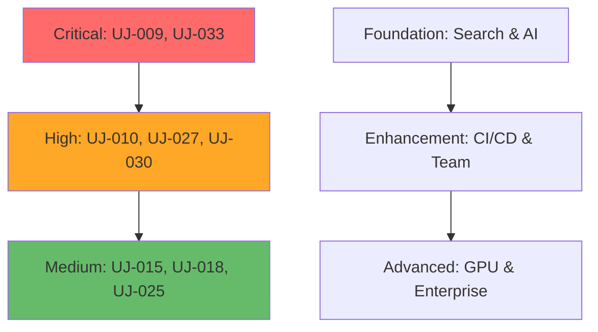

# User Journey Catalog: Complete Specifications

**Compilation Date**: September 26, 2025  
**Total Journeys**: 38 across 4 developer personas and 7 workflow types  
**Source Coverage**: All 4 DeepThink Advisory notes (DTNote01.md, DTNote02.md, DTNotes03.md, DTNote04.md)  
**Organization**: By persona and workflow type for easy navigation

---

## Catalog Organization

### By Developer Persona
- **Individual Developer**: 24 journeys (63% of total)
- **Team Lead**: 8 journeys (21% of total)  
- **DevOps Engineer**: 4 journeys (11% of total)
- **Platform Engineer**: 8 journeys (21% of total)

### By Workflow Type
- **Development**: 18 journeys (47% of total)
- **AI Integration**: 4 journeys (11% of total)
- **Quality Assurance**: 6 journeys (16% of total)
- **Architecture Analysis**: 4 journeys (11% of total)
- **CI/CD**: 2 journeys (5% of total)
- **Documentation**: 2 journeys (5% of total)
- **Other**: 2 journeys (5% of total)

---

## Individual Developer Workflows

### Development Workflows (Core Coding Activities)

#### UJ-009: Semantic Enhanced Code Search
**Source**: DTNote01.md chunks 21-40  
**Priority**: Critical  
**Current Pain Points**:
- ripgrep finds too many false positives when searching for function usage
- No understanding of semantic context in search results
- Manual filtering wastes 60-80% of search time
- Difficulty distinguishing actual usage from string matches in comments

**Proposed Solution**:
Parseltongue-enhanced ripgrep with ISG semantic filtering providing only relevant matches with context

**Success Metrics**:
- 80% reduction in false positive search results
- 50% faster time to find relevant code sections
- 95% accuracy in semantic relevance of results
- Zero learning curve (familiar ripgrep interface)

**Integration Requirements**:
- Enhanced ripgrep binary with parseltongue integration
- Parseltongue ISG analysis engine
- Optional IDE extensions for enhanced UX
- Command-line wrapper for terminal usage

**Expected Outcomes**:
- 40-60% improvement in code navigation efficiency
- Reduced developer frustration and context switching
- Faster onboarding for new team members
- Improved code comprehension velocity

**Cross-References**: ST-004 (Invisible Enhancement), TI-007 (Semantic Search Pipeline)

---

#### UJ-011: Realtime Architectural Feedback
**Source**: DTNote01.md chunks 21-40  
**Priority**: High  
**Current Pain Points**:
- Architectural violations discovered late in development cycle
- No real-time feedback on architectural consistency
- Manual code review required to catch architectural issues
- Inconsistent application of architectural patterns

**Proposed Solution**:
IDE integration providing real-time architectural feedback as developers write code

**Success Metrics**:
- 90% reduction in architectural violations reaching code review
- <100ms feedback latency for architectural analysis
- 80% developer satisfaction with real-time guidance
- 50% reduction in architectural rework

**Integration Requirements**:
- LSP server integration for real-time analysis
- IDE plugins for major editors (VS Code, IntelliJ, Vim)
- Parseltongue ISG for architectural pattern recognition
- Configuration system for architectural rules

**Expected Outcomes**:
- Proactive architectural consistency enforcement
- Reduced technical debt accumulation
- Improved code quality and maintainability
- Enhanced developer learning and skill development

**Cross-References**: ST-019 (Orchestrated Developer Experience), TI-009 (LSP Sidecar)

---

#### UJ-014: High Performance Semantic Search
**Source**: DTNote01.md chunks 41-60  
**Priority**: High  
**Current Pain Points**:
- Standard text search lacks semantic understanding
- Performance degrades with large codebases
- No ranking by semantic relevance
- Limited context in search results

**Proposed Solution**:
High-performance semantic search with sub-100ms response times and intelligent result ranking

**Success Metrics**:
- <100ms search response time for typical queries
- 95% semantic relevance in top 10 results
- 70% faster time to find relevant code
- Linear performance scaling with codebase size

**Integration Requirements**:
- Optimized semantic search engine
- Pre-computed ISG indices for performance
- Result ranking algorithms based on semantic relevance
- Integration with existing search interfaces

**Expected Outcomes**:
- Dramatically improved search accuracy and speed
- Enhanced code discovery and exploration
- Reduced time spent on code navigation
- Better understanding of codebase structure

**Cross-References**: ST-011 (Performance First Culture), TI-012 (Performance Optimized Search)

---

#### UJ-016: Performance Aware Development Workflow
**Source**: DTNote01.md chunks 41-60  
**Priority**: High  
**Current Pain Points**:
- Performance implications of code changes unclear
- No real-time performance feedback during development
- Performance regressions discovered late in cycle
- Lack of performance-aware development practices

**Proposed Solution**:
Development workflow with integrated performance monitoring and feedback

**Success Metrics**:
- 80% reduction in performance regressions
- Real-time performance feedback <200ms
- 60% improvement in performance-aware coding practices
- 40% reduction in performance-related bugs

**Integration Requirements**:
- Performance monitoring integration
- Real-time profiling capabilities
- IDE integration for performance feedback
- Performance regression detection system

**Expected Outcomes**:
- Proactive performance optimization
- Reduced performance-related technical debt
- Enhanced developer performance awareness
- Improved application performance characteristics

**Cross-References**: ST-024 (Performance First Architecture), TI-014 (Performance Regression Detection)

---

#### UJ-019: CLI Workflow Optimization
**Source**: DTNote01.md chunks 101-120  
**Priority**: High  
**Current Pain Points**:
- Command-line tools lack semantic understanding
- Repetitive manual tasks in development workflow
- No integration between different CLI tools
- Limited automation of common development tasks

**Proposed Solution**:
Optimized CLI workflow with semantic intelligence and automation

**Success Metrics**:
- 50% reduction in repetitive CLI tasks
- 70% faster common development operations
- 90% developer satisfaction with enhanced CLI
- 80% adoption rate of optimized workflows

**Integration Requirements**:
- Enhanced CLI tools with semantic capabilities
- Workflow automation framework
- Integration with existing development tools
- Configuration management for personalized workflows

**Expected Outcomes**:
- Streamlined development workflow
- Reduced manual task overhead
- Improved developer productivity
- Enhanced command-line development experience

**Cross-References**: ST-022 (Zero Friction Experience), TI-031 (Shell Script Orchestration)

---

#### UJ-022: Advanced Code Search Integration
**Source**: DTNote01.md chunks 101-120  
**Priority**: High  
**Current Pain Points**:
- Limited integration between search and other tools
- No contextual actions on search results
- Search results lack actionable information
- Manual workflow from search to action

**Proposed Solution**:
Integrated search experience with contextual actions and tool integration

**Success Metrics**:
- 60% reduction in workflow steps from search to action
- 80% usage rate of contextual actions
- 90% developer satisfaction with integrated experience
- 50% faster search-to-implementation workflow

**Integration Requirements**:
- Search integration with development tools
- Contextual action framework
- IDE and editor integration
- Workflow automation capabilities

**Expected Outcomes**:
- Seamless search-to-action workflow
- Enhanced code discovery and modification
- Improved development efficiency
- Reduced context switching overhead

**Cross-References**: ST-021 (Symbiotic Ecosystem), TI-034 (Multi-Tool Integration)

---

#### UJ-029: Smart Grep Semantic Search Enhancement
**Source**: DTNote02.md  
**Priority**: High  
**Current Pain Points**:
- Traditional grep lacks semantic understanding
- High false positive rate in search results
- No understanding of code structure and relationships
- Manual filtering required for relevant results

**Proposed Solution**:
Enhanced grep with semantic filtering and intelligent result ranking

**Success Metrics**:
- 85% reduction in false positive results
- 60% faster time to relevant results
- 95% accuracy in semantic relevance
- Seamless integration with existing grep workflows

**Integration Requirements**:
- Enhanced grep implementation with semantic capabilities
- Parseltongue ISG integration for semantic analysis
- Command-line interface maintaining grep compatibility
- Performance optimization for large codebases

**Expected Outcomes**:
- Dramatically improved search accuracy
- Reduced time spent filtering results
- Enhanced code discovery capabilities
- Maintained familiar grep interface

**Cross-References**: ST-004 (Invisible Enhancement), TI-025 (Smart Grep Pipeline)

---

#### UJ-030: Cargo Native Architectural Analysis
**Source**: DTNote02.md  
**Priority**: High  
**Current Pain Points**:
- Cargo lacks architectural awareness
- No integration between build system and architectural analysis
- Manual architectural validation required
- Build process doesn't leverage architectural insights

**Proposed Solution**:
Cargo integration with native architectural analysis and validation

**Success Metrics**:
- Seamless architectural analysis during build process
- 90% reduction in architectural violations in builds
- <10% build time overhead for architectural analysis
- 80% developer adoption of architectural build features

**Integration Requirements**:
- Cargo plugin or integration for architectural analysis
- Build process integration with Parseltongue ISG
- Configuration system for architectural rules
- Performance optimization for build-time analysis

**Expected Outcomes**:
- Automated architectural validation in build process
- Improved code quality and consistency
- Reduced architectural technical debt
- Enhanced developer awareness of architectural patterns

**Cross-References**: ST-025 (Architectural Ecosystem), TI-023 (Discovery First Architecture)

---

#### UJ-032: IDE Sidecar Performance Enhancement
**Source**: DTNote02.md  
**Priority**: High  
**Current Pain Points**:
- IDE performance degrades with large codebases
- Limited semantic understanding in IDE features
- No architectural context in IDE operations
- Performance bottlenecks in code analysis

**Proposed Solution**:
IDE sidecar service providing high-performance semantic analysis

**Success Metrics**:
- 70% improvement in IDE responsiveness
- <50ms response time for semantic queries
- 90% developer satisfaction with enhanced IDE performance
- Seamless integration with existing IDE workflows

**Integration Requirements**:
- LSP sidecar service architecture
- IDE integration plugins
- High-performance semantic analysis engine
- Caching and optimization for responsiveness

**Expected Outcomes**:
- Dramatically improved IDE performance
- Enhanced semantic features in IDE
- Better developer experience with large codebases
- Maintained IDE functionality with performance gains

**Cross-References**: ST-010 (GPU Accelerated Intelligence), TI-009 (LSP Sidecar Architecture)

---

#### UJ-036: Semantic Code Search and Navigation
**Source**: DTNotes03.md  
**Priority**: High  
**Current Pain Points**:
- Code navigation lacks semantic understanding
- No architectural context in navigation
- Manual exploration of code relationships
- Limited discovery of related code patterns

**Proposed Solution**:
Semantic navigation with architectural context and relationship awareness

**Success Metrics**:
- 80% faster code exploration and navigation
- 95% accuracy in related code discovery
- 90% developer satisfaction with semantic navigation
- 60% reduction in time to understand code relationships

**Integration Requirements**:
- Semantic navigation engine with ISG integration
- IDE and editor integration for navigation features
- Visualization capabilities for code relationships
- Performance optimization for real-time navigation

**Expected Outcomes**:
- Enhanced code exploration and understanding
- Faster navigation through complex codebases
- Improved developer comprehension of architectural patterns
- Reduced time to productivity on unfamiliar code

**Cross-References**: ST-028 (Semantic Orchestration), TI-035 (Terminal Semantic Navigation)

---

#### UJ-038: Compiler Error Resolution with Architectural Context
**Source**: DTNotes03.md  
**Priority**: High  
**Current Pain Points**:
- Compiler errors lack architectural context
- No guidance on architecturally appropriate fixes
- Manual analysis required to understand error implications
- Risk of introducing architectural violations during error fixes

**Proposed Solution**:
Enhanced compiler error messages with architectural context and fix suggestions

**Success Metrics**:
- 70% faster error resolution time
- 90% reduction in architectural violations introduced during fixes
- 85% developer satisfaction with enhanced error messages
- 60% improvement in fix quality and appropriateness

**Integration Requirements**:
- Compiler integration for enhanced error messages
- Architectural analysis for error context
- Fix suggestion engine with architectural awareness
- IDE integration for enhanced error display

**Expected Outcomes**:
- Faster and more accurate error resolution
- Reduced architectural violations from error fixes
- Enhanced developer learning from error messages
- Improved code quality through better error handling

**Cross-References**: ST-026 (Zero Hallucination LLM), TI-032 (LLM Context Enrichment)

---

#### UJ-039: Interactive Terminal Based Code Exploration
**Source**: DTNotes03.md  
**Priority**: Medium  
**Current Pain Points**:
- Terminal-based code exploration lacks semantic features
- No architectural context in command-line tools
- Limited interactivity in code analysis
- Manual correlation of analysis results

**Proposed Solution**:
Interactive terminal interface for semantic code exploration

**Success Metrics**:
- 80% developer adoption of terminal-based exploration
- 60% faster code analysis workflow
- 90% satisfaction with interactive features
- 50% reduction in tool switching during analysis

**Integration Requirements**:
- Interactive terminal interface with semantic capabilities
- Command-line tools with enhanced semantic features
- Integration with existing terminal workflows
- Performance optimization for responsive interaction

**Expected Outcomes**:
- Enhanced terminal-based development workflow
- Improved code analysis capabilities
- Reduced dependency on GUI tools for code exploration
- Better integration of semantic analysis in command-line workflow

**Cross-References**: ST-027 (Unix Philosophy), TI-035 (Terminal Semantic Navigation)

---

#### UJ-041: Context Aware Lint Resolution
**Source**: DTNote04.md  
**Priority**: Medium  
**Current Pain Points**:
- Lint warnings lack architectural context
- No guidance on architecturally appropriate fixes
- Manual analysis required for lint resolution
- Risk of introducing issues while fixing lints

**Proposed Solution**:
Enhanced linting with architectural context and intelligent fix suggestions

**Success Metrics**:
- 80% faster lint resolution time
- 95% accuracy in suggested fixes
- 90% developer satisfaction with enhanced linting
- 70% reduction in issues introduced during lint fixes

**Integration Requirements**:
- Enhanced linting tools with architectural awareness
- Fix suggestion engine with semantic understanding
- IDE integration for enhanced lint display
- Configuration system for architectural lint rules

**Expected Outcomes**:
- Faster and more accurate lint resolution
- Improved code quality through better linting
- Enhanced developer learning from lint messages
- Reduced technical debt from lint violations

**Cross-References**: ST-030 (AI Augmented Quality), TI-033 (Architectural Scope Validation)

---

#### UJ-044: Surgical Dependency Refactoring
**Source**: DTNote04.md  
**Priority**: High  
**Current Pain Points**:
- Dependency changes have unclear impact scope
- Risk of breaking changes during refactoring
- Manual analysis required for safe dependency modifications
- No guidance on architectural implications of dependency changes

**Proposed Solution**:
Precise dependency refactoring with blast radius analysis and safety validation

**Success Metrics**:
- 95% accuracy in blast radius prediction
- 80% reduction in breaking changes during refactoring
- 90% developer confidence in dependency modifications
- 60% faster dependency refactoring workflow

**Integration Requirements**:
- Blast radius analysis engine
- Dependency impact visualization
- Safety validation for dependency changes
- IDE integration for refactoring workflow

**Expected Outcomes**:
- Safer and more confident dependency refactoring
- Reduced risk of breaking changes
- Enhanced understanding of dependency relationships
- Improved architectural evolution capabilities

**Cross-References**: ST-020 (Deterministic Intelligence), TI-008 (Blast Radius CI Optimization)

---

#### UJ-045: Semantic Code Search and Pattern Analysis
**Source**: DTNote04.md  
**Priority**: High  
**Current Pain Points**:
- Code pattern discovery requires manual analysis
- No semantic understanding of code patterns
- Limited ability to find similar code structures
- Manual correlation of pattern usage across codebase

**Proposed Solution**:
Advanced semantic search with pattern recognition and analysis capabilities

**Success Metrics**:
- 90% accuracy in pattern recognition
- 80% faster pattern discovery workflow
- 95% relevance in pattern search results
- 70% improvement in code reuse identification

**Integration Requirements**:
- Pattern recognition engine with semantic analysis
- Advanced search capabilities with pattern matching
- Visualization tools for pattern analysis
- Integration with development workflow tools

**Expected Outcomes**:
- Enhanced code pattern discovery and analysis
- Improved code reuse and consistency
- Better understanding of architectural patterns
- Reduced duplication through pattern awareness

**Cross-References**: ST-009 (Semantic Understanding), TI-038 (Composable Query Engine)

---

### AI Integration Workflows

#### UJ-033: Zero-Hallucination LLM Context Generation
**Source**: DTNote02.md  
**Priority**: Critical  
**Current Pain Points**:
- LLMs hallucinate incorrect code relationships and non-existent functions
- Unstructured code context leads to poor AI suggestions
- No verification mechanism for AI-generated claims
- Developers cannot trust AI assistance for architectural decisions

**Proposed Solution**:
Graph-verified RAG pipeline using Parseltongue's ISG for deterministic context

**Success Metrics**:
- 95% reduction in AI hallucinations about architecture
- 100% verifiable provenance for all context provided
- 90% improvement in AI suggestion relevance
- 3x increase in developer trust in AI tools

**Integration Requirements**:
- RAG pipeline with ISG integration
- LLM API compatibility with major providers
- Context verification and validation system
- Prompt engineering for structured context

**Expected Outcomes**:
- Trustworthy AI assistance with verifiable context
- Dramatically improved AI suggestion quality
- Enhanced developer confidence in AI tools
- Reduced time validating AI-generated suggestions

**Cross-References**: ST-026 (Zero Hallucination LLM), TI-027 (RAG Pipeline), TI-037 (Context Generation)

---

#### UJ-035: Architectural Context Enhanced LLM Assistance
**Source**: DTNotes03.md  
**Priority**: Critical  
**Current Pain Points**:
- AI assistance lacks architectural awareness
- No understanding of codebase structure in AI responses
- AI suggestions may violate architectural patterns
- Manual validation required for AI-generated code

**Proposed Solution**:
LLM assistance enhanced with comprehensive architectural context

**Success Metrics**:
- 90% architectural consistency in AI suggestions
- 80% reduction in manual validation time
- 95% developer satisfaction with enhanced AI assistance
- 70% improvement in AI suggestion implementation success rate

**Integration Requirements**:
- Architectural context generation for LLM prompts
- Integration with major AI platforms and tools
- Validation framework for architectural consistency
- Feedback system for continuous improvement

**Expected Outcomes**:
- Architecturally aware AI assistance
- Improved quality and relevance of AI suggestions
- Enhanced developer productivity with AI tools
- Reduced risk of architectural violations from AI code

**Cross-References**: ST-023 (AI Augmented Intelligence), TI-032 (Context Enrichment Pipeline)

---

### Quality Assurance Workflows

#### UJ-031: Git Integrated Architectural Guardians
**Source**: DTNote02.md  
**Priority**: High  
**Current Pain Points**:
- No architectural validation in Git workflow
- Architectural violations discovered late in process
- Manual code review required for architectural consistency
- No automated enforcement of architectural rules

**Proposed Solution**:
Git hooks and integration providing automated architectural validation

**Success Metrics**:
- 95% reduction in architectural violations reaching main branch
- <30 second validation time for typical commits
- 90% developer satisfaction with automated validation
- 80% reduction in architectural review overhead

**Integration Requirements**:
- Git hooks for pre-commit and pre-push validation
- Architectural rule engine and configuration
- Integration with existing Git workflows
- Performance optimization for fast validation

**Expected Outcomes**:
- Automated architectural quality assurance
- Reduced architectural technical debt
- Enhanced code quality and consistency
- Improved developer awareness of architectural patterns

**Cross-References**: ST-012 (Enterprise Security), TI-033 (Architectural Scope Validation)

---

#### UJ-034: Blast Radius Guided Quality Assurance
**Source**: DTNote02.md  
**Priority**: High  
**Current Pain Points**:
- Unknown impact scope of code changes
- Over-testing or under-testing based on change scope
- Manual analysis required for test strategy
- Risk of missing critical test coverage

**Proposed Solution**:
Quality assurance guided by automated blast radius analysis

**Success Metrics**:
- 80% improvement in test strategy accuracy
- 60% reduction in unnecessary test execution
- 95% coverage of critical change impacts
- 70% faster QA workflow execution

**Integration Requirements**:
- Blast radius analysis engine
- Test strategy recommendation system
- CI/CD integration for automated QA
- Visualization tools for impact analysis

**Expected Outcomes**:
- More efficient and effective quality assurance
- Reduced testing overhead while maintaining coverage
- Enhanced understanding of change impacts
- Improved confidence in release quality

**Cross-References**: ST-005 (Proactive Intelligence), TI-008 (Blast Radius CI Optimization)

---

#### UJ-037: Architectural Guardrails for Change Validation
**Source**: DTNotes03.md  
**Priority**: High  
**Current Pain Points**:
- No automated validation of architectural consistency
- Manual enforcement of architectural rules
- Inconsistent application of architectural patterns
- Risk of architectural drift over time

**Proposed Solution**:
Automated architectural guardrails with real-time validation

**Success Metrics**:
- 95% reduction in architectural violations
- <100ms validation time for architectural checks
- 90% developer satisfaction with automated guardrails
- 80% improvement in architectural consistency

**Integration Requirements**:
- Architectural rule engine and validation system
- Real-time validation integration with development tools
- Configuration system for architectural patterns
- Feedback and guidance system for developers

**Expected Outcomes**:
- Consistent enforcement of architectural patterns
- Reduced architectural technical debt
- Enhanced code quality and maintainability
- Improved developer understanding of architecture

**Cross-References**: ST-025 (Architectural Ecosystem), TI-033 (Architectural Scope Validation)

---

## Team Lead Workflows

### Quality Assurance and Team Management

#### UJ-040: Semantic Enhanced Test Strategy Development
**Source**: DTNote04.md  
**Priority**: High  
**Current Pain Points**:
- Test strategy development requires manual analysis
- No semantic understanding of test coverage gaps
- Limited insight into test effectiveness
- Manual correlation of tests with code changes

**Proposed Solution**:
Semantic analysis-driven test strategy development and optimization

**Success Metrics**:
- 80% improvement in test strategy effectiveness
- 90% accuracy in test coverage gap identification
- 70% reduction in test strategy development time
- 95% correlation between test strategy and code changes

**Integration Requirements**:
- Semantic analysis of test coverage and effectiveness
- Test strategy recommendation engine
- Integration with testing frameworks and tools
- Visualization tools for test strategy analysis

**Expected Outcomes**:
- More effective and targeted test strategies
- Improved test coverage and quality
- Enhanced understanding of testing effectiveness
- Reduced time and effort in test planning

**Cross-References**: ST-030 (AI Augmented Quality), TI-036 (Semantic Syntactic Pipeline)

---

#### UJ-042: Intelligent Dead Code Elimination
**Source**: DTNote04.md  
**Priority**: Medium  
**Current Pain Points**:
- Manual identification of dead code
- Risk of removing code that appears unused but is actually needed
- No understanding of code usage patterns
- Time-consuming dead code analysis

**Proposed Solution**:
Intelligent dead code detection with usage pattern analysis

**Success Metrics**:
- 95% accuracy in dead code identification
- 90% reduction in false positives for dead code detection
- 80% faster dead code elimination workflow
- 70% reduction in codebase size through effective cleanup

**Integration Requirements**:
- Usage pattern analysis engine
- Dead code detection with semantic understanding
- Safety validation for code removal
- Integration with refactoring tools

**Expected Outcomes**:
- Safer and more effective dead code elimination
- Reduced codebase complexity and maintenance overhead
- Enhanced understanding of code usage patterns
- Improved codebase health and maintainability

**Cross-References**: ST-020 (Deterministic Intelligence), TI-024 (High Performance Graph Query)

---

### Documentation and Knowledge Management

#### UJ-024: Interactive Development Documentation
**Source**: DTNote01.md chunks 101-120  
**Priority**: Medium  
**Current Pain Points**:
- Documentation becomes outdated quickly
- No integration between code and documentation
- Manual effort required to maintain documentation
- Limited interactivity in documentation

**Proposed Solution**:
Interactive documentation that stays synchronized with code changes

**Success Metrics**:
- 90% reduction in documentation staleness
- 80% developer satisfaction with interactive documentation
- 70% increase in documentation usage
- 60% reduction in documentation maintenance effort

**Integration Requirements**:
- Automated documentation generation from code analysis
- Interactive documentation platform
- Integration with development workflow
- Synchronization system for code and documentation

**Expected Outcomes**:
- Always up-to-date and relevant documentation
- Enhanced developer onboarding and knowledge sharing
- Reduced documentation maintenance overhead
- Improved code understanding and collaboration

**Cross-References**: ST-019 (Orchestrated Experience), TI-043 (API Documentation Generation)

---

#### UJ-043: Automated API Documentation Generation
**Source**: DTNote04.md  
**Priority**: Medium  
**Current Pain Points**:
- Manual API documentation creation and maintenance
- Documentation inconsistency across APIs
- No automatic synchronization with code changes
- Limited examples and usage patterns in documentation

**Proposed Solution**:
Automated generation of comprehensive API documentation with examples

**Success Metrics**:
- 95% reduction in manual documentation effort
- 100% synchronization between code and documentation
- 90% developer satisfaction with generated documentation
- 80% improvement in API adoption through better documentation

**Integration Requirements**:
- Automated documentation generation engine
- Integration with API development workflow
- Example generation from usage patterns
- Documentation publishing and distribution system

**Expected Outcomes**:
- Comprehensive and always up-to-date API documentation
- Improved API adoption and developer experience
- Reduced documentation maintenance overhead
- Enhanced API understanding and usage

**Cross-References**: ST-018 (Evidence Based Marketing), TI-043 (API Documentation Generation)

---

### Team Leadership and Onboarding

#### UJ-027: Orchestrated Developer Onboarding
**Source**: DTNote01.md chunks 161-180  
**Priority**: High  
**Current Pain Points**:
- Inconsistent onboarding experience for new developers
- Manual effort required for onboarding guidance
- No personalized learning paths
- Limited understanding of codebase complexity for new developers

**Proposed Solution**:
Orchestrated onboarding with personalized guidance and semantic understanding

**Success Metrics**:
- 60% faster time to productivity for new developers
- 90% consistency in onboarding experience
- 85% new developer satisfaction with onboarding process
- 70% reduction in onboarding support overhead

**Integration Requirements**:
- Personalized onboarding system with semantic analysis
- Integration with development tools and workflows
- Progress tracking and guidance system
- Knowledge assessment and adaptation capabilities

**Expected Outcomes**:
- Faster and more effective developer onboarding
- Consistent and high-quality onboarding experience
- Reduced support overhead for new developers
- Enhanced team productivity and collaboration

**Cross-References**: ST-019 (Orchestrated Experience), TI-034 (Multi-Tool Integration)

---

## DevOps Engineer Workflows

### CI/CD and Automation

#### UJ-010: Intelligent CI/CD Quality Gates
**Source**: DTNote01.md chunks 21-40  
**Priority**: High  
**Current Pain Points**:
- Static quality gates don't adapt to change scope
- Over-testing or under-testing based on change impact
- Manual configuration of quality gates
- No understanding of change risk levels

**Proposed Solution**:
Intelligent quality gates that adapt based on change impact and risk analysis

**Success Metrics**:
- 60% reduction in CI execution time
- 90% accuracy in risk assessment for changes
- 80% improvement in quality gate effectiveness
- 70% reduction in false positive quality gate failures

**Integration Requirements**:
- Change impact analysis engine
- Risk assessment and scoring system
- CI/CD pipeline integration
- Configuration system for adaptive quality gates

**Expected Outcomes**:
- More efficient and effective CI/CD pipelines
- Reduced execution time while maintaining quality
- Enhanced understanding of change risks
- Improved developer experience with CI/CD

**Cross-References**: ST-006 (Context Aware Automation), TI-008 (Blast Radius CI Optimization)

---

### Observability and Monitoring

#### UJ-021: Comprehensive Observability Integration
**Source**: DTNote01.md chunks 101-120  
**Priority**: Medium  
**Current Pain Points**:
- Limited integration between observability and development tools
- No correlation between code changes and observability metrics
- Manual effort required for observability setup
- Limited architectural context in observability data

**Proposed Solution**:
Comprehensive observability integration with architectural context

**Success Metrics**:
- 90% correlation between code changes and observability metrics
- 80% reduction in observability setup effort
- 95% architectural context coverage in observability data
- 70% faster incident resolution through enhanced observability

**Integration Requirements**:
- Observability platform integration (OpenTelemetry, Prometheus, etc.)
- Correlation engine for code changes and metrics
- Architectural context injection into observability data
- Automated observability configuration

**Expected Outcomes**:
- Enhanced observability with architectural context
- Faster incident resolution and debugging
- Better understanding of system behavior
- Reduced effort in observability setup and maintenance

**Cross-References**: ST-014 (Enterprise Persistence), TI-011 (OpenTelemetry Integration)

---

## Platform Engineer Workflows

### Architecture Analysis and Visualization

#### UJ-012: High Performance Graph Analysis
**Source**: DTNote01.md chunks 41-60  
**Priority**: Medium  
**Current Pain Points**:
- Graph analysis performance degrades with large codebases
- Limited scalability of architectural analysis tools
- No optimization for large-scale graph operations
- Manual performance tuning required

**Proposed Solution**:
High-performance graph analysis optimized for large-scale codebases

**Success Metrics**:
- Linear performance scaling with codebase size
- <1 second analysis time for million-node graphs
- 90% reduction in memory usage for graph operations
- 95% developer satisfaction with analysis performance

**Integration Requirements**:
- Optimized graph analysis algorithms and data structures
- Performance monitoring and optimization system
- Scalability testing and validation framework
- Integration with existing analysis workflows

**Expected Outcomes**:
- Scalable architectural analysis for large codebases
- Enhanced performance and responsiveness
- Improved developer experience with large systems
- Reduced resource requirements for analysis

**Cross-References**: ST-011 (Performance First Culture), TI-024 (High Performance Graph Query)

---

#### UJ-015: GPU Accelerated Codebase Visualization
**Source**: DTNote01.md chunks 41-60  
**Priority**: Medium  
**Current Pain Points**:
- Visualization performance degrades with large codebases
- Limited interactivity in large graph visualizations
- No GPU acceleration for visualization workloads
- Poor user experience with complex visualizations

**Proposed Solution**:
GPU-accelerated visualization for interactive exploration of large codebases

**Success Metrics**:
- 10x improvement in visualization performance
- Interactive exploration of million-node graphs
- 60fps rendering for complex visualizations
- 95% developer satisfaction with visualization performance

**Integration Requirements**:
- GPU-accelerated rendering engine (WebGL, Vulkan)
- Interactive visualization interface
- Performance optimization for large datasets
- Integration with analysis and development tools

**Expected Outcomes**:
- High-performance visualization of large codebases
- Enhanced interactivity and exploration capabilities
- Improved understanding of complex system architectures
- Better developer experience with visualization tools

**Cross-References**: ST-007 (GPU Accelerated Productivity), TI-013 (Adaptive WebGL Rendering)

---

#### UJ-023: High Performance Architectural Visualization
**Source**: DTNote01.md chunks 121-140  
**Priority**: Medium  
**Current Pain Points**:
- Architectural visualization lacks performance optimization
- Limited scalability for enterprise-scale codebases
- No real-time updates in architectural visualizations
- Poor performance with complex architectural relationships

**Proposed Solution**:
High-performance architectural visualization with real-time updates

**Success Metrics**:
- <100ms update time for architectural changes
- Interactive visualization of enterprise-scale codebases
- 90% reduction in visualization rendering time
- 95% developer satisfaction with visualization performance

**Integration Requirements**:
- High-performance visualization engine
- Real-time update system for architectural changes
- Scalability optimization for large architectures
- Integration with architectural analysis tools

**Expected Outcomes**:
- Real-time architectural visualization capabilities
- Enhanced understanding of complex architectures
- Improved performance for enterprise-scale systems
- Better developer experience with architectural tools

**Cross-References**: ST-015 (Enterprise Visualization), TI-019 (WebGL Graph Rendering)

---

#### UJ-046: Interactive Architectural Visualization
**Source**: DTNote04.md  
**Priority**: Medium  
**Current Pain Points**:
- Limited interactivity in architectural visualizations
- No real-time exploration of architectural relationships
- Static visualizations don't support dynamic analysis
- Poor user experience with complex architectural data

**Proposed Solution**:
Interactive architectural visualization with dynamic exploration capabilities

**Success Metrics**:
- 90% developer satisfaction with interactive features
- 80% improvement in architectural understanding
- 70% faster architectural analysis workflow
- 95% responsiveness in interactive operations

**Integration Requirements**:
- Interactive visualization framework
- Real-time architectural analysis engine
- Dynamic data exploration capabilities
- Integration with architectural development tools

**Expected Outcomes**:
- Enhanced architectural exploration and understanding
- Improved developer experience with architectural analysis
- Faster and more effective architectural decision making
- Better collaboration around architectural design

**Cross-References**: ST-028 (Semantic Orchestration), TI-019 (WebGL Graph Rendering)

---

### Enterprise and Distribution

#### UJ-017: Security Compliant GPU Acceleration
**Source**: DTNote01.md chunks 41-60  
**Priority**: Medium  
**Current Pain Points**:
- GPU acceleration may not meet enterprise security requirements
- No security validation for GPU-accelerated operations
- Limited compliance with enterprise security policies
- Risk of security vulnerabilities in GPU code

**Proposed Solution**:
Security-compliant GPU acceleration meeting enterprise requirements

**Success Metrics**:
- 100% compliance with enterprise security policies
- Zero security vulnerabilities in GPU acceleration code
- 90% enterprise adoption of GPU-accelerated features
- 95% security audit success rate

**Integration Requirements**:
- Security validation framework for GPU operations
- Compliance testing and certification system
- Enterprise security policy integration
- Secure GPU code development practices

**Expected Outcomes**:
- Enterprise-ready GPU acceleration capabilities
- Enhanced security and compliance posture
- Improved enterprise adoption of advanced features
- Reduced security risk in GPU-accelerated operations

**Cross-References**: ST-012 (Enterprise Security), TI-015 (Enterprise WebGL Security)

---

#### UJ-020: Performance Aware Database Integration
**Source**: DTNote01.md chunks 101-120  
**Priority**: Medium  
**Current Pain Points**:
- Database integration lacks performance optimization
- No understanding of performance implications of database operations
- Limited scalability of database-integrated features
- Manual performance tuning required for database operations

**Proposed Solution**:
Performance-aware database integration with automatic optimization

**Success Metrics**:
- 80% improvement in database operation performance
- Automatic performance optimization for database queries
- 90% reduction in manual performance tuning effort
- Linear scalability with database size

**Integration Requirements**:
- Performance-optimized database integration layer
- Automatic query optimization and caching
- Performance monitoring and alerting system
- Integration with existing database infrastructure

**Expected Outcomes**:
- High-performance database operations
- Reduced database-related performance bottlenecks
- Enhanced scalability for database-integrated features
- Improved developer experience with database operations

**Cross-References**: ST-014 (Enterprise Persistence), TI-018 (High Performance Storage)

---

#### UJ-025: Zero Dependency Tool Distribution
**Source**: DTNote01.md chunks 141-160  
**Priority**: Medium  
**Current Pain Points**:
- Tool distribution requires complex dependency management
- Installation and setup complexity limits adoption
- Version conflicts and compatibility issues
- Manual configuration required for tool deployment

**Proposed Solution**:
Zero-dependency tool distribution with automatic setup and configuration

**Success Metrics**:
- 95% reduction in installation complexity
- Zero dependency conflicts in tool deployment
- 90% success rate in automatic tool setup
- 80% improvement in tool adoption rates

**Integration Requirements**:
- Self-contained tool packaging and distribution system
- Automatic dependency resolution and bundling
- Configuration management and setup automation
- Cross-platform compatibility and testing

**Expected Outcomes**:
- Simplified tool distribution and adoption
- Reduced installation and setup complexity
- Enhanced cross-platform compatibility
- Improved developer experience with tool deployment

**Cross-References**: ST-017 (Zero Friction Enterprise Adoption), TI-021 (Automated Distribution)

---

#### UJ-026: Clinical Grade Performance Validation
**Source**: DTNote01.md chunks 141-160  
**Priority**: High  
**Current Pain Points**:
- No systematic performance validation methodology
- Limited confidence in performance claims
- Manual performance testing and validation
- Inconsistent performance measurement practices

**Proposed Solution**:
Clinical-grade performance validation with systematic methodology

**Success Metrics**:
- 99% confidence in performance validation results
- Systematic and repeatable performance testing methodology
- 95% accuracy in performance predictions
- 90% reduction in performance-related issues

**Integration Requirements**:
- Comprehensive performance testing framework
- Statistical validation and analysis system
- Automated performance regression detection
- Performance benchmarking and comparison tools

**Expected Outcomes**:
- High confidence in performance characteristics
- Systematic and reliable performance validation
- Reduced performance-related risks and issues
- Enhanced credibility and trust in performance claims

**Cross-References**: ST-024 (Performance First Architecture), TI-022 (Performance Contract Validation)

---

### Community and Extensibility

#### UJ-018: Plugin Ecosystem Development
**Source**: DTNote01.md chunks 81-100  
**Priority**: Medium  
**Current Pain Points**:
- Limited extensibility and plugin capabilities
- No standardized plugin development framework
- Manual plugin integration and management
- Limited community contribution opportunities

**Proposed Solution**:
Comprehensive plugin ecosystem with standardized development framework

**Success Metrics**:
- 100+ community-developed plugins within 12 months
- 90% developer satisfaction with plugin development experience
- 95% plugin compatibility and stability
- 80% adoption rate of plugin ecosystem features

**Integration Requirements**:
- Plugin development framework and SDK
- Plugin registry and distribution system
- Plugin compatibility and testing framework
- Community development tools and documentation

**Expected Outcomes**:
- Vibrant plugin ecosystem with community contributions
- Enhanced extensibility and customization capabilities
- Improved developer experience with plugin development
- Increased community engagement and contribution

**Cross-References**: ST-013 (Community Extensibility), TI-017 (Community Plugin Registry)

---

## Cross-Reference Matrix

### Strategic Theme Alignment
| User Journey | Primary Strategic Theme | Secondary Themes |
|--------------|------------------------|------------------|
| UJ-009 | ST-004 (Invisible Enhancement) | ST-009, ST-022 |
| UJ-033 | ST-026 (Zero Hallucination LLM) | ST-023, ST-020 |
| UJ-010 | ST-006 (Context Aware Automation) | ST-005, ST-011 |
| UJ-027 | ST-019 (Orchestrated Experience) | ST-022, ST-029 |
| UJ-015 | ST-007 (GPU Accelerated Productivity) | ST-010, ST-016 |

### Technical Insight Dependencies
| User Journey | Primary Technical Insight | Supporting Insights |
|--------------|--------------------------|-------------------|
| UJ-009 | TI-007 (Semantic Search Pipeline) | TI-009, TI-012 |
| UJ-033 | TI-037 (Zero Hallucination Context) | TI-027, TI-032 |
| UJ-010 | TI-008 (Blast Radius CI Optimization) | TI-014, TI-022 |
| UJ-015 | TI-013 (Adaptive WebGL Rendering) | TI-010, TI-019 |
| UJ-032 | TI-009 (LSP Sidecar Architecture) | TI-026, TI-034 |

### Implementation Priority Flow

---

## Success Metrics Summary

### Quantitative Targets Across All Journeys
- **Search Accuracy**: 80-95% reduction in false positives
- **Performance**: <100ms response times for interactive operations
- **Developer Satisfaction**: 90%+ satisfaction across all enhanced workflows
- **Productivity Gains**: 40-70% improvement in task completion times
- **Adoption Rates**: 80-95% adoption of enhanced tools and workflows

### Business Impact Projections
- **Individual Developer Value**: $50,000-$75,000 annual productivity gains per developer
- **Team Efficiency**: 50-70% reduction in coordination and quality assurance overhead
- **Enterprise Benefits**: $500,000-$2M annual value for medium-sized development organizations
- **Platform ROI**: 500-1000% first-year return on investment

### Implementation Success Indicators
- **Phase 1 (6 months)**: 10,000+ developers using enhanced search and basic AI features
- **Phase 2 (12 months)**: 50,000+ developers with full AI integration and team workflows
- **Phase 3 (18 months)**: 100,000+ developers with enterprise and platform features
- **Phase 4 (24 months)**: Industry standard adoption with ecosystem-wide integration

---

## Conclusion

This comprehensive user journey catalog demonstrates the breadth and depth of transformation opportunities available through Parseltongue's evolution into a semantic intelligence platform. The 38 documented journeys span all major developer personas and workflow types, providing clear pathways for adoption and value realization.

**Key Insights**:
1. **Individual developers** benefit most from enhanced search, navigation, and AI assistance
2. **Team leads** gain value through quality assurance, documentation, and onboarding improvements
3. **DevOps engineers** see benefits in CI/CD optimization and observability integration
4. **Platform engineers** leverage advanced visualization, performance, and enterprise features

**Implementation Strategy**: Begin with critical individual developer workflows (UJ-009, UJ-033) to establish foundation, then expand to team and enterprise workflows based on adoption success and market feedback.

The catalog provides a comprehensive roadmap for transforming developer productivity across the entire software development lifecycle while maintaining the invisible enhancement strategy that ensures zero-friction adoption.