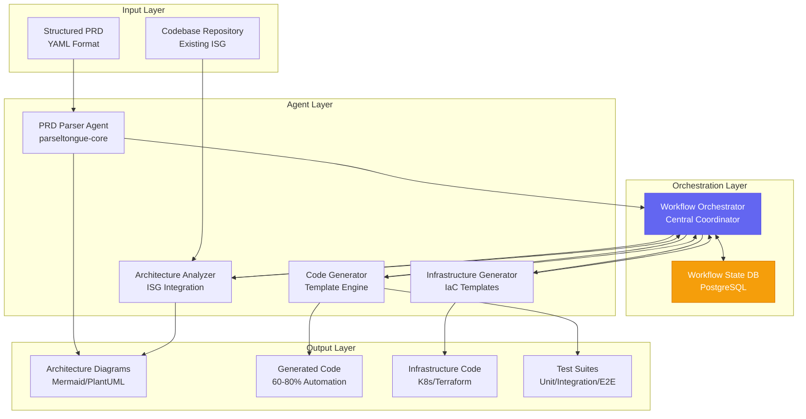

# Agent Architecture for Parseltongue Workflow Automation

## Overview

The Parseltongue Workflow Automation system uses a coordinated multi-agent architecture to transform structured PRDs into deployable code. Each agent has specific responsibilities and interfaces, orchestrated by a central workflow manager.

## Agent System Architecture



## Detailed Agent Specifications

### 1. Workflow Orchestrator (Central Coordinator)

**Purpose**: Manages the end-to-end workflow, coordinates agents, maintains state

**Responsibilities**:
- PRD validation and initial processing
- Agent task distribution and dependency management
- Workflow state persistence and recovery
- Artifact collection and management
- Error handling and retry logic

**Interface**:
```rust
pub struct WorkflowOrchestrator {
    state_db: PgPool,
    agent_registry: AgentRegistry,
    template_repo: TemplateRepository,
}

impl WorkflowOrchestrator {
    pub async fn process_prd(&self, prd_path: PathBuf) -> Result<WorkflowId>;
    pub async fn get_workflow_status(&self, id: WorkflowId) -> Result<WorkflowStatus>;
    pub async fn get_artifacts(&self, id: WorkflowId) -> Result<Vec<Artifact>>;
}
```

**State Management**:
```sql
CREATE TABLE workflows (
    workflow_id UUID PRIMARY KEY DEFAULT gen_random_uuid(),
    prd_file_path TEXT NOT NULL,
    status TEXT NOT NULL CHECK (status IN ('pending', 'running', 'completed', 'failed')),
    current_phase TEXT,
    created_at TIMESTAMPTZ DEFAULT NOW(),
    updated_at TIMESTAMPTZ DEFAULT NOW(),
    artifacts JSONB,
    error_log TEXT[]
);
```

### 2. PRD Parser Agent

**Purpose**: Parses and validates structured YAML PRDs, extracts specifications

**Responsibilities**:
- YAML schema validation
- Requirement extraction and categorization
- Dependency identification
- Success criteria parsing
- Complexity estimation

**Enhanced Parseltongue Core Integration**:
```rust
// New module in parseltongue-core
pub mod prd_parser {
    use serde::{Deserialize, Serialize};
    use validator::Validate;

    #[derive(Debug, Deserialize, Serialize, Validate)]
    pub struct StructuredPRD {
        pub feature: FeatureSpec,
        pub problem: ProblemSpec,
        pub success_criteria: SuccessCriteria,
        pub scope: ScopeSpec,
        pub architecture: ArchitectureSpec,
        pub capabilities: Vec<CapabilitySpec>,
    }

    #[derive(Debug, Deserialize, Serialize)]
    pub struct ArchitectureSpec {
        pub new_services: Vec<ServiceSpec>,
        pub modified_services: Vec<ModifiedServiceSpec>,
        pub new_datastores: Vec<DatastoreSpec>,
        pub integrations: Vec<IntegrationSpec>,
    }

    impl PRDParser {
        pub fn parse_file(path: &Path) -> Result<StructuredPRD>;
        pub fn validate_schema(prd: &StructuredPRD) -> Result<ValidationReport>;
        pub fn extract_requirements(prd: &StructuredPRD) -> Vec<Requirement>;
        pub fn estimate_complexity(prd: &StructuredPRD) -> ComplexityScore;
    }
}
```

**API Endpoints**:
```rust
// New endpoints for parseltongue binary
./parseltongue prd-parse <file> --output <json>
./parseltongue prd-validate <file> --strict
./parseltongue prd-extract <file> --type requirements
```

### 3. Architecture Analyzer Agent

**Purpose**: Analyzes PRD architecture against existing codebase ISG

**Responsibilities**:
- Change detection (NEW/MODIFIED/DELETED)
- Impact analysis and blast radius calculation
- Dependency chain analysis
- Architecture diagram generation
- Integration point identification

**Enhanced PT02 Integration**:
```rust
// New query capabilities for PT02
pub mod architecture_analysis {
    impl CozoDB {
        // Query existing services for comparison
        pub async fn get_existing_services(&self) -> Result<Vec<ServiceEntity>>;

        // Detect new vs modified services
        pub async fn detect_changes(&self, prd_arch: &ArchitectureSpec) -> Result<ChangeAnalysis>;

        // Calculate impact using ISG relationships
        pub async fn calculate_impact(&self, changes: &ChangeSet) -> Result<ImpactScore>;

        // Generate dependency chains
        pub async fn get_dependency_chains(&self, service_id: &str) -> Result<Vec<DependencyChain>>;
    }
}
```

**Change Detection Algorithm**:
```rust
pub struct ChangeDetector {
    isg_db: CozoDB,
}

impl ChangeDetector {
    pub async fn analyze_changes(&self, prd_arch: &ArchitectureSpec) -> Result<ChangeAnalysis> {
        let existing = self.isg_db.get_existing_services().await?;
        let mut changes = ChangeAnalysis::new();

        // Detect NEW services
        for new_service in &prd_arch.new_services {
            if !existing.iter().any(|s| s.name == new_service.name) {
                changes.new_components.push(ComponentChange {
                    name: new_service.name.clone(),
                    change_type: ChangeType::New,
                    component_type: ComponentType::Service,
                });
            }
        }

        // Detect MODIFIED services
        for modified_service in &prd_arch.modified_services {
            if let Some(existing) = existing.iter().find(|s| s.name == modified_service.name) {
                let diff = self.compare_service_spec(existing, modified_service)?;
                changes.modified_components.push(ComponentChange {
                    name: modified_service.name.clone(),
                    change_type: ChangeType::Modified,
                    component_type: ComponentType::Service,
                    details: diff,
                });
            }
        }

        Ok(changes)
    }
}
```

**Diagram Generation**:
```rust
pub struct DiagramGenerator {
    mermaid_cli: PathBuf,
}

impl DiagramGenerator {
    pub async fn generate_component_diagram(&self, changes: &ChangeAnalysis) -> Result<String> {
        let mermaid_content = self.build_mermaid_diagram(changes).await?;
        let output_path = self.render_diagram(&mermaid_content).await?;
        Ok(output_path)
    }

    async fn build_mermaid_diagram(&self, changes: &ChangeAnalysis) -> Result<String> {
        let mut diagram = String::from("graph TB\n");

        // Add NEW components (blue)
        for component in &changes.new_components {
            diagram.push_str(&format!(
                "    {}[{}<br/><b>NEW</b>]:::new\n",
                component.safe_name(),
                component.display_name()
            ));
        }

        // Add MODIFIED components (orange)
        for component in &changes.modified_components {
            diagram.push_str(&format!(
                "    {}[{}<br/><b>MODIFIED</b>]:::modified\n",
                component.safe_name(),
                component.display_name()
            ));
        }

        // Add style definitions
        diagram.push_str("\n    classDef new fill:#6366f1,stroke:#4f46e5,color:#fff\n");
        diagram.push_str("    classDef modified fill:#f59e0b,stroke:#d97706,color:#fff\n");

        Ok(diagram)
    }
}
```

### 4. Code Generator Agent

**Purpose**: Generates code from functional requirements and specifications

**Responsibilities**:
- Service scaffolding (directories, build files)
- API endpoint implementation
- Database model generation
- Configuration file creation
- Test suite generation

**Template Engine Architecture**:
```rust
pub struct CodeGenerator {
    template_repo: TemplateRepository,
    engine: tera::Tera,
}

impl CodeGenerator {
    pub async fn generate_service(&self, spec: &ServiceSpec) -> Result<GeneratedCode> {
        let mut artifacts = Vec::new();

        // Generate directory structure
        let structure = self.generate_directory_structure(spec).await?;
        artifacts.push(Artifact::DirectoryStructure(structure));

        // Generate main entry point
        let main_file = self.generate_main_file(spec).await?;
        artifacts.push(Artifact::File(main_file));

        // Generate API handlers from capabilities
        for capability in &spec.capabilities {
            let handlers = self.generate_handlers(capability).await?;
            artifacts.extend(handlers);
        }

        // Generate models
        let models = self.generate_models(&spec.data_models).await?;
        artifacts.extend(models);

        // Generate tests
        let tests = self.generate_tests(spec).await?;
        artifacts.extend(tests);

        Ok(GeneratedCode { artifacts })
    }

    async fn generate_handlers(&self, capability: &CapabilitySpec) -> Result<Vec<Artifact>> {
        let mut handlers = Vec::new();

        for api_spec in &capability.api {
            // Generate handler function
            let handler_code = self.engine.render("handler.rs.tera", &Context::from_serialize(api_spec))?;
            handlers.push(Artifact::File(FileArtifact {
                path: format!("internal/handlers/{}.rs", api_spec.operation_name),
                content: handler_code,
            }));

            // Generate request/response models
            let models = self.generate_api_models(api_spec).await?;
            handlers.extend(models);
        }

        Ok(handlers)
    }
}
```

**Template Structure**:
```
templates/
├── rust/
│   ├── web-service/
│   │   ├── Cargo.toml.tera
│   │   ├── main.rs.tera
│   │   ├── config/
│   │   │   └── config.rs.tera
│   │   ├── internal/
│   │   │   ├── handlers/
│   │   │   │   └── handler.rs.tera
│   │   │   ├── models/
│   │   │   │   └── model.rs.tera
│   │   │   └── middleware/
│   │   │       └── middleware.rs.tera
│   │   └── tests/
│   │       └── integration_test.rs.tera
│   └── microservice/
│       └── ...
├── typescript/
│   └── express/
├── go/
│   └── gin/
└── python/
    └── fastapi/
```

**Example Handler Template**:
```rust
// templates/rust/web-service/internal/handlers/handler.rs.tera
use crate::models::{{ req_model }};
use crate::models::{{ res_model }};

pub async fn {{ handler_name }}(
    {{#if requires_auth}}
    auth_user: AuthUser,
    {{/if}}
    {{#if has_body}}
    req_body: {{ req_model }},
    {{/if}}
) -> Result<{{ res_model }}, ApiError> {
    {{#if has_db_operation}}
    // Database operation
    {{#each db_operations}}
    let {{ result_var }} = db.{{ operation }}({{ params }}).await
        .map_err(|e| ApiError::DatabaseError(e.to_string()))?;
    {{/each}}
    {{/if}}

    {{#if has_validation}}
    // Validation
    {{#each validations}}
    if !{{ condition }} {
        return Err(ApiError::ValidationError("{{ error_message }}".to_string()));
    }
    {{/each}}
    {{/if}}

    // Business logic
    {{ business_logic }}

    Ok({{ response_var }})
}
```

### 5. Infrastructure Generator Agent

**Purpose**: Generates infrastructure as code from deployment specifications

**Responsibilities**:
- Kubernetes manifest generation
- Terraform configuration creation
- Monitoring and observability setup
- CI/CD pipeline templates
- Security configuration

**Kubernetes Generation**:
```rust
pub struct KubernetesGenerator {
    template_repo: TemplateRepository,
}

impl KubernetesGenerator {
    pub async fn generate_deployment(&self, service: &ServiceSpec) -> Result<K8sManifests> {
        let mut manifests = Vec::new();

        // Generate Deployment
        let deployment = self.generate_deployment_yaml(service).await?;
        manifests.push(K8sManifest::Deployment(deployment));

        // Generate Service
        let k8s_service = self.generate_service_yaml(service).await?;
        manifests.push(K8sManifest::Service(k8s_service));

        // Generate ConfigMap
        if service.has_config() {
            let configmap = self.generate_configmap_yaml(service).await?;
            manifests.push(K8sManifest::ConfigMap(configmap));
        }

        // Generate Secret template
        let secret = self.generate_secret_template(service).await?;
        manifests.push(K8sManifest::Secret(secret));

        Ok(K8sManifests { manifests })
    }

    async fn generate_deployment_yaml(&self, service: &ServiceSpec) -> Result<Yaml> {
        let context = Context::from_serialize(service)?;
        let yaml_content = self.engine.render("k8s/deployment.yaml.tera", &context)?;

        let mut docs: Vec<Yaml> = YamlLoader::load_from_str(&yaml_content)?;
        Ok(docs.remove(0))
    }
}
```

**Example K8s Deployment Template**:
```yaml
# templates/infrastructure/k8s/deployment.yaml.tera
apiVersion: apps/v1
kind: Deployment
metadata:
  name: {{ service_name }}
  namespace: {{ namespace }}
  labels:
    app: {{ service_name }}
    version: "{{ version }}"
spec:
  replicas: {{ replicas.min }}
  selector:
    matchLabels:
      app: {{ service_name }}
  template:
    metadata:
      labels:
        app: {{ service_name }}
        version: "{{ version }}"
    spec:
      containers:
      - name: {{ service_name }}
        image: "{{ image.repository }}:{{ image.tag }}"
        ports:
        {{#each ports}}
        - containerPort: {{ this }}
          name: "{{ this.name }}"
        {{/each}}
        env:
        {{#each env_vars}}
        - name: {{ this.name }}
          value: "{{ this.value }}"
        {{/each}}
        resources:
          requests:
            cpu: "{{ resources.requests.cpu }}"
            memory: "{{ resources.requests.memory }}"
          limits:
            cpu: "{{ resources.limits.cpu }}"
            memory: "{{ resources.limits.memory }}"
        livenessProbe:
          httpGet:
            path: {{ health.liveness.path }}
            port: {{ health.liveness.port }}
          initialDelaySeconds: {{ health.liveness.initial_delay }}
        readinessProbe:
          httpGet:
            path: {{ health.readiness.path }}
            port: {{ health.readiness.port }}
          initialDelaySeconds: {{ health.readiness.initial_delay }}
---
apiVersion: v1
kind: Service
metadata:
  name: {{ service_name }}-service
  namespace: {{ namespace }}
spec:
  selector:
    app: {{ service_name }}
  ports:
  {{#each ports}}
  - port: {{ this.external }}
    targetPort: {{ this.internal }}
    name: "{{ this.name }}"
  {{/each}}
  type: {{ service_type }}
```

## Agent Communication Protocol

### Message Format
```rust
#[derive(Debug, Serialize, Deserialize)]
pub struct AgentMessage {
    pub id: MessageId,
    pub from: AgentId,
    pub to: AgentId,
    pub message_type: MessageType,
    pub payload: serde_json::Value,
    pub timestamp: SystemTime,
    pub correlation_id: Option<WorkflowId>,
}

#[derive(Debug, Serialize, Deserialize)]
pub enum MessageType {
    TaskAssigned,
    TaskCompleted,
    TaskFailed,
    StatusRequest,
    StatusResponse,
    ArtifactGenerated,
    DependencyResolved,
}
```

### Workflow Orchestration
```rust
impl WorkflowOrchestrator {
    pub async fn execute_workflow(&self, workflow_id: WorkflowId) -> Result<()> {
        // Phase 1: PRD Parsing
        let parse_result = self.send_task_to_agent(
            AgentId::PrdParser,
            Task::ParsePRD { workflow_id },
        ).await?;

        // Phase 2: Architecture Analysis (depends on Phase 1)
        let analysis_result = self.send_task_to_agent(
            AgentId::ArchitectureAnalyzer,
            Task::AnalyzeArchitecture {
                workflow_id,
                prd_data: parse_result.data,
            },
        ).await?;

        // Phase 3: Code Generation (depends on Phase 2)
        let code_result = self.send_task_to_agent(
            AgentId::CodeGenerator,
            Task::GenerateCode {
                workflow_id,
                architecture: analysis_result.data,
            },
        ).await?;

        // Phase 4: Infrastructure Generation (parallel with Phase 3)
        let infra_result = self.send_task_to_agent(
            AgentId::InfrastructureGenerator,
            Task::GenerateInfrastructure {
                workflow_id,
                deployment_specs: analysis_result.deployment_specs,
            },
        ).await?;

        // Collect all artifacts
        self.collect_artifacts(workflow_id, vec![
            parse_result.artifacts,
            analysis_result.artifacts,
            code_result.artifacts,
            infra_result.artifacts,
        ]).await?;

        Ok(())
    }
}
```

## Error Handling and Recovery

### Agent Failure Handling
```rust
pub struct ErrorHandler {
    max_retries: u32,
    backoff_strategy: BackoffStrategy,
}

impl ErrorHandler {
    pub async fn handle_agent_failure(&self, agent: AgentId, error: AgentError) -> Result<RecoveryAction> {
        match error {
            AgentError::TemporaryFailure => {
                // Retry with exponential backoff
                Ok(RecoveryAction::RetryWithBackoff)
            },
            AgentError::InvalidInput => {
                // Return to human for correction
                Ok(RecoveryAction::EscalateToHuman)
            },
            AgentError::ResourceExhausted => {
                // Scale up agent resources
                Ok(RecoveryAction::ScaleResources)
            },
            AgentError::TemplateNotFound => {
                // Use fallback templates
                Ok(RecoveryAction::UseFallbackTemplate)
            },
        }
    }
}
```

### State Persistence and Recovery
```rust
impl WorkflowOrchestrator {
    pub async fn checkpoint_workflow(&self, workflow_id: WorkflowId, phase: WorkflowPhase) -> Result<()> {
        let checkpoint = WorkflowCheckpoint {
            workflow_id,
            phase,
            timestamp: SystemTime::now(),
            artifacts: self.get_current_artifacts(workflow_id).await?,
        };

        self.state_db.save_checkpoint(checkpoint).await?;
        Ok(())
    }

    pub async fn recover_workflow(&self, workflow_id: WorkflowId) -> Result<RecoveryPlan> {
        let checkpoint = self.state_db.get_last_checkpoint(workflow_id).await?;

        match checkpoint {
            Some(cp) => Ok(RecoveryPlan::ResumeFromPhase(cp.phase)),
            None => Ok(RecoveryPlan::StartFromBeginning),
        }
    }
}
```

## Performance Optimization

### Parallel Processing
```rust
impl WorkflowOrchestrator {
    pub async fn execute_parallel_phase(&self, workflow_id: WorkflowId) -> Result<()> {
        // Code generation and infrastructure generation can run in parallel
        let (code_result, infra_result) = tokio::try_join!(
            self.generate_code(workflow_id),
            self.generate_infrastructure(workflow_id)
        )?;

        self.merge_results(workflow_id, code_result, infra_result).await?;
        Ok(())
    }
}
```

### Caching and Memoization
```rust
pub struct TemplateCache {
    cache: Arc<RwLock<HashMap<TemplateKey, CompiledTemplate>>>,
}

impl TemplateCache {
    pub async fn get_or_compile(&self, key: TemplateKey, template: &str) -> Result<CompiledTemplate> {
        // Check cache first
        {
            let cache = self.cache.read().await;
            if let Some(compiled) = cache.get(&key) {
                return Ok(compiled.clone());
            }
        }

        // Compile and cache
        let compiled = self.compile_template(template).await?;

        {
            let mut cache = self.cache.write().await;
            cache.insert(key, compiled.clone());
        }

        Ok(compiled)
    }
}
```

## Monitoring and Observability

### Agent Metrics
```rust
pub struct AgentMetrics {
    pub tasks_processed: Counter,
    pub processing_duration: Histogram,
    pub error_rate: Counter,
    pub resource_usage: Gauge,
}

impl AgentMetrics {
    pub fn record_task_completion(&self, duration: Duration) {
        self.tasks_processed.inc();
        self.processing_duration.observe(duration.as_secs_f64());
    }

    pub fn record_error(&self, error_type: &str) {
        self.error_rate.with_label_values(&[error_type]).inc();
    }
}
```

### Distributed Tracing
```rust
#[tracing::instrument(skip(self))]
impl WorkflowOrchestrator {
    pub async fn process_prd(&self, prd_path: PathBuf) -> Result<WorkflowId> {
        let span = tracing::info_span!("process_prd", prd = %prd_path.display());
        let _enter = span.enter();

        let workflow_id = self.create_workflow(prd_path).await?;

        tracing::info!("Created workflow: {}", workflow_id);

        self.execute_workflow(workflow_id).await?;

        tracing::info!("Completed workflow: {}", workflow_id);

        Ok(workflow_id)
    }
}
```

This agent architecture provides a robust, scalable, and maintainable system for automating the PRD-to-code workflow while leveraging Parseltongue's existing ISG capabilities.