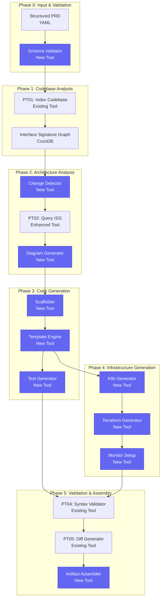

# Parseltongue Workflow Automation Toolchain Mapping

## Overview

This document maps the PRD-to-code workflow phases to the automated toolchain, integrating with existing Parseltongue tools (PT01-PT07) and adding new capabilities for complete workflow automation.

## Workflow Phases and Toolchain Integration



## Detailed Phase Mapping

### Phase 0: Input & Validation

**New Tool: PRD Schema Validator**
```bash
# Command integration
./parseltongue prd-validate <file.yaml> --strict

# Existing tool enhancement
./parseltongue pt01-folder-to-cozodb-streamer --prd-input <file.yaml>
```

**Implementation**:
```rust
// New module in parseltongue-core
pub mod prd_validator {
    use serde_json::Value;
    use schemars::JsonSchema;

    #[derive(JsonSchema)]
    pub struct StructuredPRD {
        pub feature: FeatureSpec,
        pub problem: ProblemSpec,
        pub success_criteria: SuccessCriteria,
        pub scope: ScopeSpec,
        pub architecture: ArchitectureSpec,
        pub capabilities: Vec<CapabilitySpec>,
        pub deployment: DeploymentSpec,
        pub testing: TestingSpec,
    }

    pub fn validate_prd_schema(prd: &Value) -> Result<ValidationReport> {
        // Validate against JSON Schema
        // Check required sections
        // Validate data types
        // Check reference integrity
    }
}
```

### Phase 1: Codebase Analysis (Existing PT01 Enhancement)

**Enhanced PT01: PRD-Aware Indexing**
```bash
# Existing command with new flags
./parseltongue pt01-folder-to-cozodb-streamer . \
  --db "rocksdb:mycode.db" \
  --prd-context <prd.yaml> \
  --change-detection-mode

# New output format for workflow
./parseltongue pt01-folder-to-cozodb-streamer . \
  --db "rocksdb:mycode.db" \
  --output-format "workflow_analysis"
```

**Enhancements to PT01**:
```rust
// Enhanced file streamer for PRD context
impl FileStreamer {
    pub async fn stream_with_prd_context(
        &self,
        prd: &StructuredPRD
    ) -> Result<StreamingStats> {
        // Prioritize files mentioned in PRD
        // Tag entities with PRD relevance
        // Pre-calculate change impact areas
    }
}
```

### Phase 2: Architecture Analysis (Enhanced PT02 + New Tools)

**New Tool: Change Detector**
```bash
# New command
./parseltongue change-detector \
  --db "rocksdb:mycode.db" \
  --prd <prd.yaml> \
  --output changes.json

# Integration with existing PT02
./parseltongue pt02-level00 \
  --db "rocksdb:mycode.db" \
  --change-analysis changes.json \
  --output architecture_diff.json
```

**Implementation**:
```rust
// New tool: crates/pt09-change-detector/
pub struct ChangeDetector {
    isg_db: CozoDB,
    prd_parser: PRDParser,
}

impl ChangeDetector {
    pub async fn detect_changes(&self, prd: &StructuredPRD) -> Result<ChangeAnalysis> {
        // Query existing architecture from ISG
        let existing = self.isg_db.query_architecture().await?;

        // Compare with PRD specifications
        let changes = self.compare_architecture(&existing, &prd).await?;

        // Calculate impact scores
        let impact = self.calculate_impact(&changes).await?;

        Ok(ChangeAnalysis {
            changes,
            impact,
            dependencies: self.extract_dependencies(&changes).await?,
        })
    }
}
```

**Enhanced PT02: Architecture-Aware Queries**
```bash
# New PT02 modes
./parseltongue pt02-architecture-diff \
  --db "rocksdb:mycode.db" \
  --changes changes.json \
  --output diff.json

./parseltongue pt02-dependency-impact \
  --db "rocksdb:mycode.db" \
  --component <service_name> \
  --impact-radius 3
```

**New Tool: Diagram Generator**
```bash
# New command
./parseltongue diagram-generator \
  --type component \
  --input changes.json \
  --output architecture.mmd

./parseltongue diagram-generator \
  --type dataflow \
  --input changes.json \
  --output dataflow.mmd

./parseltongue diagram-generator \
  --type deployment \
  --input changes.json \
  --output deployment.mmd
```

### Phase 3: Code Generation (New Tools)

**New Tool: Service Scaffolder**
```bash
# Command
./parseltongue scaffold-service \
  --spec <service_spec.json> \
  --language rust \
  --framework axum \
  --output ./generated/

# Integration with workflow
./parseltongue scaffold-service \
  --workflow <workflow_id> \
  --service <service_name>
```

**Template Directory Structure**:
```
templates/
├── rust/
│   ├── web-service/
│   │   ├── Cargo.toml.tera
│   │   ├── src/
│   │   │   ├── main.rs.tera
│   │   │   ├── lib.rs.tera
│   │   │   ├── config/
│   │   │   │   └── mod.rs.tera
│   │   │   ├── handlers/
│   │   │   │   └── mod.rs.tera
│   │   │   ├── models/
│   │   │   │   └── mod.rs.tera
│   │   │   └── middleware/
│   │   │       └── mod.rs.tera
│   │   └── tests/
│   │       └── integration/
│   ├── microservice/
│   └── cli-tool/
├── typescript/
│   ├── express/
│   ├── nestjs/
│   └── nextjs/
├── go/
│   ├── gin/
│   └── echo/
└── python/
    ├── fastapi/
    └── django/
```

**New Tool: Template Engine**
```bash
# Command
./parseltongue generate-from-template \
  --template rust/web-service \
  --spec <service_spec.json> \
  --output ./generated/

# Generate specific files
./parseltongue generate-handler \
  --capability <capability_spec> \
  --language rust \
  --output handlers.rs
```

**Implementation**:
```rust
// New tool: crates/pt10-template-engine/
pub struct TemplateEngine {
    templates: Arc<HashMap<String, CompiledTemplate>>,
    tera: tera::Tera,
}

impl TemplateEngine {
    pub async fn generate_service(&self, spec: &ServiceSpec) -> Result<GeneratedFiles> {
        let mut files = Vec::new();

        // Generate main structure
        files.push(self.generate_main_file(spec).await?);
        files.push(self.generate_config_file(spec).await?);

        // Generate handlers from capabilities
        for capability in &spec.capabilities {
            files.extend(self.generate_handlers(capability).await?);
        }

        // Generate models
        files.extend(self.generate_models(&spec.data_models).await?);

        Ok(GeneratedFiles(files))
    }
}
```

**New Tool: Test Generator**
```bash
# Command
./parseltongue generate-tests \
  --spec <service_spec.json> \
  --types unit,integration,e2e \
  --output ./tests/

# Integration with workflow
./parseltongue generate-tests \
  --workflow <workflow_id> \
  --coverage-target 80
```

### Phase 4: Infrastructure Generation (New Tools)

**New Tool: Kubernetes Generator**
```bash
# Command
./parseltongue generate-k8s \
  --spec <deployment_spec.json> \
  --output ./k8s/

# Generate specific resources
./parseltongue generate-deployment \
  --service <service_name> \
  --output deployment.yaml

./parseltongue generate-service \
  --service <service_name> \
  --ports 8080:80 \
  --output service.yaml
```

**Implementation**:
```rust
// New tool: crates/pt11-k8s-generator/
pub struct KubernetesGenerator {
    templates: TemplateEngine,
}

impl KubernetesGenerator {
    pub async fn generate_all(&self, spec: &DeploymentSpec) -> Result<K8sManifests> {
        Ok(K8sManifests {
            deployments: self.generate_deployments(&spec.services).await?,
            services: self.generate_services(&spec.services).await?,
            configmaps: self.generate_configmaps(&spec.config).await?,
            secrets: self.generate_secrets(&spec.secrets).await?,
            ingresses: self.generate_ingresses(&spec.ingress).await?,
        })
    }
}
```

**New Tool: Terraform Generator**
```bash
# Command
./parseltongue generate-terraform \
  --provider aws \
  --spec <infrastructure_spec.json> \
  --output ./terraform/

# Generate specific resources
./parseltongue generate-rds \
  --database <db_spec> \
  --output rds.tf
```

**New Tool: Monitoring Generator**
```bash
# Command
./parseltongue generate-monitoring \
  --services <service_specs> \
  --stack prometheus \
  --output ./monitoring/

# Generate dashboards
./parseltongue generate-dashboard \
  --service <service_name> \
  --metrics <metric_list> \
  --output dashboard.json
```

### Phase 5: Validation & Assembly (Enhanced Existing Tools)

**Enhanced PT04: Workflow-Aware Validation**
```bash
# Existing command with workflow integration
./parseltongue pt04-syntax-preflight-validator \
  --input ./generated/ \
  --workflow <workflow_id> \
  --validation-level strict

# New workflow-specific validation
./parseltongue validate-workflow \
  --workflow <workflow_id> \
  --check compilation,tests,security
```

**Enhanced PT05: Diff Generation for Workflow**
```bash
# Existing command enhanced for workflow
./parseltongue pt05-llm-cozodb-to-diff-writer \
  --db "rocksdb:mycode.db" \
  --future-state ./generated/ \
  --workflow <workflow_id> \
  --output workflow_diff.json
```

**New Tool: Artifact Assembler**
```bash
# Command
./parseltongue assemble-artifacts \
  --workflow <workflow_id> \
  --output ./artifacts/

# Generate deployment package
./parseltongue create-deployment-package \
  --workflow <workflow_id> \
  --format tar.gz
```

## Complete Workflow CLI Integration

### New Unified CLI Interface
```bash
# Complete workflow execution
./parseltongue workflow execute \
  --prd <path/to/prd.yaml> \
  --output ./output/ \
  --config workflow.toml

# Step-by-step execution
./parseltongue workflow step \
  --phase parse-prd \
  --input <prd.yaml>

./parseltongue workflow step \
  --phase analyze-architecture \
  --db "rocksdb:code.db"

./parseltongue workflow step \
  --phase generate-code \
  --workflow <workflow_id>

# Interactive mode
./parseltongue workflow interactive \
  --prd <prd.yaml>
```

### Workflow Configuration
```toml
# workflow.toml
[workflow]
output_dir = "./generated"
temp_dir = "./temp"
parallel_phases = ["code_generation", "infrastructure_generation"]
cleanup_temp = true

[code_generation]
language = "rust"
framework = "axum"
test_coverage_target = 80
automation_target = 70

[infrastructure]
provider = "aws"
kubernetes_version = "1.26"
monitoring_stack = "prometheus"

[validation]
syntax_check = true
security_scan = true
dependency_check = true
test_execution = true

[diagrams]
formats = ["mermaid", "svg"]
include_dataflow = true
include_deployment = true
```

### Integration with Existing Parseltongue Commands

**Enhanced PT01**:
```bash
# Original functionality preserved
./parseltongue pt01-folder-to-cozodb-streamer . --db "rocksdb:code.db"

# New workflow-aware indexing
./parseltongue pt01-folder-to-cozodb-streamer . \
  --db "rocksdb:code.db" \
  --workflow-mode \
  --change-detection
```

**Enhanced PT02**:
```bash
# Original functionality preserved
./parseltongue pt02-level00 --where-clause "ALL" --output deps.json

# New workflow-specific exports
./parseltongue pt02-workflow-analysis \
  --db "rocksdb:code.db" \
  --workflow <workflow_id> \
  --output workflow_analysis.json
```

### Error Handling and Recovery Integration

```bash
# Checkpoint and recovery
./parseltongue workflow checkpoint \
  --workflow <workflow_id> \
  --phase architecture_analysis

./parseltongue workflow resume \
  --workflow <workflow_id> \
  --from-checkpoint

# Recovery from failures
./parseltongue workflow recover \
  --workflow <workflow_id> \
  --auto-retry

# Debug mode
./parseltongue workflow execute \
  --prd <prd.yaml> \
  --debug \
  --keep-temp
```

## Performance Optimizations

### Parallel Execution
```bash
# Run phases in parallel where possible
./parseltongue workflow execute \
  --prd <prd.yaml> \
  --parallel-code-infra \
  --max-workers 4
```

### Incremental Updates
```bash
# Only regenerate changed components
./parseltongue workflow incremental \
  --workflow <workflow_id> \
  --changed-components <component_list>
```

### Caching
```bash
# Enable template and artifact caching
./parseltongue workflow execute \
  --prd <prd.yaml> \
  --cache-dir ./cache \
  --reuse-cache
```

This comprehensive toolchain mapping integrates the new workflow automation capabilities with Parseltongue's existing powerful code analysis tools, creating a seamless end-to-end solution for PRD-to-code automation.