# v0.9.0 Minto Pyramid: Executive Vision

**Purpose**: Quick-reference visual summary of v0.9.0 evolution using the Minto Pyramid Principle.

**Navigation**:
- **Top Section**: Visual flowchart (executive overview)
- **Middle Section**: Minto Pyramid explanation (<300 words)
- **Bottom Section**: Key research foundations

---

## Visual Overview: v0.9.0 Three-Pillar Evolution

```mermaid
---
config:
  theme: base
  themeVariables:
    primaryColor: "#f0f9ff"
    primaryTextColor: "#0c4a6e"
    primaryBorderColor: "#0ea5e9"
    lineColor: "#38bdf8"
    secondaryColor: "#ecfdf5"
    tertiaryColor: "#fef9c3"
    quaternaryColor: "#fee2e2"
    background: "#ffffff"
    fontSize: "14px"
---
flowchart TD
    Start([v0.8.6: Progressive Disclosure<br/>30K tokens for signatures]) --> Vision{v0.9.0 Evolution<br/><b>Goal: 500-1K tokens</b><br/>30-60x compression}

    Vision --> Pillar1["<b>PT07: Analytics Dashboard</b><br/>📊 Graph-Native Queries<br/>Blast radius + complexity metrics<br/>Coverage reports + hotspot detection<br/><b>Performance:</b> ~100ms queries"]

    Vision --> Pillar2["<b>PT08: Semantic Aggregation</b><br/>🎯 Intelligent Clustering<br/>Modernity signatures<br/>Dependency clustering<br/>Multi-level architectural views<br/><b>Compression:</b> 30-60x reduction"]

    Vision --> Pillar3["<b>PT11: Journey-Aware Compression</b><br/>🔄 Task-Specific Context<br/>Bug-fix journey: 2.6K tokens<br/>Security audit: 3K tokens<br/>Pattern research: 7.5K tokens<br/>Refactoring: 2.2K tokens<br/><b>Method:</b> Phase-based filtering"]

    Pillar1 --> Foundation["<b>Research Foundation:</b><br/>Code Property Graphs (CPG)<br/>Knowledge Graph reasoning<br/>Hierarchical compression<br/>Static analysis meta-patterns"]

    Pillar2 --> Foundation
    Pillar3 --> Foundation

    Foundation --> Result["✅ <b>Result: Right Abstraction for Task</b><br/>NOT generic summarization<br/>NOT dumping everything<br/>BUT task-aware context selection"]

    Result --> Examples["<b>Examples:</b><br/>Bug-fix needs: blast radius + temporal state<br/>Security needs: unsafe blocks + public API<br/>Refactor needs: type system + dependencies<br/>Pattern needs: architectural decisions"]

    Examples --> Metrics["<b>Success Metrics:</b><br/>Token efficiency: 500-1K tokens for overview<br/>Query performance: <100ms @ 1K entities<br/>Comprehension: 95%+ accuracy without reading code<br/>Productivity: 80% reduction in 'figuring out' time"]

    classDef currentStyle fill:#fee2e2,stroke:#dc2626,stroke-width:2px,color:#7f1d1d
    classDef visionStyle fill:#dbeafe,stroke:#2563eb,stroke-width:3px,color:#1e3a8a
    classDef pillarStyle fill:#fef3c7,stroke:#ca8a04,stroke-width:2px,color:#854d0e
    classDef foundationStyle fill:#e9d5ff,stroke:#7c3aed,stroke-width:2px,color:#5b21b6
    classDef successStyle fill:#dcfce7,stroke:#16a34a,stroke-width:3px,color:#14532d
    classDef exampleStyle fill:#f0fdf4,stroke:#15803d,stroke-width:2px,color:#14532d

    class Start currentStyle
    class Vision visionStyle
    class Pillar1,Pillar2,Pillar3 pillarStyle
    class Foundation foundationStyle
    class Result successStyle
    class Examples,Metrics exampleStyle
```

---

## Minto Pyramid Explanation

### Main Answer (Top of Pyramid)

**v0.9.0 achieves 30-60x token reduction by providing task-aware context instead of generic summaries.**

### Three Supporting Pillars (Second Level)

#### 1. PT07 - Graph Analytics Dashboard
Instant answers without reading code. "What depends on this function?" → 100ms query reveals blast radius. "What's the complexity hotspot?" → Cyclomatic complexity report. "What's untested?" → Coverage analysis. **Enables informed decisions before changes.**

#### 2. PT08 - Semantic Aggregation
Compress architectural patterns into signatures. Instead of 1000 function signatures, show "3 clusters: authentication (12 fns), data processing (45 fns), API handlers (8 fns)." **Reveals structure, not noise.** Modernity signatures quantify language feature usage. Multi-level views enable package → class → function navigation.

#### 3. PT11 - Journey-Aware Compression
Different tasks need different context. Bug-fix journey (2.6K tokens): blast radius + temporal state. Security audit (3K tokens): unsafe blocks + public API surface. Pattern research (7.5K tokens): architectural decisions + structural patterns. Refactoring (2.2K tokens): type system + dependency graph. **Task-specific filtering beats generic summarization.**

### Key Insight (Foundation)

**Context compression isn't deletion—it's choosing the RIGHT abstraction.** Current v0.8.6 provides "all signatures" (30K tokens). v0.9.0 provides "exactly what THIS task needs" (500-1K tokens). A bug-fix doesn't need the full type system; it needs blast radius and dependencies.

**Evidence:** 2024 academic research (HOMER, TokenSkip, CPG papers) shows task-specific filtering beats generic summarization by 10x while maintaining 95%+ accuracy.

---

## Journey Examples (Concrete Use Cases)

### Bug-Fix Journey (2.6K tokens - 10x reduction)

**Phase 1: Discovery (800 tokens)**
- Blast radius: 5-hop dependency graph
- Temporal state: What changed recently?
- Test coverage: What's untested?

**Phase 2: Planning (1.2K tokens)**
- Affected entities: Signatures only
- Dependency impact: Forward/reverse deps
- Risk assessment: Public API changes?

**Phase 3: Validation (600 tokens)**
- Changed entities: Future code diffs
- Test requirements: Coverage gaps
- Build impact: Type system changes

**Result:** LLM sees exactly what's needed to fix the bug, nothing more.

---

### Security Audit Journey (3K tokens - 8x reduction)

**Phase 1: Surface Analysis (1K tokens)**
- Public API surface: All `pub` functions/structs
- Unsafe blocks: All `unsafe` code locations
- External dependencies: Crate graph

**Phase 2: Risk Assessment (1.2K tokens)**
- Async functions: Concurrency risks
- FFI boundaries: Foreign function interfaces
- Input validation: Public function signatures

**Phase 3: Recommendations (800 tokens)**
- Vulnerability patterns: Known anti-patterns
- Mitigation strategies: Best practices
- Test coverage: Security test gaps

**Result:** Security-focused context without drowning in implementation details.

---

### Pattern Research Journey (7.5K tokens - 4x reduction)

**Phase 1: Architecture (3K tokens)**
- Package-level graph: Module relationships
- Design patterns: Factory, Builder, Strategy detection
- Architectural decisions: Why this structure?

**Phase 2: Evolution (2.5K tokens)**
- Modernity signatures: Language feature usage
- Historical trends: Code age analysis
- Refactoring candidates: Complexity hotspots

**Phase 3: Recommendations (2K tokens)**
- Pattern suggestions: Apply X pattern to Y module
- Consistency checks: Style violations
- Best practices: Idiomatic improvements

**Result:** High-level understanding for research and documentation.

---

### Refactoring Journey (2.2K tokens - 10x reduction)

**Phase 1: Type System (800 tokens)**
- Type signatures: All function/struct types
- Trait implementations: Interface contracts
- Generic constraints: Where clauses

**Phase 2: Dependencies (1K tokens)**
- Dependency graph: Who calls what?
- Coupling analysis: Highly coupled modules
- Interface stability: Public API changes

**Phase 3: Impact (400 tokens)**
- Blast radius: Change propagation
- Test coverage: What needs new tests?
- Migration path: Step-by-step plan

**Result:** Type-safe refactoring plan with minimal context overhead.

---

## Research Foundations (2024 Papers)

### Code Property Graphs (CPG)
- **Vul-LMGNN** (arXiv 2408.03910): AST+CFG+DFG joint representation
- **AISE** (arXiv 2408.02220): Symbolic execution + abstract interpretation
- **GraphFVD**: Program dependence graphs for vulnerability detection
- **Impact**: 10% higher F1 scores in vulnerability detection vs AST-only

### Hierarchical Context Compression
- **HOMER** (ICLR 2024): Memory-efficient LLM context (26-54% reduction, 95%+ accuracy)
- **TokenSkip**: Adaptive token importance scoring
- **Acon**: Attention-based compression with neural networks
- **Impact**: 4-10x compression ratios while maintaining semantic fidelity

### Knowledge Graph Reasoning
- **FalkorDB**: Graph databases vs vector databases for code understanding
- **Neo4j GraphRAG**: Reasoning and inference over code graphs
- **Cypher queries**: Declarative graph traversal languages
- **Impact**: Structured relationships enable complex queries (transitive deps, blast radius)

### Static Analysis Meta-Patterns
- **Confidence gating**: Multi-agent agreement scoring
- **Embarrassingly parallel**: Concurrent analysis of code entities
- **Abstract interpretation**: Semantic analysis without concrete execution
- **Impact**: Scalable analysis for large codebases (>1M LOC)

---

## Implementation Roadmap (12-14 Weeks)

| Weeks | Tool | Focus | Deliverable |
|-------|------|-------|-------------|
| 1-2 | PT07 | Analytics dashboard | 8 report types (blast radius, complexity, coverage) |
| 3-4 | PT08 | Semantic aggregation | Modernity signatures, clustering, multi-level views |
| 5-6 | PT11 | Journey-aware compression | 4 journey types with phase-based context |
| 7-10 | PT01 ext | CFG/DFG/provenance | Control flow + data flow extraction |
| 11-12 | PT09 | Graph reasoning | Pattern detection, semantic clustering |

**Priority Order:**
- **P0 (Must-have)**: PT07, PT08, PT11 - Core compression capabilities
- **P1 (Should-have)**: PT01 extensions - Enhanced indexing
- **P2 (Nice-to-have)**: PT09 - Advanced reasoning

---

## Success Metrics

### Quantitative
- **Token efficiency**: 500-1K tokens for architectural overview (vs 30K in v0.8.6)
- **Query performance**: <100ms for analytics on 1K entities
- **Compression ratio**: 30-60x for journey-specific context
- **Comprehension accuracy**: 95%+ on meta-questions without reading code

### Qualitative
- **Developer productivity**: 80% reduction in "figuring out what to work on" time
- **Tool adoption**: 70%+ of users using PT07 dashboard daily
- **Decision confidence**: 4.0/5 average score (vs 2.5/5 baseline without tools)
- **Context overflow**: 90% reduction in "too much context" complaints

---

## Comparison: v0.8.6 vs v0.9.0

| Capability | v0.8.6 | v0.9.0 |
|------------|--------|--------|
| **Indexing** | ISGL1 keys + signatures | + CFG + DFG + provenance |
| **Export** | 3 levels (2-60K tokens) | + Journey-aware (500-1K tokens) |
| **Queries** | Basic WHERE clauses | + Graph analytics (blast radius, clustering) |
| **Context** | Signatures or full code | + Task-specific aggregation |
| **Reasoning** | CozoDB datalog only | + Pattern detection + inference |
| **Use Case** | "Show me the code" | "Answer questions without reading code" |

---

## Related Documents

- **v090scope.md**: Full technical specification (68KB, 9 sections, 26 citations)
- **README.md**: Current v0.8.6 capabilities and quick start
- **P00.md**: Complete visual architecture (zzArchive202510/)
- **CLAUDE.md**: Project context auto-loaded by Claude Code

---

## Design Philosophy

This document embodies **Minto Pyramid Principle for technical communication**:

1. **Answer First**: Main conclusion at the top (30-60x compression via task-aware context)
2. **Three Pillars**: Supporting arguments grouped logically (PT07, PT08, PT11)
3. **Evidence-Based**: 2024 research citations validate approach
4. **Visual-First**: Mermaid diagram provides instant comprehension
5. **Actionable**: Clear roadmap with priorities and metrics

**Target Audience**: Executives, technical leads, and stakeholders who need to understand v0.9.0 value proposition in <5 minutes.

---

**Built with functional Rust, TDD-first principles, and ultra-minimalist design.**
**For LLM-driven code understanding workflows.**
