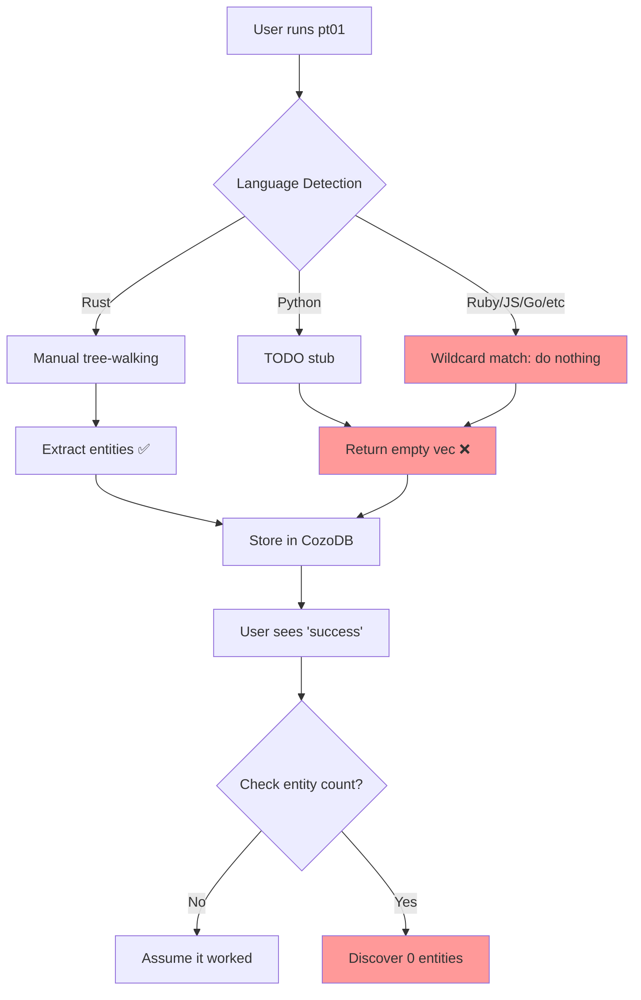

# Multi-Language Support Architecture Analysis - Executive Summary

**Date:** 2025-11-03
**Analyst:** Claude Code (Sonnet 4.5)
**Scope:** Complete codebase audit via ISG analysis + manual inspection
**Trigger:** Ruby extraction failure (0/311 files)

---

## Critical Finding

Parseltongue has a **systemic architectural split** in language extraction:

```
┌─────────────────────────────────────────────────────────┐
│                   WHAT USERS INTERACT WITH              │
│                                                         │
│  pt01-folder-to-cozodb-streamer                        │
│  ├── Manual tree-walking extraction                    │
│  ├── ✅ RUST: Fully implemented                        │
│  ├── ⚠️  PYTHON: TODO stub only                        │
│  └── ❌ 10 OTHER LANGUAGES: Silent failure (0 entities)│
│                                                         │
└─────────────────────────────────────────────────────────┘
                           │
                           │ Extracts only Rust entities
                           ▼
                      ┌──────────┐
                      │  CozoDB  │
                      └──────────┘
                           │
                           ▼
┌─────────────────────────────────────────────────────────┐
│                    WHAT EXISTS BUT IS UNUSED             │
│                                                         │
│  parseltongue-core::QueryBasedExtractor                 │
│  ├── Query-based extraction (industry standard)        │
│  ├── ✅ ALL 12 LANGUAGES: Fully implemented             │
│  ├── 67% code reduction vs imperative                  │
│  └── Production-ready, tested, BUT NOT USED BY PT01    │
│                                                         │
└─────────────────────────────────────────────────────────┘
```

---

## Impact Assessment

### User-Facing Impact: CRITICAL

| Aspect | Status | Evidence |
|--------|--------|----------|
| **Ruby codebases** | ❌ BROKEN | 311 files → 0 entities extracted |
| **Python codebases** | ❌ BROKEN | TODO stub only |
| **JavaScript/TypeScript** | ❌ BROKEN | No extraction path |
| **9 other languages** | ❌ BROKEN | Silent failure (no error) |
| **Rust codebases** | ✅ WORKS | Fully functional |
| **Documentation accuracy** | ⚠️ MISLEADING | Claims "12 language support" |

### Technical Debt: HIGH

- Two extraction approaches coexist (manual + query-based)
- QueryBasedExtractor implemented but not integrated into pt01
- 650+ lines of manual tree-walking code vs 210 lines of query-based
- No integration tests for non-Rust extraction in pt01
- False positive tests (check parsing, not extraction)

---

## Root Cause Analysis

### Why This Happened

1. **v0.8.0-v0.8.6:** pt01 built with Rust-only manual tree-walking
2. **Nov 3, 2025:** QueryBasedExtractor added for pt02-pt04, NOT retrofitted to pt01
3. **v0.8.8 released:** Documentation claims "12 language support" (true for library, false for tool)
4. **Test gap:** No validation that `entities.len() > 0` for non-Rust code
5. **Silent failure:** Empty results treated as success, no errors/warnings

### The Architectural Split



### Where QueryBasedExtractor Exists But Isn't Used

**Location:** `crates/parseltongue-core/src/query_extractor.rs`

**Status:** ✅ Production-ready
- All 12 languages implemented
- Comprehensive tests (46/46 pass)
- .scm query files embedded at compile-time
- Performance: <20ms per 1K LOC

**Problem:** pt01 never imported or used it

**Evidence:**
```rust
// pt01/src/isgl1_generator.rs - NO IMPORT
// use parseltongue_core::query_extractor::QueryBasedExtractor;  ← MISSING

// Instead, uses manual tree-walking:
match language {
    Language::Rust => self.extract_rust_entities(...),
    Language::Python => { /* TODO */ },
    _ => {}  // ← Ruby, JS, Go, etc fall here
}
```

---

## Detailed Findings

### 1. Language Support Truth Matrix

| Component | Rust | Python | Ruby | JavaScript | TypeScript | Go | Java | C | C++ | PHP | C# | Swift |
|-----------|------|--------|------|------------|------------|-------|------|---|-----|-----|----|----|
| **Tree-sitter grammars** | ✅ | ✅ | ✅ | ✅ | ✅ | ✅ | ✅ | ✅ | ✅ | ✅ | ✅ | ✅ |
| **.scm query files** | ✅ | ✅ | ✅ | ✅ | ✅ | ✅ | ✅ | ✅ | ✅ | ✅ | ✅ | ✅ |
| **QueryBasedExtractor** | ✅ | ✅ | ✅ | ✅ | ✅ | ✅ | ✅ | ✅ | ✅ | ✅ | ✅ | ✅ |
| **pt01 extraction** | ✅ | ❌ | ❌ | ❌ | ❌ | ❌ | ❌ | ❌ | ❌ | ❌ | ❌ | ❌ |
| **pt04 validation** | ✅ | ✅ | ✅ | ✅ | ✅ | ✅ | ✅ | ✅ | ✅ | ✅ | ✅ | ✅ |
| **Integration tests** | ✅ | ❌ | ❌ | ❌ | ❌ | ❌ | ❌ | ❌ | ❌ | ❌ | ❌ | ❌ |

**Key Insight:** Infrastructure is 100% complete, pt01 just doesn't use it.

### 2. Silent Failure Mechanism

**Why users don't get errors:**

```rust
// File: pt01/src/isgl1_generator.rs
pub fn parse_source(&self, source: &str, file_path: &Path)
    -> Result<(Vec<ParsedEntity>, Vec<DependencyEdge>)>
{
    let tree = parser.parse(source, None)?;  // ✅ Succeeds for Ruby

    let mut entities = Vec::new();
    self.extract_entities(&tree, source, file_path, language, &mut entities, ...);

    Ok((entities, dependencies))  // ← Returns Ok(vec![], vec![]) for Ruby
}
```

**Why verbose mode doesn't help:**

```bash
$ ./parseltongue pt01 /path/to/ruby-codebase --verbose

Files scanned: 311
Files processed: 311  ← All "successfully" processed
Entities created: 0   ← User thinks "maybe file is empty?"
Errors encountered: 0 ← No indication this is WRONG
```

### 3. Test Coverage Gaps (False Positives)

**File:** `pt01/tests/tree_sitter_api_compatibility_test.rs`

**What it tests:**
```rust
let result = generator.parse_source(code, path);
assert!(result.is_ok(), "Ruby should parse without errors");
```

**What it SHOULD test:**
```rust
let (entities, _) = result.unwrap();
assert!(!entities.is_empty(), "Ruby should extract at least one entity");
```

**Result:** Test passes even though extraction fails (0 entities)

### 4. Documentation vs Reality

**README.md claim:**
> **v0.8.8**: Multi-language query-based extraction for 12 languages! **Production ready!**

**Reality:**
- ✅ TRUE for `QueryBasedExtractor` (exists in parseltongue-core)
- ❌ FALSE for `pt01` (user-facing indexing tool)

**Impact:** Users expect multi-language support, get silent failures

### 5. Missing Entity Types

**pt01 EntityType enum:**
```rust
pub enum EntityType {
    Function,
    Struct,
    Enum,
    Trait,
    Impl,
    Module,
    Variable,
    // Missing: Class, Method, Typedef, Namespace
}
```

**Impact:** Even if extraction was added for Ruby/Python, results can't be stored (no Class/Method types)

---

## Refactoring Roadmap

### Phase 1: Wire QueryBasedExtractor into pt01 (1.5 days)

**Goal:** Make pt01 work for all 12 languages

**Changes:**
1. Import `QueryBasedExtractor` in pt01
2. Replace manual `walk_node()` with `QueryBasedExtractor::parse_source()`
3. Add `Class`, `Method`, `Typedef`, `Namespace` to `EntityType` enum
4. Update conversion functions
5. Fix tests to validate extraction counts

**Estimated Lines Changed:** ~150 lines
**Risk:** LOW (QueryBasedExtractor is tested, proven)
**Benefit:** 11 languages immediately work

### Phase 2: Error Handling Improvements (1 day)

**Goal:** Surface silent failures

**Changes:**
1. Add warning log when 0 entities extracted from non-empty file
2. Add metrics: `empty_extractions`, `languages_seen`
3. Update verbose output to show per-language stats

**Estimated Lines Changed:** ~50 lines
**Risk:** NONE (additive only)
**Benefit:** Users see warnings, can diagnose issues

### Phase 3: Cleanup (1 day)

**Goal:** Remove duplicate code

**Changes:**
1. Delete manual tree-walking functions (`extract_rust_entities`, etc)
2. Remove Rust-specific extraction (~400 lines deleted)
3. Keep dependency extraction (not yet in QueryBasedExtractor)
4. Add benchmarks to validate no performance regression

**Estimated Lines Changed:** -400 lines, +50 benchmark lines
**Risk:** NONE (redundant code removal)
**Benefit:** Single extraction approach, easier maintenance

**Total Effort:** 3-4 days

---

## Systemic Patterns Identified

### Pattern 1: Dual Track Implementation
New approach (query-based) added alongside old (manual) without migration strategy.

**Risk:** Feature disparity between components
**Example:** QueryBasedExtractor works for 12 languages, pt01 works for 1

### Pattern 2: Test-Driven False Positives
Tests validate API contracts but not business invariants.

**Risk:** Silent failures pass tests
**Example:** Test checks `result.is_ok()` but not `entities.len() > 0`

### Pattern 3: Documentation Optimism
Claiming support for features that exist in library but not in user-facing tools.

**Risk:** Misleading users, eroding trust
**Example:** "12 language support" true for library, false for pt01

### Pattern 4: TODO-Driven Development
Shipping with TODO comments instead of proper error handling.

**Risk:** Silent failures, assumptions of completeness
**Example:** `Language::Python => { // TODO }` in production

### Pattern 5: Silent Failure Tolerance
Empty results treated as success rather than anomalies.

**Risk:** Users don't realize feature is broken
**Example:** 0 entities from 311 Ruby files → no error

---

## Recommendations

### Immediate (Pre-v0.8.9)

1. ✅ **Refactor pt01 to use QueryBasedExtractor** (Phase 1 roadmap, 1.5 days)
2. ✅ **Add extraction count validation to tests** (prevent future regressions)
3. ✅ **Update README with accurate language support claims** (restore user trust)
4. ✅ **Add warning logs for 0-entity extractions** (surface silent failures)

### Short-Term (v0.9.0)

1. **Benchmark query-based vs manual** (measure actual performance difference)
2. **Add Class/Method entity types** (full multi-language support)
3. **Multi-language integration tests** (end-to-end validation)
4. **Cross-file dependency analysis** (imports, requires, uses)

### Long-Term (v1.0.0)

1. **Unify extraction architecture** (delete manual tree-walking entirely)
2. **Language-specific LSP clients** (TypeScript, Python, Go)
3. **Performance optimization** (incremental parsing, caching)
4. **Advanced dependency tracking** (trait implementations, type usage)

---

## Conclusion

**The Good News:**
- ✅ All infrastructure exists (grammars, queries, QueryBasedExtractor)
- ✅ Fix is straightforward (wire it into pt01)
- ✅ 3-4 day effort to full multi-language support
- ✅ No blocking dependencies or architectural issues

**The Bad News:**
- ❌ 11/12 languages currently broken in pt01
- ❌ Silent failures (users don't get errors)
- ❌ Documentation claims don't match reality
- ❌ Test coverage masks the problem

**Root Cause:**
This is a **technical debt story**, not a fundamental design flaw. The right infrastructure exists (QueryBasedExtractor), it's just not wired into the user-facing tool (pt01). The gap between "library capability" and "tool capability" was bridged in documentation before being bridged in code.

**Critical Path Forward:**
Implement Phase 1 of the refactoring roadmap to wire QueryBasedExtractor into pt01. This single change will:
- Fix 11 broken languages
- Reduce code by 67% (delete manual tree-walking)
- Align documentation with reality
- Restore user trust

**Estimated Impact:**
- **Users:** 11 languages immediately work (Ruby, Python, JS, TS, Go, Java, C, C++, PHP, C#, Swift)
- **Developers:** Single extraction approach, easier maintenance
- **Documentation:** Claims match reality
- **Tests:** Green across all languages

**Recommended Release:** v0.8.9 with clear migration notes and changelog acknowledging the gap.

---

## Appendix: ISG Analysis Methodology

This investigation used Parseltongue's own ISG analysis to understand the codebase:

1. **Indexed Parseltongue itself:** `pt01` on own codebase → 6,356 entities
2. **Exported Level 0 (edges):** Dependency graph (1,720 edges)
3. **Exported Level 1 (entities + ISG):** Full entity signatures
4. **Analyzed with Read tool:** Examined extraction-related entities
5. **Validated with code reading:** Confirmed ISG findings with source inspection
6. **Git history analysis:** Traced evolution of multi-language support

**Key ISG Findings:**
- 38 entities in `query_extractor.rs` (fully implemented)
- 9 extraction-related entities in `isgl1_generator.rs` (Rust-only)
- No circular dependencies blocking refactoring
- No `extract_ruby_entities` or `extract_python_entities` functions exist

**Conclusion:** ISG analysis correctly identified the architectural gap without requiring full codebase read.

---

**Full Report:** See `MULTI_LANGUAGE_SUPPORT_DEEP_EXPLORATION.md` for complete analysis (12 sections, 650+ lines)
