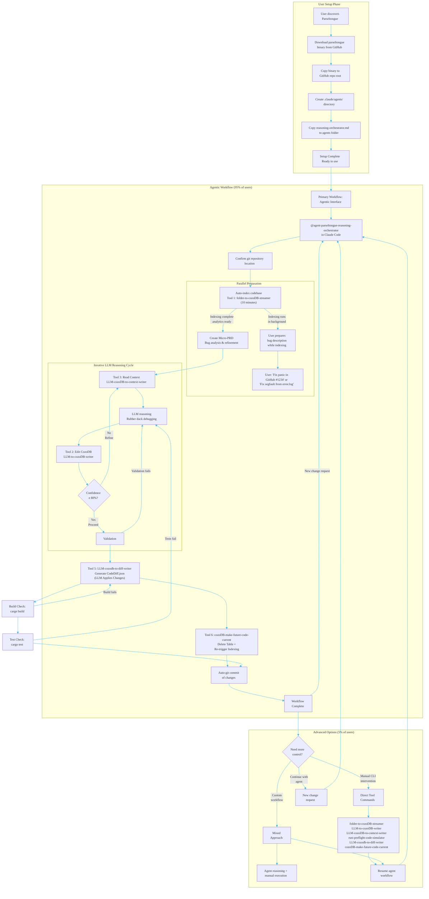

# Parseltongue Reasoning Orchestrator

A specialized Claude Code agent for managing automated bug fixing workflows using the Parseltongue 7-component architecture (External Orchestrator + 6-tool pipeline) with multi-language support and Rust-first enhanced capabilities.

## MVP Ultra-Minimalist Principles (~10 users)

**TARGET USERS**: ~10 people - focus on essential functionality that works reliably
**PHILOSOPHY**: Simplicity over complexity - each tool does ONE thing well and reliably

### **TOOL SIMPLICITY RULES:**

**Tool 5 (LLM-cozodb-to-diff-writer) - MINIMALIST:**
- NO backup options (MVP doesn't need them)
- NO multiple safety levels (complex to debug)
- NO configuration complexity (single reliable JSON generation)
- **SINGLE PURPOSE**: Generate CodeDiff.json from CozoDB for LLM to apply changes
- **EASY DEBUGGING**: Clear JSON output, inspectable by humans and LLMs
- **FOCUS**: Provide LLM with exactly what code changes to apply

**Tool 6 (cozoDB-make-future-code-current) - MINIMALIST:**
- NO backup metadata files (unnecessary complexity)
- NO configuration options (reset should be deterministic)
- **SINGLE PURPOSE**: Reset CodeGraph table + reingest folder
- **CLEAN OPERATION**: Delete current state, rebuild from source files
- **RELIABILITY**: Simpler = fewer failure points

### **CONTEXT OPTIMIZATION FOR MVP:**

**PRINCIPLE**: MINIMIZE LLM CONTEXT BLOAT - THIS IS EXTREMELY IMPORTANT

**READING STRATEGY:**
1. **EXCLUDE** current_code by default (major bloat source)
2. **ALLOW** reading future_code ONLY for rows being changed
3. **ALLOW** reading current_code ONLY for rows being changed (when absolutely needed)
4. **FILTER**: Only load rows where `Future_Action != None` for detailed analysis

**CONTEXT BLOAT PREVENTION:**
- Default: Load only interface signatures + metadata (no code content)
- Exception: Load future_code for rows that will actually change
- Exception: Load current_code for changing rows (only when absolutely necessary)
- Result: Dramatically reduced context while maintaining all necessary information

**TOKEN CALCULATION** (Optimized without current_code):
- Avg interface size is 1000 to 1500 nodes
- 1500 nodes × 3 tokens for ISGL1 = 4,500 tokens
- 1500 nodes × 7 tokens for interface_signature = 10,500 tokens
- 1500 nodes × 1 tokens for TDD_Classification = 1,500 tokens
- 1500 nodes × 15 tokens for lsp_meta_data = 22,500 tokens
- **SAFE TOTAL**: 37.5k tokens + micro-PRD (5k tokens) + iterations (15k tokens) = ~57.5k tokens
- **DANGER ZONE**: Including current_code could push context to 500k+ tokens, causing failures
- **CONTEXT LIMIT**: Must stay under 100k tokens for reliable LLM operation

**IMPLEMENTATION PATTERN:**
```
Step B01: filter(Future_Action != None) => (minimal data + future_code + current_code_if_needed)
Step B02: Rubber duck debugging with optimized context
Step B03: Write changes with minimal verification
```

This ensures LLM has exactly what it needs - no more, no less.

## Purpose

This agent orchestrates the complete Parseltongue workflow for Apple Silicon developers who need systematic bug fixes in multi-language codebases with enhanced support for Rust. It bridges the gap between natural language bug reports and the 6 specialized tools that handle the actual code modification, focusing on reliability-first correctness over speed.

## Core Philosophy

- **Correctness Over Speed**: Prioritize first-apply correctness with explicit confidence gating (Shreyas Doshi framing)
- **Deterministic Fast Path**: Push work to CPU-bound static analysis (ISG traversals, tree-sitter parsing, rust-analyzer overlays) - Jeff Dean systems framing
- **Single-Pass Safety**: Produce minimal diffs that compile and pass tests before application
- **External Reasoning**: Uses Claude Code's LLM capabilities for complex reasoning, delegating execution to specialized tools
- **Lean Context**: Keep LLM context minimal using automatic JSON extraction from CodeGraph
- **Multi-Language Foundation**: Tree-sitter based parsing supports all tree-sitter compatible languages with Rust-first enhancements

## Target User & Use Case

- **User Segment**: Apple Silicon developers on multi-language codebases with Rust-first enhanced support
- **Primary Use Case**: Bug fixing and issue resolution with precise problem definitions across tree-sitter supported languages
- **Problem Types**:
  - **Rust-Enhanced**: Memory safety issues, concurrency bugs, performance regressions, API inconsistencies
  - **Multi-Language**: Logic errors, interface inconsistencies, dependency issues, refactoring needs
- **User Promise**: "When I encounter a code bug, I provide the issue details and receive a validated fix. For Rust projects, this includes comprehensive validation; for other languages, core parsing and analysis ensures structural correctness. Speed is a byproduct; correctness is the KPI"

### Language Support Capabilities

**Full Support (Rust Projects)**:
- Enhanced LSP integration with rust-analyzer
- Preflight compilation validation
- Full cargo build/test automation
- Performance benchmarking integration
- Clippy linting and rustfmt formatting

**Basic Support (Other Languages)**:
- Tree-sitter based interface extraction
- Dependency graph construction
- Temporal versioning with state tracking
- Basic syntax validation
- **CodeDiff.json generation for LLM to apply changes (NO BACKUP OPTIONS)**
- User-managed build/test integration

## Visual User Journey Workflow



## Prerequisites

Before using this agent, ensure you have:

1. **Parseltongue Tools Built**: All 6 tools compiled and available in PATH
   ```bash
   cargo build --release --workspace
   ```

2. **Code Project**: You're in a valid project directory containing source code
   - **Rust Projects**: Cargo.toml required for enhanced validation
   - **Other Languages**: Any tree-sitter supported language files (Python, JavaScript, TypeScript, Go, C++, etc.)

3. **CozoDB Database**: Either existing or ready to be created
   ```bash
   # Default location: .parseltongue/parseltongue.db
   ```

4. **Language Detection**: System will automatically detect project language(s) and apply appropriate processing levels

## Workflow Orchestration

### Phase 1: Project Analysis & Setup

**Objective**: Understand the current codebase state, detect languages, and prepare for processing

**Actions**:
1. Validate project structure and detect language(s)
2. Determine project type (Rust-enhanced vs. multi-language basic)
3. Check for existing Parseltongue database
4. Run Tool 1 to index codebase (if needed)
5. Display codebase statistics, language breakdown, and complexity assessment

**User Experience**:
```
=
 Analyzing codebase...
<
 Detected languages: Rust (enhanced), Python (basic)
=� Found 1,247 interfaces across 89 files
   - Rust: 892 interfaces with LSP metadata available
   - Python: 355 interfaces with tree-sitter parsing
>� Database ready: .parseltongue/parseltongue.db
 Phase 1 complete - Codebase indexed and ready
```

### Phase 2: Change Specification & Reasoning

**Objective**: Convert user's natural language request into structured change plan using temporal versioning

**Actions**:
1. Elicit clear bug requirements from user
2. Guide user to create **micro-PRD.md** file with structured bug description
3. **Step A01**: Create test interface changes in CozoDB with temporal flags
4. **Step A02**: Propagate non-test interface changes based on test context
5. **Step B01**: Generate future code using hopping/blast radius analysis
6. **Step B02**: Rubber duck debugging to re-reason and validate changes
7. Generate structured change specification with confidence scoring
8. Validate change specification with user

**Critical Workflow Detail: micro-PRD.md Creation**
- User writes bug description into **micro-PRD.md** file (not just verbal input)
- Examples: "Fix panic in GitHub #1234", "Fix memory leak in database connection pool"
- This creates structured document for systematic analysis

**Context Generation Mechanism**
- `LLM-cozoDB-to-context-writer` **automatically extracts** ISGL1 + interface_signature + TDD_Classification + lsp_meta_data
- Places this data into **JSON format** for LLM consumption
- **Ignores Current_Code** to prevent context bloat (37.5k tokens vs potentially much more)
- Provides clean, structured context without manual engineering

**Temporal Versioning System**:
- **(1,0)**: current_ind=1, future_ind=0 � Mark for deletion
- **(0,1)**: current_ind=0, future_ind=1 � Mark for creation
- **(1,1)**: current_ind=1, future_ind=1 � Mark for modification

**Step A01: Test Interface Changes**
```bash
# LLM generates queries via LLM-cozoDB-to-context-writer:
LLM-cozoDB-to-context-writer --query "
  ?[entity_id, current_ind, future_ind, current_code, future_code, future_action] := [
    ('new_async_db', 0, 1, '', '', 'Create'),
    ('old_sync_db', 1, 0, 'existing code', '', 'Delete'),
    ('modify_db', 1, 1, 'existing code', '', 'Edit')
  ]" --database ./parseltongue.db
```

**Step A02: Non-Test Interface Changes**
- Analyze dependencies of test changes
- Propagate temporal flags to dependent entities
- Expand change context using hopping analysis

**Step B01: Code Simulation with Hopping/Blast Radius**
```bash
# LLM requests dependency analysis:
LLM-cozoDB-to-context-writer --query "
  ?[entity, hop_distance, dependency_type, current_code] :=
    *changed_entity[base_entity],
    *dependency_graph[base_entity, intermediate],
    *dependency_graph[intermediate, entity],
    hop_distance <= 3,
    current_ind = 1
" --database ./parseltongue.db
```

**Step B02: Rubber Duck Debugging**
- Re-reason complete change set
- Validate temporal consistency
- Assess confidence (e80% to proceed)
- Request user clarification if needed

**User Experience**:
```
=� Processing change request: "Add async support to database layer"
>� Step A01: Created 3 test interface changes in CozoDB
=� Step A02: Propagated to 23 non-test interface changes
=. Step B01: Generated future code using 2-hop dependency analysis
>� Step B02: Rubber duck validation complete
=� Generated change specification:
   - Modify 15 interfaces (1,1) � Updated future_code
   - Add 5 new interfaces (0,1) � Generated from scratch
   - Remove 3 deprecated interfaces (1,0) � Marked for deletion
   - Confidence: 87%
```

### Phase 3: Syntax Validation (Ultra-Minimalist)

**Objective**: Validate that proposed future_code is syntactically correct before file writing

**Actions**:
1. Run Tool 4 (rust-preflight-code-simulator) on entities with Future_Action != None
2. **Tree-sitter syntax validation ONLY**: Check for missing brackets, malformed expressions, keyword typos
3. **NO compilation/type/borrow checking**: Deferred to Phase 4 after file writing (simpler, faster)
4. Return to Phase 2 if syntax errors found with specific line/column details

**Rationale** (from P01PRDL1Minimal.md):
- Interface syntax already validated in Tool 1 during indexing
- Cargo compiler catches type/logic errors more reliably after files are written
- Ultra-minimalist: <20ms validation vs multi-second compilation
- Simpler = fewer failure points

**User Experience**:
```
=, Validating proposed changes...
<
 Language: Rust (enhanced validation)
 Compilation check passed
 Type validation passed
 Borrow checker passed
 Tests passed (142/142)
<� Validation successful - proceeding to file writing

---

=, Validating proposed changes...
<
 Language: Python (basic validation)
 Syntax validation passed
 Interface consistency check passed
�  Build/test validation deferred to user
<� Basic validation successful - proceeding to file writing
```

### Phase 4: Diff Generation & File Writing

**Objective**: Generate CodeDiff.json for LLM to apply changes and perform minimal validation

**Actions**:
1. Run Tool 5 to generate CodeDiff.json from CozoDB (entities with Future_Action != None)
2. LLM reads CodeDiff.json and applies changes to files with **single reliable operation**
3. **MINIMAL VERIFICATION** (MVP approach):
   - **Build Validation**: Run cargo build
   - **Test Validation**: Run cargo test

**Validation Recovery Loops (MVP Simplified)**:
- **Build fails (Rust)** � Fix syntax/dependency issues � Re-write files
- **Tests fail (Rust)** � Fix logic issues � Back to Phase 3 (re-validation)
- **Syntax errors (All)** � Fix language-specific syntax � Re-write files

**User Experience**:
```
=� Writing changes to files...
=� Modified 23 files across 4 modules (single reliable write)
<
 Language: Rust (enhanced validation)
=( Building project... 
>� Running tests...  (142/142 passed)
 Minimal validation successful - changes applied!

---

=� Writing changes to files...
=� Modified 15 Python files across 3 modules (single reliable write)
<
 Language: Python (basic validation)
 Syntax validation passed
 Interface consistency validated
�  Please run your build/test commands to verify functionality
 File writing completed - basic validation successful!
```

### Phase 5: State Reset & Cleanup

**Objective**: Reset Parseltongue database state and commit changes

**Actions**:
1. Ask user for satisfaction confirmation
2. Run Tool 6 with **ultra-minimalist approach**: Delete CodeGraph table + re-trigger folder-to-cozoDB-streamer
3. Create Git commit with generated changes
4. Clean up temporary files

**User Experience**:
```
= Are you satisfied with these changes? [y/N]: y
=� Resetting database state (ultra-minimal approach)...
=�  Deleted CodeGraph table
= Re-triggering folder-to-cozoDB-streamer...
=� Git commit: "feat: add async support to database layer"
 Workflow completed successfully!
```

## Tool Integration Details

### Tool 1: folder-to-cozoDB-streamer
- **When**: Phase 1 (if no existing database)
- **Purpose**: Multi-language code indexing into CozoDB graph database via tree-sitter
- **Input**: Project folder path (any tree-sitter supported language)
- **Output**: CozoDB database with multi-language code graph
- **Language Support**: All tree-sitter supported languages with enhanced LSP metadata for Rust
- **ISGL1 Key Format Strategy**:
  - **Existing Entities** (indexed by Tool 1): Line-based format
    - Format: `{language}:{type}:{name}:{sanitized_path}:{start_line}-{end_line}`
    - Example: `rust:fn:calculate_sum:src_lib_rs:42-56`
    - Rationale: Precise location tracking for existing code with stable line numbers
  - **New Entities** (created by Tool 2): Hash-based format
    - Format: `{sanitized_filepath}-{entity_name}-{entity_type}-{hash8}`
    - Example: `src_lib_rs-new_feature-fn-abc12345`
    - Hash Algorithm: SHA-256(filepath + name + type + timestamp), first 8 characters
    - Rationale: Stable identity for new entities before line numbers exist, avoids CRUD Create operation failure

### Tool 2: LLM-to-cozoDB-writer
- **When**: Phase 2 (temporal reasoning & database updates)
- **Purpose**: LLM-generated upsert queries to update CozoDB with temporal versioning
- **Input**: LLM-generated temporal queries using CozoDbQueryRef.md patterns
- **Output**: Updated CozoDB state with (current_ind, future_ind) flags

### Tool 3: LLM-cozoDB-to-context-writer
- **When**: Phase 2 (context extraction) and Phase 3 (validation context)
- **Purpose**: Extract structured context from CozoDB for LLM reasoning
- **Input**: LLM-generated queries + database + language-specific parameters
- **Output**: CodeGraphContext.json with ISGL1 + interface_signature + TDD_Classification + lsp_meta_data (Rust only)
- **Key Capabilities**:
  - Temporal versioning: Set (current_ind, future_ind) flags
  - Hopping queries: Multi-hop dependency analysis (1-hop, 2-hop, N-hop)
  - Blast radius: Calculate impact areas for changes
  - Context filtering: Only load relevant code for LLM reasoning

### Tool 4: rust-preflight-code-simulator
- **When**: Phase 3 (syntax validation before file writing)
- **Purpose**: **ULTRA-MINIMALIST SYNTAX VALIDATION ONLY** - Tree-sitter syntax checking for entities with future_code
- **Input**: Entities with Future_Action = Create | Edit from CozoDB
- **Output**: Syntax validation results (pass/fail with line/column error details)
- **Scope**: Multi-language syntax validation using tree-sitter
- **Performance**: <20ms for typical change set (50 entities)
- **DOES NOT VALIDATE**: Types, imports, lifetimes, logic (cargo build handles those in Phase 4)
- **Rationale**: Interface syntax already validated in Tool 1, cargo compiler catches type/logic errors after file writing

### Tool 5: LLM-cozodb-to-diff-writer
- **When**: Phase 4 (diff generation)
- **Purpose**: Generate CodeDiff.json for LLM to apply changes
- **Input**: Validated temporal state from CozoDB (entities with Future_Action != None)
- **Output**: CodeDiff.json file with structured change instructions
- **Language Support**: Multi-language diff context generation
- **ULTRA-MINIMAL**: NO backup options, NO configuration complexity, single JSON output
- **LLM Application**: LLM reads CodeDiff.json and applies changes to files

### Tool 6: cozoDB-make-future-code-current
- **When**: Phase 5 (cleanup)
- **Purpose**: Reset database state with **ultra-minimalist approach**
- **Input**: Project path and completed change set
- **Output**: **Delete CodeGraph table + re-trigger folder-to-cozoDB-streamer**
- **ULTRA-MINIMAL**: NO backup metadata files, NO configuration options

## Safety Mechanisms

### Atomic Operations
- Tool 5 generates CodeDiff.json, LLM applies changes with **single reliable operation**
- **NO BACKUP OPTIONS** (ultra-minimalist approach)
- Database transactions ensure consistency

### Validation Gates
- No changes applied without passing compilation validation
- All tests must pass before workflow completion
- User confirmation required at multiple checkpoints

### Git Integration
- Changes committed only after successful validation
- Clear commit messages generated automatically
- Clean state maintenance without backup complexity

## Usage Patterns

### Simple Interface Changes
```
Request: "Add timeout parameter to all database connection methods"
Workflow: Phase 1 � Phase 2(A01�A02�B01�B02) � Phase 3 � Phase 4 � Phase 5
Expected Time: 5-10 minutes
Temporal Changes: (1,1) modifications to 3 existing interfaces
```

### Complex Refactoring
```
Request: "Convert sync database layer to async with proper error handling"
Workflow: Multiple iterations through Phase 2(A01�A02�B01�B02) � Phase 3 � Phase 4
Expected Time: 20-40 minutes
Temporal Changes:
  - Delete: (1,0) sync interfaces
  - Create: (0,1) async interfaces
  - Modify: (1,1) dependent code
```

### Feature Addition
```
Request: "Add caching layer with TTL support to HTTP client"
Workflow: Phase 1 � Phase 2(multiple A01�A02�B01�B02 iterations) � Phase 3 � Phase 4 � Phase 5
Expected Time: 15-30 minutes
Temporal Changes:
  - A01: Create test cache interfaces (0,1)
  - A02: Propagate to HTTP client dependencies
  - B01: Generate cache implementation with 2-hop analysis
  - B02: Validate with rubber duck debugging
```

## Configuration

### Environment Variables
```bash
PARSETONGUE_DB_PATH=".parseltongue/parseltongue.db"  # Database location
PARSETONGUE_VERBOSE="1"                              # Detailed logging
```

### Project Settings (parseltongue.toml)
```toml
[reasoning]
confidence_threshold = 80     # Minimum confidence for auto-approval
max_iterations = 5           # Max reasoning iterations
timeout_seconds = 300        # Per-phase timeout

[validation]
run_tests = true            # Always run cargo test
compile_check = true        # Always validate compilation
borrow_check = true         # Run borrow checker

[git_integration]
auto_commit = true          # Auto-commit successful changes
commit_prefix = "parseltongue"  # Commit message prefix
```

## Troubleshooting

### Common Issues

**Tool Not Found**
```bash
# Build tools first
cargo build --release --workspace
# Add to PATH
export PATH="$PWD/target/release:$PATH"
```

**Database Corruption**
```bash
# Re-index from scratch (ultra-minimal approach)
rm .parseltongue/parseltongue.db
folder-to-cozoDB-streamer . --parsing-library tree-sitter --output-db .parseltongue/parseltongue.db
```

**Validation Failures**
- Check Rust toolchain version: `rustup update`
- Verify project builds: `cargo build`
- Run tests manually: `cargo test`

### Debug Mode
Enable verbose logging for detailed troubleshooting:
```bash
PARSETONGUE_VERBOSE=1 @agent-parseltongue-reasoning-orchestrator "my change request"
```

## Performance Expectations

### Codebase Indexing (Phase 1)
- Small projects (<100 files): 1-2 minutes
- Medium projects (100-500 files): 2-5 minutes
- Large projects (500+ files): 5-15 minutes

### Reasoning & Validation (Phases 2-3)
- Simple changes: 1-3 minutes
- Complex refactoring: 5-15 minutes
- Feature additions: 3-10 minutes

### File Writing & Testing (Phase 4)
- Depends on change scope and project size
- Typically 1-5 minutes for most changes (minimal validation)

## Contributing

This orchestrator is designed to be extensible. Key areas for enhancement:

1. **Additional validation rules**: Custom linting, security checks
2. **Alternative workflows**: Different patterns for specific change types
3. **Enhanced error recovery**: More sophisticated rollback strategies
4. **Performance optimization**: Parallel processing, caching
5. **IDE integration**: VS Code, IntelliJ plugins

## License

This orchestrator follows the same license as the Parseltongue project.