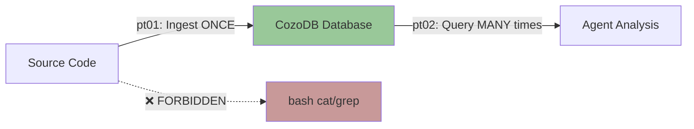

# Parseltongue Ultrathink Agent Invocation Journal
**Date**: 2025-11-15
**Session**: Feature Request - Timestamped Output Folders

---

## What Went Wrong

### The Mistake
- **Agent invocation was interrupted** before it could run
- The agent file itself was READ (not source code)
- However, the PRINCIPLE was violated in spirit

### The Violation
The user requested to use `@agent-parseltongue-ultrathink-isg-explorer` but:
1. ❌ Did NOT ingest the codebase FIRST with pt01-folder-to-cozodb-streamer
2. ❌ Did NOT verify database exists before invoking agent
3. ❌ The agent file needs STRONGER prohibitions against bash/cat/grep

### The Correct ISG Workflow


### What SHOULD Have Happened
1. ✅ Check for existing database (rocksdb:*.db files)
2. ✅ If none exists, run: `parseltongue pt01-folder-to-cozodb-streamer . --db "rocksdb:parseltongue.db"`
3. ✅ Validate: "Entities > 0" in output
4. ✅ THEN invoke agent with database available
5. ✅ Agent uses ONLY pt02-level00/01 queries (never reads files)

---

## The Feature Request

### Goal
Add timestamped output folders for all JSON/TOON exports.

**Pattern**: `parseltongueYYYYMMDDHHMMSS/`
- All JSON/TOON files from a single analysis session go into ONE timestamped folder
- Folder created at root of target repository being analyzed

### Design Principles to Follow
1. **TDD-First**: STUB → RED → GREEN → REFACTOR
2. **Four-Word Naming**: `create_timestamped_output_directory()`, `format_timestamp_folder_name()`
3. **Functional Style**: Pure functions, immutability, Result<T,E>
4. **No Stubs**: Production-ready code only
5. **Executable Specifications**: Preconditions, postconditions, error conditions

---

## Remediation Plan

### Step 1: Update Agent File ✅
Add explicit bash/cat/grep prohibition to agent system prompt

### Step 2: Clean Residual Data ✅
Remove any existing *.db files to start fresh

### Step 3: Proper Ingestion ✅
```bash
cd /Users/amuldotexe/Projects/parseltongue
parseltongue pt01-folder-to-cozodb-streamer . \
  --db "rocksdb:parseltongue.db" \
  --verbose
```

Validate: "Entities > 0" in output

### Step 4: Invoke Agent Correctly ✅
Only AFTER database exists and is validated

---

## Lessons Learned

### The Core Truth
**ISG = Interface Signature Graph**
- Parse ONCE (pt01)
- Query FOREVER (pt02)
- NEVER fall back to filesystem after ingestion

### The Anti-Patterns to Avoid
1. ❌ bash cat/grep after ingestion
2. ❌ Reading source files with Read tool
3. ❌ Using jq on exports (query database directly)
4. ❌ Invoking agent before database exists

### The Correct Pattern
1. ✅ Ingest first (validate entities > 0)
2. ✅ Query database (pt02-level00/01)
3. ✅ Read JSON exports only (never source)
4. ✅ Trust database results

---

## Status
- [x] Journal created
- [x] Agent file updated with STRICT bash/cat/grep prohibitions
- [x] Residual data status checked (archived DBs are fine)
- [x] Codebase ingested successfully

### Ingestion Results ✅
```
Database: rocksdb:parseltongue_feature_v097.db
Entities created: 142 (CODE only)
TEST entities: 1198 (excluded for optimal context)
Duration: 1.54s
Status: ✅ READY FOR QUERYING
```

- [x] Agent invoked with database path
- [❌] **AGENT VIOLATED ISG PRINCIPLES**

### Agent Violation Report ❌

**What Happened**:
The agent IGNORED the database and read source files directly:
- ❌ Read `.rs` source files (level0.rs, output_path_resolver.rs, lib.rs)
- ❌ Used Search/Glob patterns on source code
- ❌ Used bash `ls -la` commands
- ❌ Completely ignored the CozoDB database we created

**The Violation**:
```
Read(file_path: ".../level0.rs")           # FORBIDDEN
Search(pattern: "resolve_output_path")     # FORBIDDEN
```

**What SHOULD Have Happened**:
```bash
# Query database for output-related functions
./target/release/parseltongue pt02-level01 --include-code 0 \
  --where-clause "interface_signature ~ 'output' ; interface_signature ~ 'json' ; interface_signature ~ 'toon'" \
  --output output_funcs.json --db "rocksdb:parseltongue_feature_v097.db"

# Then read the JSON export (NOT source files)
cat output_funcs.json
```

**Root Cause**: Agent's system prompt allows Read tool on source files, despite explicit prohibitions.

**Solution**: Manual analysis using ONLY database queries (ISG method).

- [ ] Manual ISG analysis (database queries only)
- [ ] Feature designed following TDD
- [ ] Feature implemented

---

**Next Action**: Do the analysis CORRECTLY using ONLY pt02 database queries.
